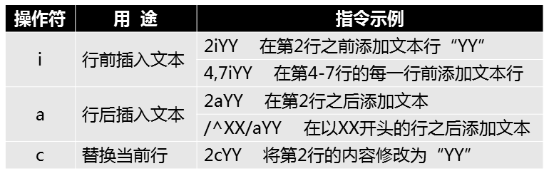

# Sed

## Sed工具概述

流式编辑器

- 非交互式对文本进行增删改查
- 逐行处理，并将结果输出到屏幕


## 命令格式

#### 主要用法

- 格式1：前置命令 | sed [选项]  '条件指令'
- 格式2：sed [选项]  '条件指令'  文件


#### 常见选项

```bash
-n ： 屏蔽默认输出

-i ： 修改文件内容

-r ： 启用拓展的正则表达式
```

#### 条件


#### 常用动作指令


```bash
1）p指令案例集锦
[root@sv7 ~]# sed -n 'p' user               #输出所有行，等同于cat user
[root@sv7 ~]# sed -n '4p' user              #输出第4行
[root@sv7 ~]# sed -n '4,7p' user            #输出第4~7行
[root@sv7 ~]# sed -n '/^bin/p' user         #输出以bin开头的行
[root@sv7 ~]# sed -n '$=' user              #输出文件的行数

2）d指令案例集锦
[root@sv7 ~]# sed '3,5d' user               #删除第3~5行
[root@sv7 ~]# sed '/root/d' user            #删除所有包含root的行
[root@sv7 ~]# sed '/root/!d' user           #删除不包含root的行，!符号表示取反
[root@sv7 ~]# sed '/^dae/d' user            #删除以dae开头的行
[root@sv7 ~]# sed '$d' user                 #删除文件的最后一行
[root@sv7 ~]# sed '/^$/d' user              #删除所有空行

3）sed命令的s替换基本功能（s/旧内容/新内容/选项（选项可选））：
[root@sv7 ~]# vim shu.txt        #新建素材
2017 2011 2018
2017 2017 2024
2017 2017 2017
[root@sv7 ~]# sed 's/2017/6666/' shu.txt     #把所有行的第1个2017替换成6666
[root@sv7 ~]# sed 's/2017/6666/g' shu.txt    #所有行的所有2017都替换成6666
[root@sv7 ~]# sed '2s/2017/6666/g' shu.txt   #第2行的所有2017都替换成6666

[root@sv7 ~]# sed 's/2017/6666/2' shu.txt    #把所有行的第2个2017替换成6666
[root@sv7 ~]# sed '1s/2017/6666/' shu.txt    #把第1行的第1个2017替换成6666
[root@sv7 ~]# sed '3s/2017/6666/3' shu.txt   #把第3行的第3个2017替换成6666
[root@sv7 ~]# sed '/2024/s/2017/6666/g' shu.txt #找含有2024的行，将里面的所有2017替换成6666
```




```bash
[root@sv7 ~]# cat user
root:x:0:0:root:/root:/bin/bash
[root@sv7 ~]# sed '1a xx' user
root:x:0:0:root:/root:/bin/bash
xx
[root@sv7 ~]# sed '1i xx' user
xx
root:x:0:0:root:/root:/bin/bash
[root@sv7 ~]# sed '1c xx' user
xx
```


## sed应用

修改网站根目录

```bash
sed -i '/^Listen/s/80/82' /etc/httpd/conf/httpd.conf
```

修改主机名的配置文件

```bash
sed -i 's/^.*$/haha/' /etc/hostname  # $ 表示匹配一行的结束
```

修改hosts文件，添加两条记录

```bash
sed -i '$a\192.168.4.5 svr5.tarena.com svr5' /etc/hosts
sed -i '$a\192.75.217.56 www.baidu.com' /etc/hosts # $表示最后一行行号
```


## 提问环节

**问题一：sed  选项-r 、-i 、-n 的含义**

<details><summary>点击展开</summary> <br>
-n ： 屏蔽默认输出  <br>
-i ： 修改文件内容   <br>
-r ： 启用拓展的正则表达式  <br>
</details>


**问题二：sed 实现修改httpd监听端口为8088**

<details> <summary>点击展开</summary> <br>sed -i '/^Listen/s/80/8088' /etc/httpd/conf/httpd.conf
</details>


