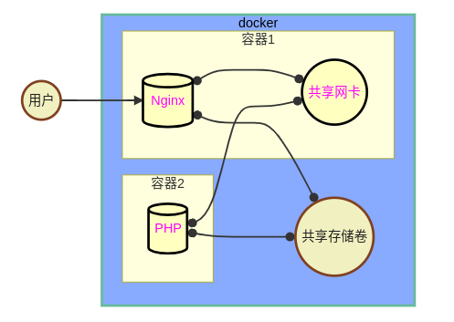

# Docker

## docker 安装部署

### 容器安装部署

```bash
# 添加 Docker 的官方仓库
sudo yum-config-manager --add-repo https://download.docker.com/linux/centos/docker-ce.repo
# 安装 docker 服务
[root@docker ~]# dnf install -y docker-ce
[root@docker ~]# systemctl enable --now docker
```

### 镜像代理

```bash
vim /etc/docker/daemon.json
{
    "registry-mirrors": ["这里配置镜像仓库加速器地址"],
    "insecure-registries":[] ##私人仓库地址
}
```


## docker常用命令

### 信息查询命令

| 命令           | 说明                     |
| -------------- | ------------------------ |
| docker version | 查看服务器与客户端版本   |
| docker info    | 查看 docker 服务配置信息 |

```bash
# 查看服务器与客户端版本
[root@docker ~]# docker version
Client: Docker Engine - Community
 Version:           25.0.2
 ... ...
Server: Docker Engine - Community
 Engine:
  Version:           25.0.2

# 查看配置信息
[root@docker ~]# docker info
 ... ...
 Kernel Version: 4.18.0-553.el8_10.x86_64
 Operating System: Rocky Linux 8.10 (Green Obsidian)
 OSType: linux
 Architecture: x86_64
 CPUs: 2
```

### 管理命令（1）

| 镜像管理命令                                      | 说明                   |
| :------------------------------------------------ | :--------------------- |
| docker images                                     | 查看本机镜像           |
| docker pull 镜像名称:标签                         | 下载镜像               |
| docker save 镜像名称:标签 -o 文件名               | 备份镜像为tar包        |
| docker load -i 备份文件名称                       | 导入备份的镜像文件     |
| docker history 镜像名称:标签                      | 查看镜像的制作历史     |
| docker build -t 镜像名称:标签  dockerfile所在目录 | 利用dockerfile创建镜像 |

```bash
# 下载 busybox 镜像
[root@docker ~]# docker pull busybox:latest

# 查看本机镜像
[root@docker ~]# docker images
REPOSITORY   TAG       IMAGE ID       CREATED         SIZE
busybox      latest    a9d583973f65   2 years ago     1.23MB

# 备份镜像为 tar 包
[root@docker ~]# docker save busybox:latest -o busybox.tar

# 使用 tar 包恢复镜像
[root@docker ~]# docker load -i busybox.tar

# 导入镜像
[root@docker ~]# docker load -i myos.tar.xz
Loaded image: rockylinux:8.5
Loaded image: myos:8.5
Loaded image: myos:php-fpm
Loaded image: myos:nginx
Loaded image: myos:httpd
Loaded image: myos:latest

# 查看本机镜像
[root@docker ~]# docker images
REPOSITORY   TAG       IMAGE ID       CREATED         SIZE
myos         php-fpm   f70bdfd2042c   12 months ago   275MB
myos         nginx     10dc658da2fe   12 months ago   274MB
myos         latest    1de38c85c2d1   13 months ago   4.67MB
myos         httpd     9245e660f88f   13 months ago   299MB
myos         8.5       621bfd7f9b46   13 months ago   249MB
rockylinux   8.5       210996f98b85   2 years ago     205MB

# 查看镜像的制作历史
[root@docker ~]# docker history myos:8.5
IMAGE          CREATED         CREATED BY                              SIZE
621bfd7f9b46   6 months ago    /bin/bash                               44.8MB    
210996f98b85   2 years ago     /bin/sh -c #(nop)  CMD ["/bin/bash"]    0B        
<missing>      2 years ago     /bin/sh -c #(nop) ADD file:790b60 …     205MB
```

### 管理命令（2）

| 容器管理命令                         | 说明                                        |
| ------------------------------------ | ------------------------------------------- |
| docker run -it(d) 镜像名称:标签      | 创建容器                                    |
| docker ps                            | 查看容器的信息                              |
| docker inspect 镜像名称\|容器名称    | 查询（容器/镜像）的详细信息                 |
| docker [start\|stop\|restart] 容器id | 启动、停止、重启容器                        |
| docker exec -it 容器ID 启动命令      | 在容器内执行命令                            |
| docker logs 容器ID                   | 查看容器日志                                |
| docker cp 路径1 路径2                | 拷贝文件：路径格式（本机路径、容器ID/路径） |

- **run**

```bash
# 创建一个容器
[root@docker ~]# docker run -it myos:8.5
[root@3aa1df05b795 /]# hostname
3aa1df05b795
[root@3aa1df05b795 /]# ps -ef
UID          PID    PPID  C STIME TTY          TIME CMD
root           1       0  0 15:13 pts/0    00:00:00 /bin/bash
root          19       1  0 15:13 pts/0    00:00:00 ps -ef
[root@3aa1df05b795 /]# ifconfig eth0
eth0: flags=4163<UP,BROADCAST,RUNNING,MULTICAST>  mtu 1500
        inet 172.17.0.2  netmask 255.255.0.0  broadcast 172.17.255.255
        ether 02:42:ac:11:00:02  txqueuelen 0  (Ethernet)
        RX packets 0  bytes 0 (0.0 B)
        RX errors 0  dropped 0  overruns 0  frame 0
        TX packets 0  bytes 0 (0.0 B)
        TX errors 0  dropped 0 overruns 0  carrier 0  collisions 0
[root@3aa1df05b795 /]# exit
# 创建后台容器
[root@docker ~]# docker run -itd myos:httpd
6d6884244a995791f8171efa3ce81be1e9e51bedf25c3a5a67bac8bb7bc019b0
# 创建名为web1的后台容器
[root@docker ~]# docker run -itd --name web1 myos:nginx
14b669a75a95e9ba590c37137abc9d828d2c769d46f69c35fb0e8cc98cc544c4 
```

- **ps**

```bash
# 查询容器状态
[root@docker ~]# docker ps
CONTAINER ID   IMAGE        ... ...  STATUS          PORTS     NAMES
14b669a75a95   myos:nginx   ... ...  Up 25 minutes   80/tcp    web1
6d6884244a99   myos:httpd   ... ...  Up 25 minutes   80/tcp    hawking
[root@docker ~]# docker ps -a
CONTAINER ID   IMAGE        ... ...  STATUS          PORTS     NAMES
14b669a75a95   myos:nginx   ... ...  Up 25 minutes   80/tcp    web1
6d6884244a99   myos:httpd   ... ...  Up 25 minutes   80/tcp    hawking
47ded92f442f   myos:8.5     ... ...  Exited (0)                yonath
[root@docker ~]# docker ps -aq
14b669a75a95
6d6884244a99
47ded92f442f
```

- **start、stop、restart**

```bash
[root@docker ~]# docker ps -a
CONTAINER ID   IMAGE        ... ...  STATUS          PORTS     NAMES
14b669a75a95   myos:nginx   ... ...  Up 25 minutes   80/tcp    web1
6d6884244a99   myos:httpd   ... ...  Up 25 minutes   80/tcp    hawking
47ded92f442f   myos:8.5     ... ...  Exited (0)                yonath
# 启动容器
[root@docker ~]# docker start web1 47ded92f442f
web1
47ded92f442f
[root@docker ~]# docker ps -a
CONTAINER ID   IMAGE        ... ...  STATUS          PORTS     NAMES
14b669a75a95   myos:nginx   ... ...  Up 25 minutes   80/tcp    web1
6d6884244a99   myos:httpd   ... ...  Up 25 minutes   80/tcp    hawking
47ded92f442f   myos:8.5     ... ...  Up 2 seconds              yonath
# 停止容器
[root@docker ~]# docker stop web1 
web1
# 命令替换，停止所有容器
[root@docker ~]# docker stop $(docker ps -aq)
14b669a75a95
6d6884244a99
47ded92f442f
[root@docker ~]# docker ps -a
CONTAINER ID   IMAGE        ... ...  STATUS          PORTS     NAMES
14b669a75a95   myos:nginx   ... ...  Exited (0)                web1
6d6884244a99   myos:httpd   ... ...  Exited (0)                hawking
47ded92f442f   myos:8.5     ... ...  Exited (0)                yonath
# 重启容器
[root@docker ~]# docker restart web1
web1
```

### 管理命令（3）

| 管理命令                                 | 说明                                       |
| ---------------------------------------- | ------------------------------------------ |
| docker rm 容器ID                         | 删除容器                                   |
| docker tag 镜像ID:标签 镜像名称:新的标签 | 创建新的镜像名称和标签                     |
| docker rmi 镜像名称:标签                 | 删除镜像（必须先删除该镜像启动的所有容器） |

```bash
# 删除容器
[root@docker ~]# docker rm 47ded92f442f
# 强制删除容器
[root@docker ~]# docker rm -f web1
# 删除所有容器
[root@docker ~]# docker rm -f $(docker ps -aq)
6d6884244a99

# 删除一个镜像
[root@docker ~]# docker rmi -f busybox:latest
Untagged: busybox:latest
# 已经创建了容器的镜像无法删除
[root@docker-0001 ~]# docker images
REPOSITORY   TAG       IMAGE ID       CREATED         SIZE
... ...
myos         latest    1de38c85c2d1   13 months ago   4.67MB
<none>       <none>    a9d583973f65   2 years ago     1.23MB
# 给镜像设置一个新的名称标签
[root@docker ~]# docker tag a9d583973f65 busybox:latest
[root@docker ~]# docker images
[root@docker-0001 ~]# docker images
REPOSITORY   TAG       IMAGE ID       CREATED         SIZE
......
myos         latest    1de38c85c2d1   13 months ago   4.67MB
busybox      latest    a9d583973f65   2 years ago     1.23MB
```

## 简单镜像制作

```bash
##使用基础镜像创建一个容器
[root@docker ~]# docker run -itd --name linux rockylinux:8.5
# 删除容器内的Yum配置文件
[root@docker ~]# docker exec -it linux rm -rf /etc/yum.repos.d
# 关闭秘钥检查
[root@docker ~]# sed -ri 's,(gpgcheck).*,\1=0,' /etc/yum.repos.d/*.repo
# 拷贝宿主机的Yum配置文件到容器内
[root@docker ~]# docker cp /etc/yum.repos.d linux:/etc/
# 在容器内安装工具软件包
[root@docker ~]# docker exec -it linux dnf install -y net-tools vim-enhanced tree bash-completion iproute procps-ng psmisc
# 清理缓存文件
[root@docker ~]# docker exec -it linux dnf clean all
# 停止容器
[root@docker ~]# docker stop linux
# 把容器制作成镜像
[root@docker ~]# docker commit linux mylinux:latest
sha256:7a4449e20f4c59d1f6c4db838b4724cbf63c8f4195513c5f17d053c7752891d5
# 查看新制作的镜像
[root@docker ~]# docker images
REPOSITORY   TAG       IMAGE ID       CREATED         SIZE
mylinux      latest    b64da40467ae   3 seconds ago   249MB
rockylinux   8.5       210996f98b85   13 months ago   205MB
# 删除制作镜像的容器
[root@docker ~]# docker rm -f linux 
linux
```

## 容器部署应用

- **部署 apache 服务**

```bash
# 删除所有容器
[root@docker ~]# docker rm -f $(docker ps -aq)
# 创建一个名为 myweb 的容器
[root@docker ~]# docker run -it --rm --name myweb mylinux:latest
#-----------------------------------------------------------
# 在容器内安装部署 apache
[root@a7f9d0c3e3e2 /]# dnf install -y httpd
[root@a7f9d0c3e3e2 /]# echo "Hello World ." >/var/www/html/index.html
[root@a7f9d0c3e3e2 /]# cat /usr/lib/systemd/system/httpd.service
[root@a7f9d0c3e3e2 /]# export LANG=C
[root@a7f9d0c3e3e2 /]# /usr/sbin/httpd -DFOREGROUND
# 在另一个终端完成访问验证
```

- **为 apache 添加解析 php 文件支持**

```bash
# 在另一个终端拷贝 public/info.php 到 docker 主机
[root@docker ~]# docker cp info.php myweb:/var/www/html/

# ctrl + c 终止服务运行
[root@a7f9d0c3e3e2 /]# dnf install -y php
[root@a7f9d0c3e3e2 /]# vim /etc/httpd/conf.modules.d/00-mpm.conf
11: LoadModule mpm_prefork_module ... ... # 去掉注释 
23: # LoadModule mpm_event_module ... ... # 注释配置 
[root@a7f9d0c3e3e2 /]# /usr/sbin/httpd -DFOREGROUND

# 服务不要关闭，在其他终端完成测试
[root@docker ~]# curl http://172.17.0.2/info.php
<pre>
Array
(
    [REMOTE_ADDR] => 172.17.0.1
    [REQUEST_METHOD] => GET
    [HTTP_USER_AGENT] => curl/7.61.1
    [REQUEST_URI] => /info.php
)
php_host:   616e75df56ae
1229
```


## Dockerfile详解

| **指令**   | **说明**                                               |
| ---------- | ------------------------------------------------------ |
| FROM       | 指定基础镜像（scratch 代表空镜像）                     |
| RUN        | 在容器内执行命令，可以写多条                           |
| ADD        | 把文件拷贝到容器内，如果文件是 tar.xx 格式，会自动解压 |
| COPY       | 把文件拷贝到容器内，不会自动解压                       |
| ENV        | 设置启动容器的环境变量                                 |
| WORKDIR    | 设置启动容器的默认工作目录（唯一）                     |
| CMD        | 容器默认的启动参数（唯一）                             |
| ENTRYPOINT | 容器默认的启动命令（唯一）                             |
| USER       | 启动容器使用的用户（唯一）                             |
| EXPOSE     | 使用镜像创建的容器默认监听使用的端口号/协议            |

#### 语法案例（1）

```bash
# 编写 Dockerfile
[root@docker ~]# mkdir myimg
[root@docker ~]# vim myimg/Dockerfile 
FROM mylinux:latest
CMD  ["/bin/ls", "-l"]
# 创建镜像
[root@docker ~]# docker build -t img:v1 myimg/
......
[root@docker ~]# docker images
REPOSITORY   TAG       IMAGE ID       CREATED         SIZE
img          v1        9278f72f8cb1   5 seconds ago   249MB
mylinux      latest    e3b3d26bf0da   21 hours ago    249MB
rockylinux   8.5       210996f98b85   13 months ago   205MB
# 创建容器
[root@docker ~]# docker run -it --rm img:v1
total 48
lrwxrwxrwx   1 root root    7 Oct 11  2021 bin -> usr/bin
drwxr-xr-x   5 root root  360 Feb  5 04:21 dev
drwxr-xr-x   1 root root 4096 Feb  5 04:21 etc
drwxr-xr-x   2 root root 4096 Oct 11  2021 home
......
# 传递参数命令，覆盖 CMD 执行
[root@docker ~]# docker run -it --rm img:v1 id
uid=0(root) gid=0(root) groups=0(root)
```

#### 语法案例（2）

```bash
# ENTRYPOINT 与 CMD 执行方式为 ${ENTRYPOINT} ${@-${CMD}}
[root@docker ~]# vim myimg/Dockerfile 
FROM mylinux:latest
ENTRYPOINT ["echo"]
CMD  ["/bin/ls", "-l"]
# 创建镜像
[root@docker ~]# docker build -t img:v2 myimg/
......

# CMD 做为参数传递，在容器内执行了 echo '/bin/ls -l'
[root@docker ~]# docker run -it --rm img:v2 
/bin/ls -l

# CMD 被替换，在容器内执行了 echo id
[root@docker ~]# docker run -it --rm img:v2 id
id
```

#### 语法案例（3）

```bash
# 制作测试文件
[root@docker ~]# tar -cf myimg/myfile.tar -C /etc hosts issue
# 编辑Dockerfile
[root@docker ~]# vim myimg/Dockerfile 
FROM mylinux:latest
COPY myfile.tar /tmp/        # 新添加
ADD  myfile.tar /var/tmp/    # 新添加
CMD  ["/bin/bash"]

# 创建镜像
[root@docker ~]# docker build -t img:v3 myimg/
......

# 运行测试
[root@docker ~]# docker run -it --rm img:v3
# 使用 COPY 进来的文件还是 tar 包
bash-4.4$ tree /tmp
/tmp
`-- myfile.tar
# 使用 ADD 添加的文件已经被解压了
bash-4.4$ tree /var/tmp
/var/tmp
|-- hosts
`-- issue
```

#### 语法案例（4）

```bash
[root@docker ~]# vim myimg/Dockerfile 
FROM mylinux:latest
COPY myfile.tar /tmp/
ADD  myfile.tar /var/tmp/
RUN  touch /tmp/file1        # 新添加
USER nobody                  # 新添加
RUN  touch /tmp/file2        # 新添加
CMD  ["/bin/bash"]

# 创建镜像
[root@docker ~]# docker build -t img:v4 myimg/
......

# 运行测试
[root@docker ~]# docker run -it --rm img:v4
# USER 指令设置使用 nobody 用户运行容器
bash-4.4$ id
uid=65534(nobody) gid=65534(nobody) groups=65534(nobody)
# USER 指令前创建的文件是 root 权限，之后是 USER 用户权限
bash-4.4$ ls -l /tmp/file? 
-rw-r--r-- 1 root   root   0 Feb  5 05:25 /tmp/file1
-rw-r--r-- 1 nobody nobody 0 Feb  5 05:25 /tmp/file2
```

#### 语法案例（5）

```bash
# 编辑Dockerfile
[root@docker ~]# vim myimg/Dockerfile 
FROM mylinux:latest
COPY myfile.tar /tmp/
ADD  myfile.tar /var/tmp/
RUN  touch /tmp/file1
USER nobody
RUN  touch /tmp/file2
ENV  TZ="Asia/Shanghai"      # 新添加
EXPOSE 12345/tcp             # 新添加
CMD  ["/bin/bash"]

# 创建镜像
[root@docker ~]# docker build -t img:v5 myimg/
......

# 运行测试
[root@docker ~]# docker run -it --rm img:v5
# 环境变量可以直接调用
bash-4.4$ echo ${TZ}
Asia/Shanghai
bash-4.4$ date +%T
10:50:18

# 在其他终端查看
[root@docker ~]# docker ps
CONTAINER ID   IMAGE      ... ...    STATUS          PORTS
14b669a75a95   img:v5     ... ...    Up 1 minutes    12345/tcp
```

#### 语法案例（6）

```bash
# 编辑Dockerfile
[root@docker ~]# vim myimg/Dockerfile 
FROM mylinux:latest
COPY myfile.tar /tmp/
ADD  myfile.tar /var/tmp/
RUN  touch /tmp/file1
USER nobody
RUN  touch /tmp/file2
ENV  TZ="Asia/Shanghai"
EXPOSE 12345/tcp
WORKDIR /tmp                 # 新添加
CMD  ["/bin/bash"]

# 创建镜像
[root@docker ~]# docker build -t img:v6 myimg/
......
# 运行测试
[root@docker ~]# docker run -it --rm img:v6
# 环境变量可以直接调用
bash-4.4$ pwd
/tmp
```


## **容器技术**

### 对外发布服务

#### 端口绑定

- **docker  run  -itd  -p 宿主机端口:容器端口  镜像:标签**

```bash
[root@docker ~]# docker run -itd --rm --name web -p 80:80 myos:nginx
# 绑定后，直接访问宿主机的 IP 地址即可
[root@docker ~]# curl http://192.168.88.31
Nginx is running !
```

#### 容器存储卷

- **docker run -itd -v 宿主机对象:容器内对象 镜像:标签**

```bash
[root@docker ~]# docker run -itd --rm --name web -p 80:80 \
                   -v /var/webroot:/usr/local/nginx/html myos:nginx

[root@docker ~]# curl http://192.168.88.31/
hello world
```

#### 容器网络通信

##### 实验架构图例



##### 共享名称空间

```bash
# 使用 nginx 的网络名称空间
[root@docker ~]# docker run -itd --rm --name php --network=container:web myos:php-fpm
d5a02b75486ce428f02b25f869f21299387fa4f51a605f478b466656d7c85c6f

[root@docker ~]# curl http://192.168.88.31/info.php
File not found.

[root@docker ~]# docker exec -it web ss -ltun
Netid  State      Recv-Q    Send-Q     Local Address:Port
tcp    LISTEN     0         128            127.0.0.1:9000
tcp    LISTEN     0         128                    *:80

# 为 php 增加数据卷
[root@docker ~]# docker rm -f php
[root@docker ~]# docker run -itd --rm --name php --network=container:web \
                   -v /var/webroot:/usr/local/nginx/html myos:php-fpm

[root@docker ~]# curl http://192.168.88.31/info.php
<pre>
Array
(
    [REMOTE_ADDR] => 192.168.88.31
    [REQUEST_METHOD] => GET
    [HTTP_USER_AGENT] => curl/7.61.1
    [REQUEST_URI] => /info.php
)
php_host:   da7df895c434
1229
```

## 服务编排与治理

### 项目文件

```bash
# 创建项目文件
[root@docker ~]# vim docker-compose.yaml
name: myweb
version: "3"
services:
  websvc:
    container_name: nginx
    image: myos:nginx
```

### 项目管理命令

| **指令**           | **说明**                   |
| ------------------ | -------------------------- |
| up                 | 创建项目并启动容器         |
| ls                 | 列出可以管理的项目         |
| images             | 列出项目使用的镜像         |
| ps                 | 显示项目中容器的状态       |
| logs               | 查看下项目中容器的日志     |
| start/stop/restart | 启动项目/停止项目/重启项目 |
| down               | 删除项目容器及网络         |


### compose 语法

| **指令**       | **说明**                                                     |
| :------------- | ------------------------------------------------------------ |
| container_name | 指定容器名称                                                 |
| image          | 指定为镜像名称或镜像 ID                                      |
| ports          | 暴露端口信息                                                 |
| volumes        | 数据卷,支持 [volume、bind、tmpfs、npipe]                     |
| network_mode   | 设置网络模式                                                 |
| environment    | 设置环境变量                                                 |
| restart        | 容器保护策略[always、no、on-failure]                         |
| command        | 覆盖容器启动后默认执行的命令                                 |
| healthcheck    | 配置服务健康检测                                             |
| depends_on     | 服务依赖关系 services_[started、healthy、completed_successfully] |

### 容器服务编排

```yaml
[root@docker ~]# vim docker-compose.yaml 
name: myweb
version: "3"
services:
  websvc:
    container_name: nginx
    image: myos:nginx
    ports:
      - 80:80
    environment:
      - "TZ=Asia/Shanghai"
    volumes:
      - type: bind
        source: /root/conf/nginx.conf
        target: /usr/local/nginx/conf/nginx.conf
      - type: bind
        source: /var/webroot
        target: /usr/local/nginx/html
  phpsvc:
    container_name: php
    image: myos:php-fpm
    restart: always
    network_mode: "service:websvc"
    volumes:
      - type: bind
        source: /var/webroot
```

