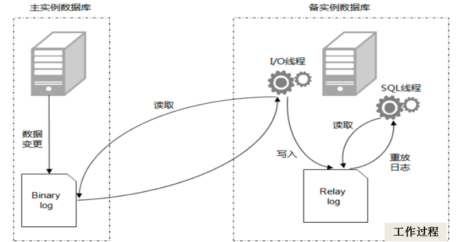
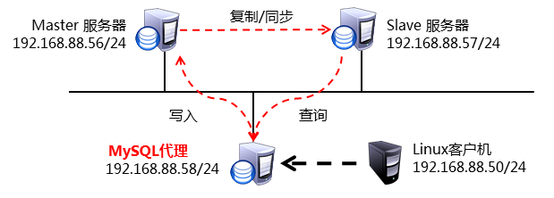
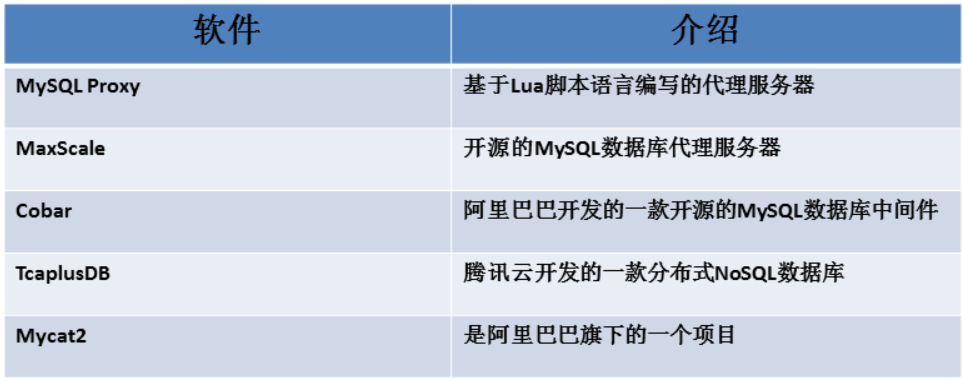
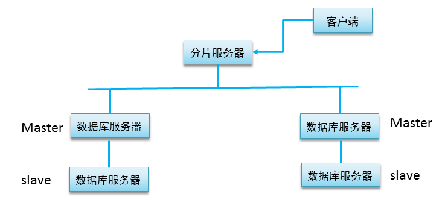
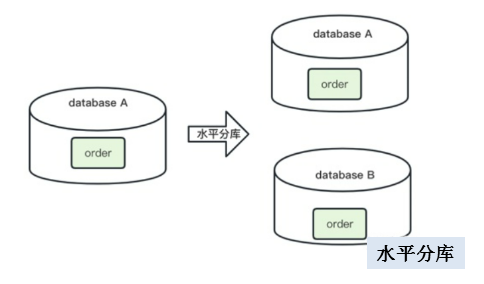
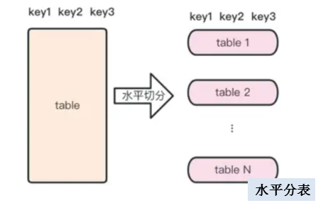
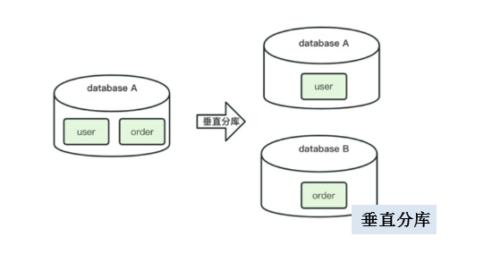
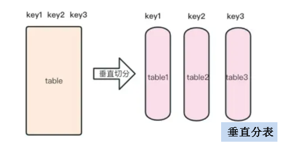
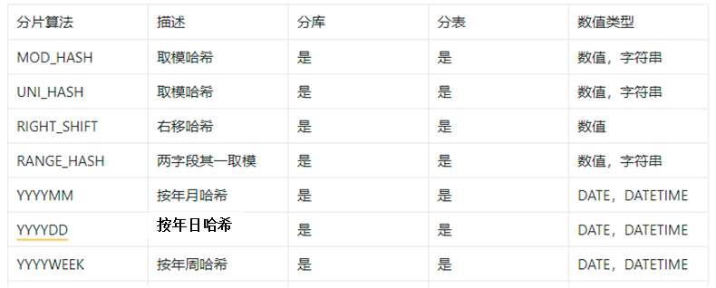
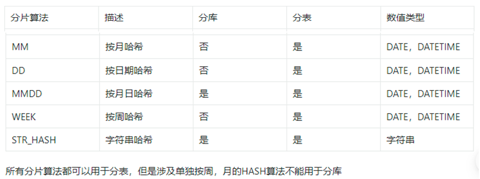

# DBA

## SQL语句分类

​    **DDL:** database define language，数据定义语句
​       create/alter/drop

​    **DML:** database manager language，数据操作语句
​        insert/update/delete

​    **DQL**: database query language，数据查询语句
​        select/show

​    **DCL**: database control language，数据控制语句
​        grant/revoke

​    **TCL**: transcation control language，事务控制语句
​        begin/commit/savepoint/rollback  


## Mysql事务：

​    针对于DML
​    一组SQL语句要么全部执行，要么全部不执行
​    是保证数据准确性的机制

​    **特性**：
​        原子性(Auomicity):在一个事务中，像增删改（DML）要么全部成功，要么全部失败
​        一致性(Consistency)：事务完成时必须所有数据都保持一致状态
​        隔离性(Isolation)：多个事务的执行是互不干扰的
​        持久性(Durability)：事务一旦提交或回滚，它对数据库中的数据的改变就是永久的


## 索引:数据结构,加速查询

#### 分类:

**作用效果:**
				普通索引:字段值无约束		      		 mul
				唯一索引:字段值唯一但可以赋空值	uni
				主键索引:字段值唯一且不能赋空值	pri
**作用字段**:
				单列索引:作用于一个字段
				多列索引/复合索引:作用于多个字段,从最左字段开始匹配
**存储方式**:
				聚簇索引:数据和索引存放在一起
				非聚簇索引:数据和索引不在一起
**数据结构**:
				树形索引:btree/b+tree   正排表:根据行号找内容
				哈希索引:hash
				全文索引:fulltext
				空间索引:


#### 使用规则：

- 一个表中可以有多个index
- 任何数据类型的表头都可以设置索引
- 表头值可以重复，也可以赋NULL值
- 通常在where条件中的表头上设置Index
- index索引标志MUL

```sql
// 查看索引名
show index from word.city;

// 创建聚合索引
create index idx_n_c on word.city(name,countrycode);
alter table word.city add index idx_n_c(name,countrycode);

//创建前缀索引
create index idx_d on word.city(district(5));
alter table word.city add index idx_d(district(5));

//删除索引
drop index idx_na on word.city;
alter table word.city drop index idx_na;
```


## 慢查询配置

#### 慢查询日志 (`slow_query_log`)

- **Variable_name**: `slow_query_log`
- **Value**: `OFF`

这表示当前慢查询日志功能是关闭状态。当这个值为`OFF`时，MySQL不会记录任何被认为是“慢”的查询到日志文件中。若要启用慢查询日志以便于性能调优和问题排查，你需要将此变量设置为`ON`。

#### 慢查询日志文件路径 (`slow_query_log_file`)

- **Variable_name**: `slow_query_log_file`
- **Value**: `/var/lib/mysql/mysql40-slow.log`

即使慢查询日志功能目前是关闭的，这个变量指定了当慢查询日志开启时，日志将被写入哪个文件。在你的例子中，如果启用了慢查询日志，日志将会保存在`/var/lib/mysql/mysql40-slow.log`。

#### 长查询时间 (`long_query_time`)

- **Variable_name**: `long_query_time`
- **Value**: `10.000000`

这个变量定义了被认为是“慢”的查询阈值，单位是秒。在这个配置下，只有执行时间超过10秒的查询才会被视为慢查询，并且在慢查询日志开启的情况下被记录下来。默认值通常是10秒，但为了更细致地监控数据库性能，管理员可能会调整这个值至更低（例如1秒或更低），以便捕捉那些虽然未达到10秒但也可能影响性能的查询。


## 用户授权

```sql
// 创建用户
create user 用户名@"客户端地址" identified by "密码";
// 授予权限
grant 权限列表 on 库名 to 用户名@"客户端地址";
```


```sql
//删除已有授权用户的权限
pevoke 权限列表 on 库名 from 用户名@"客户端地址";
```


## 建表范式


## 备份方式:

#### 按照运行状态：

**冷备份**:在数据库服务停止运行的状态下做数据备份
			cp/tar/zip


**温备份**:数据库服务运行状态下进行数据备份,数据库的读操作可以正常自行但写操作会被阻塞
			mysqldump

缺点：效率低，速度慢，锁表; 备份过程中，数据插入和更新操作被阻塞。

```bash
# 备份表
[root@mysql40 ~]# mysqldump -uroot -p'123456' tarena salary > /bak/salary.sql
# 备份所有库
[root@mysql40 ~]# mysqldump -uroot -p'123456' -A > /bak/all.sql
# 备份1个库
[root@mysql40 ~]# mysqldump -uroot -p'123456' -B tarena > /bak/tarena.sql
# 备份多个库
[root@mysql40 ~]# mysqldump -uroot -p'123456' -B studb db1 > /bak/dbs.sql
```

**热备份**:在数据库服务正常运行的状态下做数据备份,数据库读写请求都不受影响
			xtrabackup
				--host --port --user --password --datadir --backup
				--target-dir --incremental-basedir
				--prepare --apply-log-only --incremental-dir

```bash
--host: 指定要连接的 MySQL 服务器主机名或 IP 地址。
--port: 指定 MySQL 服务器监听的端口号。
--user: 指定用于连接到 MySQL 服务器的用户名。
--password: 指定用于连接到 MySQL 服务器的用户密码。
--datadir: 指定 MySQL 数据文件所在的目录。这个参数对于指定数据存储位置很重要。
--backup: 表示执行备份操作。使用此选项时，需要同时指定 --target-dir 来确定备份文件存放的位置。
--target-dir: 指定备份文件存储的目标目录。在执行备份时是必需的。
--incremental-basedir: 当执行增量备份时，指定前一次全量或增量备份的目录作为基础备份目录。
--prepare: 准备阶段，使备份的数据文件处于一致状态，以便可以用来恢复。通常在备份完成后运行。
--apply-log-only: 在准备备份时使用，阻止回滚阶段的发生。这在创建增量备份链时非常重要，确保后续的增量备份可以正确应用。
--incremental-dir: 指定增量备份的目录。在准备增量备份时使用，将增量备份应用到全量备份上。
---
# xtrabackup --host=127.0.0.1 --user=root --password=123456 --backup --target-dir=/fullbak --datadir=/var/lib/mysql

# xtrabackup --host=127.0.0.1 --user=root --password=123456 --datadir=/var/lib/mysql  --backup --incremental-basedir=/fullbak  --target-dir=/new2

# xtrabackup  --prepare  --apply-log-only  --target-dir=/opt/fullbak  --incremental-dir=/opt/new2
```


#### 按照备份数据：

**物理备份**:数据库的磁盘文件
**逻辑备份**:备份时刻下数据库的库表的SQL语句

#### 按照备份策略：

**完整备份**:
**部分备份**:
		差异备份
		增量备份


## MySQL锁

锁类型：

​				读锁：共享锁

​				写锁：排它锁/互斥锁

锁粒度：

​				行级锁
​				表级锁
​				页级锁	


## MySQL日志:

错误日志:MySQL运行信息

查询日志:所有的查询相关语句

慢查询日志:超过指定时间阈值的查询语句

二进制日志:所有引起数据改变的语句

中继日志:主从同步中用到的过渡性日志

事务日志:事务管理相关日志
		重做日志:保证事务持久性的日志
		回滚日志:保证事务原子性的日志


binlog日志

- 二进制日志
- mysql服务日志的一种
- 保存处查询以外的sql命令
- 可用于数据的备份和恢复
- 配置mysql主从同步的必要条件

自定义binlog日志

```bash
[root@mysql42 ~]# vim /etc/my.cnf.d/mysql-server.cnf
log_bin=/mylog/mysql52   /目录名/日志名 //指定存放目录和文件名

[root@mysql42 ~]# mkdir /mylog
[root@mysql42 ~]# chown mysql:mysql /mysql
[root@mysql42 ~]# systemctl restart mysqld
[root@mysql42 ~]# ls /mylog
mysql52.000001  mysql52.index
```

日志文件管理命令

```bash
show master status;  //查看正在使用的日志
show binary logs;	 //查看已有的日志文件
purge master logs to "日志名";  //删除编号之前的日志 
reset master;				   //删除所有日志，重新创建体制
show binlog events in "日志文件名"; //查看日志文件内容

//通过日志文件，恢复所有数据
mysqlbinlog mysql52.000001 | mysql -uroot -p'123456'
```


## Mysql主从同步

#### 原理



Master

--启用binlog日志，记录所有数据库更新和修改操作

Slave

--Slave_IO: 复制master主机 binlog日志文件里的sql命令到本机的relay-log文件里

--Slave_SQL:执行本机relay-log文件里的SQL语句，实现Master数据一致。

#### 主从同步结构

一主一从:搭建简单,副本少

主主复制:多节点写入容易造成死锁

一主多从:副本多且无关联,主节点负载高

联级复制:主节点负载相对低,但副本之间存在关联

多主一从：


#### 

#### 构建主从同步

**一主一从**

```bash
## Master
vim /etc/my.cnf.d/mysql-server.cnf
[mysqld]
log_bin=mysql53
server_id=53

mysql> create user repluser@"%" identified by "123456";
mysql> grant replication slave on *.*  to repluser@"%";
mysql> show master status;   #查看master状态信息

## Slave
vim /etc/my.cnf.d/mysql-server.cnf
[mysqld]
server-id=54

mysql> change master to  
master_host="192.168.88.53",        #主服务器ip地址
master_user="repluser",			    #主服务器授权用户
master_password="123456",		    #授权用户密码
master_log_file="mysql53.000001",   #主服务器binlog日志
master_log_pos=667;					#日志偏移量
mysql> start slave ; 
mysql> show slave status \G 
```

**一主多从**

重复配置如上


## MySQL读写分离

**拓扑**



Mysql数据库的读操作和写操作分别分配到不同的服务器上，通过这种方式可以提高数据库的并发处理能力和性能、降低系统失败的风险。要保证负责读访问主机与负责写访问主机的数据一致。


**中间软件**




### Mycat

```bash
# 安装
## http://www.mycat.org.cn/ 下载启动包和核心jar
yum -y install java-1.8.0-openjdk.x86_64
unzip mycat2-install-template-1.21.zip
mv mycat /usr/local/
cp mycat2-1.21-release-jar-with-dependencies.jar  /usr/local/mycat/lib/
chmod  +x /usr/local/mycat/bin/* 
# 配置mycat服务器
## 定义客户端mycat服务使用用户及密码
vim /usr/local/mycat/conf/users/root.user.json 
{
        "dialect":"mysql",
        "ip":null,
        "password":"123456", 密码
        "transactionType":"proxy",
        "username":"mycat" 用户名
}
------
## 定义连接的数据库服务器
 vim /usr/local/mycat/conf/datasources/prototypeDs.datasource.json 
{
        "dbType":"mysql",
        "idleTimeout":60000,
        "initSqls":[],
        "initSqlsGetConnection":true,
        "instanceType":"READ_WRITE",
        "maxCon":1000,
        "maxConnectTimeout":3000,
        "maxRetryCount":5,
        "minCon":1,
        "name":"prototypeDs",
        "password":"123456", #密码
        "type":"JDBC",
        "url":"jdbc:mysql://localhost:3306/mysql?useUnicode=true&serverTimezone=Asia/Shanghai&characterEncoding=UTF-8", #连接本机的数据库服务
        "user":"plj", #用户名
        "weight":0
}
## 在mycat58主机运行数据库服务
mysql> create user plj@"%" identified by "123456";  //创建plj用户
mysql> grant all on *.* to plj@"%" ;   //授予权限
mysql> exit  //断开连接

## 启动mycat
/usr/local/mycat/bin/mycat start
netstat  -utnlp  | grep 8066
tcp6       0      0 :::8066  :::*       LISTEN      57015/java      
```

 

**配置读写分离**

```bash
# 配置读写分离
mysql -h127.0.0.1 -P8066 -umycat -p654321
## 添加数据库服务器
MySQL> /*+ mycat:createdatasource{
"name":"whost56", 
"url":"jdbc:mysql://192.168.88.56:3306",
"user":"plja","password":"123456"
}*/;
MySQL> /*+ mycat:createdatasource{
"name":"rhost57", 
"url":"jdbc:mysql://192.168.88.57:3306",
"user":"plja","password":"123456"
}*/;
## 查看数据源
mysql> /*+mycat:showDataSources{}*/ \G
## 配置数据库服务器添加plja用户
[root@mysql56 ~]# mysql 
mysql> create user plja@"%" identified by "123456";
mysql> grant all on *.* to  plja@"%";
## 创建集群
mysql -h127.0.0.1 -P8066 -umycat -p123456
mysql>/*!mycat:createcluster{
"name":"rwcluster",
"masters":["whost56"],
"replicas":["rhost57"]
}*/ ;
## 查看集群信息
mysql> /*+ mycat:showClusters{}*/ \G

## 修改master角色主机仅负责写访问
vim /usr/local/mycat/conf/datasources/whost56.datasource.json
{
        "dbType":"mysql",
        "idleTimeout":60000,
        "initSqls":[],
        "initSqlsGetConnection":true,
        "instanceType":"WRITE", #仅负责写访问
        "logAbandoned":true,
        "maxCon":1000,
        "maxConnectTimeout":30000,
        "maxRetryCount":5,
        "minCon":1,
        "name":"whost56",
        "password":"123456",
        "queryTimeout":0,
        "removeAbandoned":false,
        "removeAbandonedTimeoutSecond":180,
        "type":"JDBC",
        "url":"jdbc:mysql://192.168.88.56:3306?serverTimezone=Asia/Shanghai&useUnicode=true&characterEncoding=UTF-8&autoReconnect=true",
        "user":"plja",
        "weight":0
}
//修改slave角色主机仅负责读访问
vim /usr/local/mycat/conf/datasources/rhost57.datasource.json
{
        "dbType":"mysql",
        "idleTimeout":60000,
        "initSqls":[],
        "initSqlsGetConnection":true,
        "instanceType":"READ",  #仅负责读访问
        "logAbandoned":true,
        "maxCon":1000,
        "maxConnectTimeout":30000,
        "maxRetryCount":5,
        "minCon":1,
        "name":"rhost57",
        "password":"123456",
        "queryTimeout":0,
        "removeAbandoned":false,
        "removeAbandonedTimeoutSecond":180,
        "type":"JDBC",
        "url":"jdbc:mysql://192.168.88.57:3306?serverTimezone=Asia/Shanghai&useUnicode=true&characterEncoding=UTF-8&autoReconnect=true",
        "user":"plja",
        "weight":0
}
//修改读策略
vim /usr/local/mycat/conf/clusters/rwcluster.cluster.json 
{
        "clusterType":"MASTER_SLAVE",
        "heartbeat":{
                "heartbeatTimeout":1000,
                "maxRetryCount":3,
                "minSwitchTimeInterval":300,
                "showLog":false,
                "slaveThreshold":0.0
        },
        "masters":[
                "whost56"
        ],
        "maxCon":2000,
        "name":"rwcluster",
        "readBalanceType":"BALANCE_ALL_READ", #把读访问平均分配给read角色的主机
        "replicas":[
                "rhost57"
        ],
        "switchType":"SWITCH"
}
```


## 数据分片



- 水平分库

将表水平切分分散到不同的库里，每个库有相同的表，但表里的数据不同。



- 水平分表

表的结构不变，数据分散存储到不同表中。每个表的结构一样、数据不一样，所有表的数据合并是表的总数据















```bash
/*+ mycat:createdatasource{
"name":"dw1", 
"url":"jdbc:mysql://192.168.88.61:3306",
"user":"plj",
"password":"123456"
}*/;

/*+ mycat:createdatasource{
"name":"dr1", 
"url":"jdbc:mysql://192.168.88.62:3306",
"user":"plj",
"password":"123456"
}*/;


/*!mycat:createcluster{
"name":"c1",
"masters":["dw1"],
"replicas":["dr1"]
}*/;

/*+ mycat:showClusters{}*/ \G


```

```sql
create table tarena.employees(
employee_id  int  primary key,
name char(10),dept_id int , 
mail varchar(30)
) default charset utf8
dbpartition BY mod_hash(employee_id) tbpartition BY mod_hash(employee_id) 
tbpartitions 1 dbpartitions 2;

/*
dbpartitions 2  指定数据库分片的数量为2
tbpartitions 1  指定每个数据库中表分区数量为1
*/


```

**关联表**

MyCat2中对于关联表，不需要有过多的声明，他可以根据分片规则自行判断。--- 相同的分片算法、字段id 例如  ` mod_hash (employee_id)  `

```sql
create table tarena.salary(
employee_id int primary key, 
p_date date , basic int , bonus int 
) DEFAULT CHARSET=utf8 
dbpartition BY mod_hash(employee_id) 
tbpartition BY mod_hash(employee_id) tbpartitions 1;
```

**全局表**

```sql
create table tarena.dept(
dept_id int, 
dept_name char(10),
primary key(dept_id)
)default charset utf8  broadcast;

/*分片策略  broadcast 不分片，广播给所有数据库节点。
```


## MySQL高可用解决方案:

​	MySQL双主+Keepalived
​	MySQL-MMM集群
​	MySQL-MHA集群
​	MySQL-Galera集群
​	PXC集群
​	MySQL-MGR集群


## SQL使用

#### 修改用户密码

```sql
ALTER USER 'username'@'host' IDENTIFIED BY '新密码';
```

#### 修改表

```sql
## 修改表名
alter table studb.stu rename studb.stuinfo; 
## 删除表头
alter table studb.stuinfo drop age ; 
## 查看表头
desc stuinfo; 
## 添加表头，默认添加在末尾
alter table studb.stuinfo add  mail  char(30) ; 
## after 添加在指定表头名的下方
alter table  studb.stuinfo 
add number  char(9) first , 
add  school char(10) after name;
## 修改表头数据类型
alter table  studb.stuinfo  modify  mail varchar(50);
```

#### 复制表

```sql
## select 复制表只复制数据、表字段、字段类型
create table studb.salary1  select  * from tarena.salary;
## like 复制表只复制整个表结构
create table studb.salary2  like tarena.salary;
```

#### 数据批量处理

```bash
## 默认目录
/var/lib/mysql-files/

## 修改检索目录为/myload
vim /etc/my.cnf.d/mysql-server.cnf
[mysqld]
secure_file_priv=/myload  添加此行
## 赋予服务对于该目录的权限
chown mysql:mysql /myload
```

```sql
## 导入数据
load data infile "/myload/passwd" into table db1.user3 
fields terminated by ":"   # 字段间隔
lines terminated by "\n" ; # 行间隔

## 导出数据
select  name , email , phone_number 
from tarena.employees  
where employee_id <= 5 into outfile "/myload/employees.txt"  fields terminated by ":" lines terminated by "!!!!!!";
```


### 数据类型

**数值类型**
整型：


浮点类型：


定点数（Fixed Point）：DECIMAL 主要用于需要精确表示小数的场景，比如货币金额等。


**字符类型**


**枚举类型**

enum类型   单选

set类型   	多选


**时间日期型**


### 约束分类


**auto_increment**

**truncate**

```sql
 create     table   db1.t38 (
     id   int   primary key  auto_increment   , 
     name   char(10) , 
     class   char(7) , 
     addr   char(10)
  );
  
 truncate db1.t38;       #删除表数据，且从新计算行号。
```


**主键**

```sql
## 删除约束
alter table db1.t36 drop primary key;

## 添加约束
alter table db1.t36 add primary key(card_id);

## 一张表只能有一个主键，但是一个主键可以包含多个字段
create table db1.t37(
	name char(10),
    char_id char(18), 
    class char(10)
    primary key (name,char_id)
);
```

**复合主键**


**外键使用规则：**

- 表存储引擎必须是innodb
- 表头数据类型要一致
- 被参照表头必须要是索引类型的一种(primary key)

```sql
create table   库.表(
表头列表 , 
foreign key(表头名)        #指定外键
references 库.表(表头名)   #指定参考的表头名
on update  cascade         #同步更新
on  delete  cascade        #同步删除
)engine=innodb;
```

外键字段的值必须在参考表字段值范围内
验证同步更新（ on update cascade)
验证同步删除（ on delete cascade)


### 数据库服务相关参数

主配置文件: /etc/my.cnf.d/mysql-server.cnf

数据库目录:/usr/lib/mysql

端口号:3306

进程名:  mysqld

```bash
ss -antlup | grep 3306
```

进程所有者: mysql

```bash
ps -aux | grep mysqld
```


## sql执行顺序

- FROM：首先确定数据来源，包括表、视图等，并处理任何JOIN操作。
- WHERE：对FROM子句产生的结果集进行过滤。只有满足WHERE条件的行才会被保留下来。
- GROUP BY：将符合条件的行按指定列或表达式分组。这个步骤通常与聚合函数（如COUNT, SUM, AVG等）一起使用。
- HAVING：进一步过滤由GROUP BY产生的结果集。HAVING子句允许您指定过滤条件，这与WHERE子句类似，但HAVING专门用于过滤分组后的数据。
- SELECT：选择要显示的列或表达式的值。这是许多人认为查询开始的地方，但实际上它是相对靠后执行的一个步骤。
- DISTINCT：如果查询中使用了DISTINCT关键字，那么在这一步骤中会去除重复的记录。
- ORDER BY：根据一个或多个列对结果集进行排序。注意，ORDER BY是在所有选择和过滤完成后才执行的最后一个步骤。
- LIMIT / OFFSET（如果有）：最后，限制返回的行数或跳过一定数量的行。这个功能的具体实现依赖于具体的数据库系统。


## 表连接区别


在SQL中，表连接（JOIN）是用于从多个表中检索数据的重要手段。不同的连接方式决定了哪些记录会包含在结果集中，主要基于这些表之间的关系以及如何匹配记录。以下是几种常见的SQL连接类型及其区别：

#### 1. 内连接（INNER JOIN）
- **定义**：返回两个表中满足连接条件的所有行。如果某一行在另一个表中没有匹配的记录，则该行不会出现在结果集中。
- **语法**：
  
  ```sql
  SELECT * FROM table1 INNER JOIN table/XMLSchema 0;
  ```
- **使用场景**：当你只关心那些在两个表中都有匹配记录的数据时。

#### 2. 左连接（LEFT JOIN 或 LEFT OUTER JOIN）
- **定义**：返回左表中的所有记录，以及右表中与之匹配的记录。如果没有找到匹配项，右表中的列将包含NULL值。
- **语法**：
  
  ```sql
  SELECT * FROM table1 LEFT JOIN table2 ON table1.id = table2.id;
  ```
- **使用场景**：当你希望保留左表中的所有记录，并且对右表中可能不存在匹配项的情况不敏感时。

#### 3. 右连接（RIGHT JOIN 或 RIGHT OUTER JOIN）
- **定义**：返回右表中的所有记录，以及左表中与之匹配的记录。如果没有找到匹配项，左表中的列将包含NULL值。
- **语法**：
  ```sql
  SELECT * FROM table1 RIGHT JOIN table2 ON table1.id = table2.id;
  ```
- **使用场景**：当你希望保留右表中的所有记录，并且对左表中可能不存在匹配项的情况不敏感时。

#### 4. 全外连接（FULL JOIN 或 FULL OUTER JOIN）
- **定义**：返回左右两个表中的所有记录。当某个表中没有找到匹配项时，对应的列将包含NULL值。
- **语法**：
  ```sql
  SELECT * FROM table1 FULL JOIN table2 ON table1.id = table2.id;
  ```
- **使用场景**：当你需要保留两个表中的所有记录，无论它们是否在另一个表中有匹配项时。

#### 5. 交叉连接（CROSS JOIN）
- **定义**：生成两个表的笛卡尔积，即第一个表的每一行与第二个表的每一行组合。如果不指定连接条件，结果集的大小将是两个表行数的乘积。
- **语法**：
  ```sql
  SELECT * FROM table1 CROSS JOIN table2;
  ```
- **使用场景**：通常用于生成测试数据或在特定情况下需要考虑所有可能的组合。

#### 6. 自连接（Self Join）
- **定义**：不是一种独立的连接类型，而是指一个表与自身进行连接。这通常涉及到为表取别名以便区分同一个表的不同实例。
- **语法**：
  ```sql
  SELECT a.name, b.name FROM employees a JOIN employees b ON a.manager_id = b.employee_id;
  ```
- **使用场景**：当你需要查询表中存在层次结构的数据时，比如员工和他们的经理都在同一个表中。

每种连接类型都有其特定的应用场景，选择合适的连接类型可以帮助你更高效地获取所需的数据。理解这些连接类型的区别对于编写有效的SQL查询至关重要。


## 注意事项及错误信息

```sql
mysql> insert into db1.gz values(3,50000);  
ERROR 1452 (23000): Cannot add or update a child row: a foreign key constraint fails (`db1`.`gz`, CONSTRAINT `gz_ibfk_1` FOREIGN KEY (`gz_id`) REFERENCES `yg` (`yg_id`) ON DELETE CASCADE ON UPDATE CASCADE)


mysql> insert into db1.gz values(3,50000);  
ERROR 1452 (23000): Cannot add or update a child row: a foreign key constraint fails (`db1`.`gz`, CONSTRAINT `gz_ibfk_1` FOREIGN KEY (`gz_id`) REFERENCES `yg` (`yg_id`) ON DELETE CASCADE ON UPDATE CASCADE)
```


```bash
SQL 错误 [1064] [42000]: You have an error in your SQL syntax; check the manual that corresponds to your MySQL server version for the right syntax to use near 'ORDER BY nx DESC' at line 9

## 解决
GROUP BY 子句中的列：当你使用了聚合函数（如 SUM()），并在 SELECT 中选择了非聚合列时，所有非聚合列都必须出现在 GROUP BY 子句中。
```


```bash
SQL 错误 [1366] [HY000]: Incorrect string value: '\xE5\xAE\xA2\xE6\x9C\x8D...' for column 'departname' at row 1

## 解决
字符编码不匹配的问题。为了确保能够正确地存储和处理中文字符，你需要确保数据库、表以及列都使用支持中文的字符集，如 utf8mb4。

CHARSET=utf8mb4 COLLATE=utf8mb4_unicode_ci;
```


# Redis

#### 软件安装使用

```bash
[root@redis64 ~]# yum -y install redis  安装软件
[root@redis64 ~]# systemctl  start redis 启动服务
[root@redis64 ~]# netstat  -utnlp  | grep redis-server  查看端口
tcp        0      0 127.0.0.1:6379    0.0.0.0:*    LISTEN      1970/redis-server 1
[root@redis64 ~]# redis-cli  连接服务
[root@redis64 ~]# redis-cli  -h 192.168.88.64 -p 6364 –a 123456
```

配置文件

```bash
[root@redis64 ~]# vim /etc/redis.conf  
69  bind 192.168.88.64  ##IP地址
92  port 6364 ##端口号
508 requirepass 123456  ##密码

838 cluster-enabled  yes                         ##启用集群功能  
846 cluster-config-file  nodes-6379.conf         ##存储集群信息文件
852 cluster-node-timeout  5000  ##集群中主机通信超时时间
```

#### 常用命令

- mset mget keys type
- exists ttl expire move select
- del flushdb flushall

```bash
# mset 一次存储多个变量
mset name pyf age 80 class nsd2502
# mget 一次查看多个变量
mget name age
# keys *  查看所有变量
# select 1  切换 1号库
# move age 1  移动变量到其他库里
# exists  检查变量是否存储
exists  name
# expire 命令设置变量的过期时间，不设置 变量永不过期
expire sex 15
# ttl 查看变量过期时间
ttl sex
# type 查看变量存储数据类型
type sex
# del 删除内存里面的变量
del name
# flushdb  删除当前库的所有数据
# flushall 清空内存
```


## Redis 高可用技术

一、持久化

​	持久化是最简单的高可用方法(有时不被归为高可用手段)，主要作用是数据备份，即将数据存储在硬盘，保证数据不会因进程推出而丢失。

二、主从复制

​	复制是高可用Redis的基础，哨兵和集群都是在复制基础上实现高可用，复制主要实现了数据的多机备份，以及对于读操作的负载均衡和简单的故障恢复。缺陷：故障恢复无法自动化; 写操作无法实现负载均衡;  存储能力受到单机的限制。

三、哨兵

​	在复制的基础上，哨兵实现了自动化的故障恢复

​	缺陷：写操作无法实现负载均衡； 存储能力受到了单机的限制

四、集群

​	通过集群，Redis解决了写操作无法实现负载均衡，以及存储能力受到了单机限制的问题，实现了较为完善的高可用方案。


## redis集群三主三从

搭建集群

```bash
## ansible-playbook 配置redis
---
- name: set redis.conf
  hosts: all
  become: yes
  vars: 
    redis_port: 6379
    cluster_config_file: "nodes-{{ redis_port }}.conf"
    cluster_node_timeout: 5000
  tasks:
    - name: install redis
      yum:
        name: redis
        state: present
    
    - name: set bind
      lineinfile:
        path: /etc/redis.conf
        regexp: '^bind'
        line: 'bind {{ ansible_host }}'
        backrefs: no

    - name: 修改 port 行（第92行）
      lineinfile:
        path: /etc/redis.conf
        regexp: '^port'
        line: 'port {{ redis_port }}'
        backrefs: no

    - name: 替换第838行：启用集群模式
      shell: |
        sudo sed -i '838c\cluster-enabled yes' /etc/redis.conf

    - name: 替换第846行：设置集群配置文件
      shell: |
        sudo sed -i '846c\cluster-config-file {{ cluster_config_file }}' /etc/redis.conf

    - name: 替换第852行：设置集群节点超时时间
      shell: |
        sudo sed -i '852c\cluster-node-timeout {{ cluster_node_timeout }}' /etc/redis.conf

    - name: 启动并启用 Redis 服务
      systemd:
        name: redis
        enabled: yes
        state: started        
```

创建redis集群

```bash
# 创建redis集群
redis-cli  --cluster   create   192.168.88.51:6379  192.168.88.52:6379  192.168.88.53:6379  192.168.88.54:6379 192.168.88.55:6379 192.168.88.56:6379  --cluster-replicas 1
>>> Creating cluster
>>> Performing hash slots allocation on 6 nodes...
Using 3 masters:
192.168.88.51:6379
192.168.88.52:6379
192.168.88.53:6379
Adding replica 192.168.88.55:6379 to 192.168.88.51:6379
Adding replica 192.168.88.56:6379 to 192.168.88.52:6379
Adding replica 192.168.88.54:6379 to 192.168.88.53:6379
M: 0eb3b7aa0493a19189cba35b0c658202cc20884b 192.168.88.51:6379
   slots:0-5460 (5461 slots) master
M: a9cb8ccd31bf3eb70433c00906c9f1a99b5e8441 192.168.88.52:6379
   slots:5461-10922 (5462 slots) master
M: f2c1bdb78d8d224c3666fa6440bdf80ba563c581 192.168.88.53:6379
   slots:10923-16383 (5461 slots) master
S: bdba77868965371680fa825badff59bf8ef95a81 192.168.88.54:6379
   replicates f2c1bdb78d8d224c3666fa6440bdf80ba563c581
S: 11510f42bfd9cf667bab5f31c01476d94984200a 192.168.88.55:6379
   replicates 0eb3b7aa0493a19189cba35b0c658202cc20884b
S: fe572ce003ee634c52adc4b42d92d15f847937d7 192.168.88.56:6379
   replicates a9cb8ccd31bf3eb70433c00906c9f1a99b5e8441
Can I set the above configuration? (type 'yes' to accept): yes 同意 
....
....
[OK] All nodes agree about slots configuration.
>>> Check for open slots...
>>> Check slots coverage...
[OK] All 16384 slots covered.  //创建成功的提示
```


集群操作命令

```bash
# 查看集群的主节点
redis-cli  --cluster  info 192.168.88.51:6379
# 查看集群的主节点和从节点
redis-cli --cluster check 192.168.88.53:6379
# 查看集群里所有的key
redis-cli --cluster call 192.168.88.56:6379 keys \*
redis-cli -c -h 192.168.88.54 -p 6379

# 高可用性，主节点停止后，它的从节点代替成为新的主节点。

```

在web中的应用

```bash
yum -y install gcc pcre-devel zlib-devel make
yum -y install nginx php php-fpm mysqld

## 加载redis模块


```


Redis雪崩

在某个时间段内，Redis节点集群中大量的缓存数据同时过期或者失败，导致瞬间来了大量的请求，从而引发Redis服务性能异常下降甚至瘫痪的现象。

Redis击穿

在某个时间点上，针对某一个特定的key大量的请求到来，而该key恰好又不存在或者已经失效，导致请求全部落到数据库上，从而引发数据库压力过大、性能异常下降甚至瘫痪的现象

Redis穿透

是指针对某个key的请求，在缓存和数据库中都不存在，导致每次请求都必须查询数据库，从而引发数据库压力过大、性能异常下降甚至瘫痪的现象。 


```bash
#!/bin/bash
# 数据库配置
DBHOST='127.0.0.1'
DBPORT=3306
DBUSER='root'
DBPASSWORD='123456'

# 数据目录与备份目录
DATADIR="/var/lib/mysql/"
DBBAK_DIR="/db_bak"
XDB="/usr/local/percona/bin/xtrabackup"

# 时间变量
CURDATE=$(date +%Y_%m_%d)
CURHOUR=$(date +%H)
CURMINUTE=$(date +%M)
CURSECOND=$(date +%S)

# 全量备份基础目录（每小时一个）
BASE_DIR="${DBBAK_DIR}/${CURDATE}/${CURHOUR}/base"
# 增量备份目录（每分钟一个）
TARGET_DIR="${DBBAK_DIR}/${CURDATE}/${CURHOUR}/${CURHOUR}_${CURMINUTE}"

# 创建备份总目录
[ ! -d "${DBBAK_DIR}" ] && mkdir -p "${DBBAK_DIR}"

# 创建当天目录
[ ! -d "${DBBAK_DIR}/${CURDATE}" ] && mkdir -p "${DBBAK_DIR}/${CURDATE}"

# 创建当前小时目录
[ ! -d "${DBBAK_DIR}/${CURDATE}/${CURHOUR}" ] && mkdir -p "${DBBAK_DIR}/${CURDATE}/${CURHOUR}"

# 判断是否整点，执行全量备份
if [ "${CURMINUTE}" = "00" ]; then
    echo "$(date '+%Y-%m-%d %H:%M:%S') - 开始全量备份到: ${BASE_DIR}"
    
    # 执行全量备份
    ${XDB} --host=${DBHOST} \
           --port=${DBPORT} \
           --user=${DBUSER} \
           --password=${DBPASSWORD} \
           --backup \
           --datadir=${DATADIR} \
           --target-dir=${BASE_DIR}

    if [ $? -ne 0 ]; then
        echo "$(date '+%Y-%m-%d %H:%M:%S') - 全量备份失败"
        exit 1
    fi

else
    echo "$(date '+%Y-%m-%d %H:%M:%S') - 开始增量备份到: ${TARGET_DIR}"

    # 检查是否存在 base 目录
    if [ ! -d "${BASE_DIR}" ]; then
        echo "$(date '+%Y-%m-%d %H:%M:%S') - 错误：找不到基础备份目录: ${BASE_DIR}"
        exit 1
    fi

    # 执行增量备份
    ${XDB} --host=${DBHOST} \
           --port=${DBPORT} \
           --user=${DBUSER} \
           --password=${DBPASSWORD} \
           --backup \
           --datadir=${DATADIR} \
           --target-dir=${TARGET_DIR} \
           --incremental-basedir=${BASE_DIR}

    if [ $? -ne 0 ]; then
        echo "$(date '+%Y-%m-%d %H:%M:%S') - 增量备份失败"
        exit 1
    fi
fi

echo "$(date '+%Y-%m-%d %H:%M:%S') - 备份完成"
```


