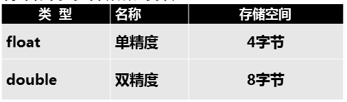
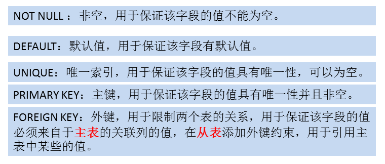
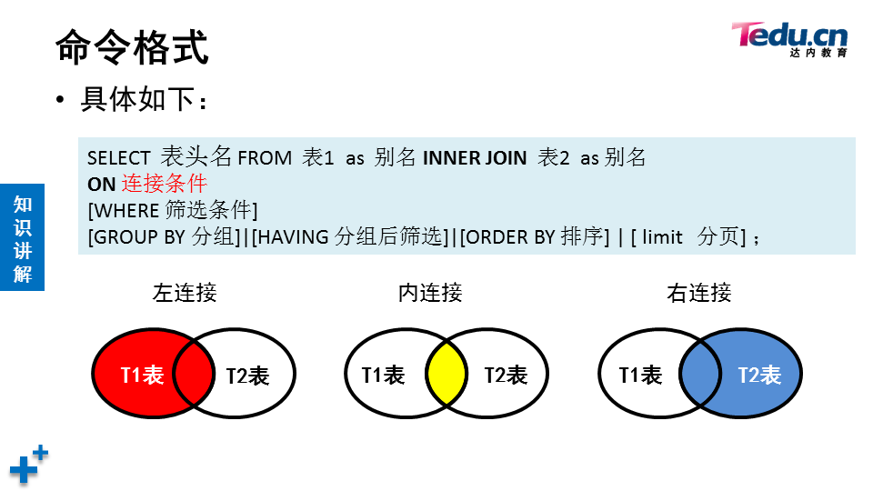

# DBA

## 命令使用

#### 修改表

```sql
## 修改表名
alter table studb.stu rename studb.stuinfo; 
## 删除表头
alter table studb.stuinfo drop age ; 
## 查看表头
desc stuinfo; 
## 添加表头，默认添加在末尾
alter table studb.stuinfo add  mail  char(30) ; 
## after 添加在指定表头名的下方
alter table  studb.stuinfo 
add number  char(9) first , 
add  school char(10) after name;
## 修改表头数据类型
alter table  studb.stuinfo  modify  mail varchar(50);
```

#### 复制表

```sql
## select 复制表只复制数据、表字段、字段类型
create table studb.salary1  select  * from tarena.salary;
## like 复制表只复制整个表结构
create table studb.salary2  like tarena.salary;
```

#### 数据批量处理

```bash
## 默认目录
/var/lib/mysql-files/

## 修改检索目录为/myload
vim /etc/my.cnf.d/mysql-server.cnf
[mysqld]
secure_file_priv=/myload  添加此行
## 赋予服务对于该目录的权限
chown mysql:mysql /myload
```

```sql
## 导入数据
load data infile "/myload/passwd" into table db1.user3 
fields terminated by ":"   # 字段间隔
lines terminated by "\n" ; # 行间隔

## 导出数据
select  name , email , phone_number 
from tarena.employees  
where employee_id <= 5 into outfile "/myload/employees.txt"  fields terminated by ":" lines terminated by "!!!!!!";
```


### 数据类型

**数值类型**
整型：


浮点类型：



定点数（Fixed Point）：DECIMAL 主要用于需要精确表示小数的场景，比如货币金额等。


**字符类型**


**枚举类型**

enum类型   单选

set类型   	多选


**时间日期型**


### 约束分类



```sql
## 删除约束
alter table db1.t36 drop primary key;

## 添加约束
alter table db1.t36 add primary key(card_id);

## 一张表只能有一个主键，但是一个主键可以包含多个字段
create table db1.t37(
	name char(10),
    char_id char(18), 
    class char(10)
    primary key (name,char_id)
);
```


### 数据库服务相关参数

主配置文件: /etc/my.cnf.d/mysql-server.cnf

数据库目录:/usr/lib/mysql

端口号:3306

进程名:  mysqld

```bash
ss -antlup | grep 3306
```

进程所有者: mysql

```bash
ps -aux | grep mysqld
```


## sql执行顺序

- FROM：首先确定数据来源，包括表、视图等，并处理任何JOIN操作。
- WHERE：对FROM子句产生的结果集进行过滤。只有满足WHERE条件的行才会被保留下来。
- GROUP BY：将符合条件的行按指定列或表达式分组。这个步骤通常与聚合函数（如COUNT, SUM, AVG等）一起使用。
- HAVING：进一步过滤由GROUP BY产生的结果集。HAVING子句允许您指定过滤条件，这与WHERE子句类似，但HAVING专门用于过滤分组后的数据。
- SELECT：选择要显示的列或表达式的值。这是许多人认为查询开始的地方，但实际上它是相对靠后执行的一个步骤。
- DISTINCT：如果查询中使用了DISTINCT关键字，那么在这一步骤中会去除重复的记录。
- ORDER BY：根据一个或多个列对结果集进行排序。注意，ORDER BY是在所有选择和过滤完成后才执行的最后一个步骤。
- LIMIT / OFFSET（如果有）：最后，限制返回的行数或跳过一定数量的行。这个功能的具体实现依赖于具体的数据库系统。


## 表连接区别



在SQL中，表连接（JOIN）是用于从多个表中检索数据的重要手段。不同的连接方式决定了哪些记录会包含在结果集中，主要基于这些表之间的关系以及如何匹配记录。以下是几种常见的SQL连接类型及其区别：

#### 1. 内连接（INNER JOIN）
- **定义**：返回两个表中满足连接条件的所有行。如果某一行在另一个表中没有匹配的记录，则该行不会出现在结果集中。
- **语法**：
  
  ```sql
  SELECT * FROM table1 INNER JOIN table/XMLSchema 0;
  ```
- **使用场景**：当你只关心那些在两个表中都有匹配记录的数据时。

#### 2. 左连接（LEFT JOIN 或 LEFT OUTER JOIN）
- **定义**：返回左表中的所有记录，以及右表中与之匹配的记录。如果没有找到匹配项，右表中的列将包含NULL值。
- **语法**：
  
  ```sql
  SELECT * FROM table1 LEFT JOIN table2 ON table1.id = table2.id;
  ```
- **使用场景**：当你希望保留左表中的所有记录，并且对右表中可能不存在匹配项的情况不敏感时。

#### 3. 右连接（RIGHT JOIN 或 RIGHT OUTER JOIN）
- **定义**：返回右表中的所有记录，以及左表中与之匹配的记录。如果没有找到匹配项，左表中的列将包含NULL值。
- **语法**：
  ```sql
  SELECT * FROM table1 RIGHT JOIN table2 ON table1.id = table2.id;
  ```
- **使用场景**：当你希望保留右表中的所有记录，并且对左表中可能不存在匹配项的情况不敏感时。

#### 4. 全外连接（FULL JOIN 或 FULL OUTER JOIN）
- **定义**：返回左右两个表中的所有记录。当某个表中没有找到匹配项时，对应的列将包含NULL值。
- **语法**：
  ```sql
  SELECT * FROM table1 FULL JOIN table2 ON table1.id = table2.id;
  ```
- **使用场景**：当你需要保留两个表中的所有记录，无论它们是否在另一个表中有匹配项时。

#### 5. 交叉连接（CROSS JOIN）
- **定义**：生成两个表的笛卡尔积，即第一个表的每一行与第二个表的每一行组合。如果不指定连接条件，结果集的大小将是两个表行数的乘积。
- **语法**：
  ```sql
  SELECT * FROM table1 CROSS JOIN table2;
  ```
- **使用场景**：通常用于生成测试数据或在特定情况下需要考虑所有可能的组合。

#### 6. 自连接（Self Join）
- **定义**：不是一种独立的连接类型，而是指一个表与自身进行连接。这通常涉及到为表取别名以便区分同一个表的不同实例。
- **语法**：
  ```sql
  SELECT a.name, b.name FROM employees a JOIN employees b ON a.manager_id = b.employee_id;
  ```
- **使用场景**：当你需要查询表中存在层次结构的数据时，比如员工和他们的经理都在同一个表中。

每种连接类型都有其特定的应用场景，选择合适的连接类型可以帮助你更高效地获取所需的数据。理解这些连接类型的区别对于编写有效的SQL查询至关重要。


## 注意事项及错误信息

```bash
SQL 错误 [1064] [42000]: You have an error in your SQL syntax; check the manual that corresponds to your MySQL server version for the right syntax to use near 'ORDER BY nx DESC' at line 9

## 解决
GROUP BY 子句中的列：当你使用了聚合函数（如 SUM()），并在 SELECT 中选择了非聚合列时，所有非聚合列都必须出现在 GROUP BY 子句中。
```


```bash
SQL 错误 [1366] [HY000]: Incorrect string value: '\xE5\xAE\xA2\xE6\x9C\x8D...' for column 'departname' at row 1

## 解决
字符编码不匹配的问题。为了确保能够正确地存储和处理中文字符，你需要确保数据库、表以及列都使用支持中文的字符集，如 utf8mb4。

CHARSET=utf8mb4 COLLATE=utf8mb4_unicode_ci;
```


# Redis

#### 软件安装使用

```bash
[root@redis64 ~]# yum -y install redis  安装软件
[root@redis64 ~]# systemctl  start redis 启动服务
[root@redis64 ~]# netstat  -utnlp  | grep redis-server  查看端口
tcp        0      0 127.0.0.1:6379    0.0.0.0:*    LISTEN      1970/redis-server 1
[root@redis64 ~]# redis-cli  连接服务
[root@redis64 ~]# redis-cli  -h 192.168.88.64 -p 6364 –a 123456
```

配置文件

```bash
[root@redis64 ~]# vim /etc/redis.conf  
69  bind 192.168.88.64  ##IP地址
92  port 6364 ##端口号
508 requirepass 123456  ##密码

838 cluster-enabled  yes                         ##启用集群功能  
846 cluster-config-file  nodes-6379.conf         ##存储集群信息文件
852 cluster-node-timeout  5000  ##集群中主机通信超时时间
```

#### 常用命令

- mset mget keys type
- exists ttl expire move select
- del flushdb flushall

```bash
# mset 一次存储多个变量
mset name pyf age 80 class nsd2502
# mget 一次查看多个变量
mget name age
# keys *  查看所有变量
# select 1  切换 1号库
# move age 1  移动变量到其他库里
# exists  检查变量是否存储
exists  name
# expire 命令设置变量的过期时间，不设置 变量永不过期
expire sex 15
# ttl 查看变量过期时间
ttl sex
# type 查看变量存储数据类型
type sex
# del 删除内存里面的变量
del name
# flushdb  删除当前库的所有数据
# flushall 清空内存

```


