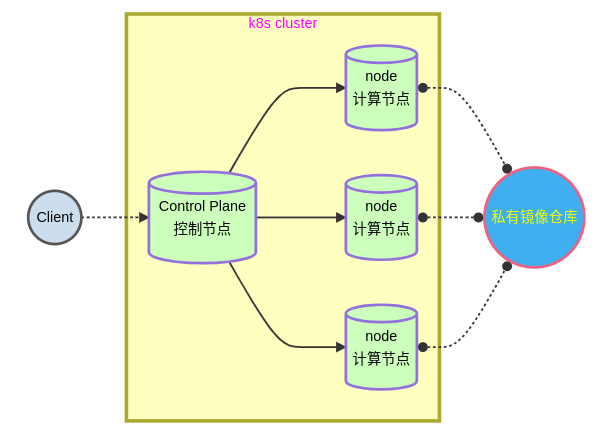

# kubernetes

## 集群图例

## kubernetes 安装

### 主机清单

| 主机名    | IP地址         | 最低配置    |
| --------- | -------------- | ----------- |
| harbor    | 192.168.88.240 | 2CPU,4G内存 |
| master    | 192.168.88.50  | 2CPU,4G内存 |
| node-0001 | 192.168.88.51  | 2CPU,2G内存 |
| node-0002 | 192.168.88.52  | 2CPU,2G内存 |
| node-0003 | 192.168.88.53  | 2CPU,2G内存 |