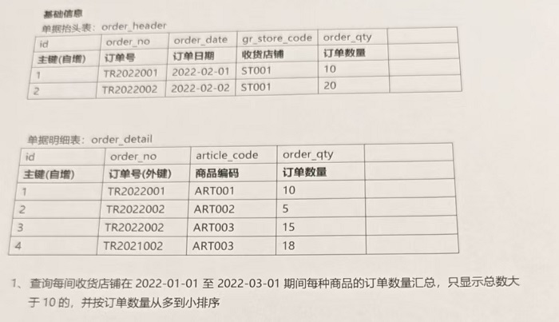
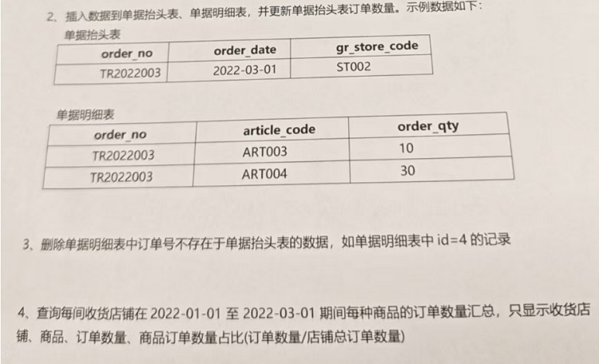

```sql
// 建表


```




```sql
select h.order_no,article_code,sum(d.order_qty) 
from order_detail d left join order_header h 
on d.order_no = h.order_no
where h.order_date between 20220101 and 20220301
group by order_no, article_code
having sum(d.order_qty) > 10
order by sum(d.order_qty) desc ;

```




```sql
delete from order_detail where order_no not in 
(select order_no from order_header);
```

```sql
SELECT 
    h.gr_store_code AS 收货商铺,
    d.article_code AS 商品,
    SUM(d.order_qty) AS 订单数量,
    SUM(d.order_qty) / SUM(SUM(d.order_qty)) 
        OVER (PARTITION BY h.gr_store_code) AS 商品订单数量占比
FROM 
    order_detail d
LEFT JOIN 
    order_header h ON d.order_no = h.order_no
WHERE 
    h.order_date IS NULL OR h.order_date BETWEEN '2022-01-01' AND '2022-03-31'
GROUP BY 
    d.article_code, h.gr_store_code;
```

