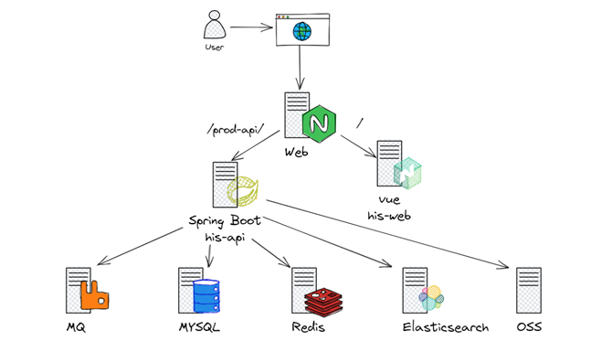
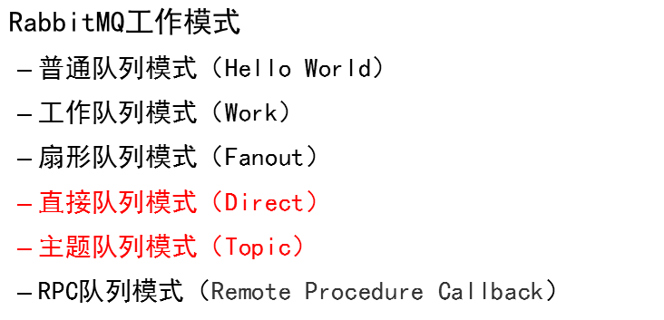
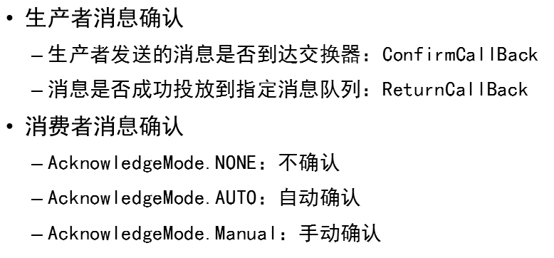

# Project02




## CI/CD


## Elasticsearch

基于Lucene的搜索服务器

提供分布式多用户能力的全文搜索引擎，基于RESTful WEB 接口

使用java语言开发

**功能：**

企业搜索：提升任何用例的搜索和发现体验

日志监测：快照且可拓展的日志管理

Maps：实时探索位置数据


**特性：**

流行的企业搜索引擎

兼容所有平台

秒级搜索

PB级的结构化和非结构化数据

面向文档的数据库

分布式


**常用API：**

| http1.0            | http1.1                     |
| ------------------ | --------------------------- |
| GET：获取资源      | OPTIONS：查询支持           |
| POST：传输实体文本 | PUT：传输                   |
| HEAD：获取响应报头 | DELETE：删除资料            |
|                    | TRACE：追踪路径             |
|                    | CONNECT：用隧道协议连接代理 |

```bash
curl -H 指定http请求头信息
-X HTTP方法
ES服务器地址
-d 指定要传输的数据JSON
```


## 消息队列

消息是指两个应用之间传递的数据

数据的形式有很多，文本字符串、嵌入对象

队列是一种数据结构，具有先入先出的特点

是存储消息的介质

| 优点     | 缺点           |
| -------- | -------------- |
| 异步处理 | 系统可用性降低 |
| 应用解藕 | 系统复杂度提高 |
| 流量削峰 | 一致性问题     |


#### `RabbitMQ`

基于AMQP协议，使用Erlang开发的开源消息队列中间件

Erlang是一种面向并发编程的解释型语言

**特点**

支持几乎所有的常用编程语言

可视化界面管理

插件机制

灵活策略：简单模式、工作队列模式、广播模式、路由模式、通配符模式

支持集群

可靠性：支持持久化，传输确认，发布消费确认








