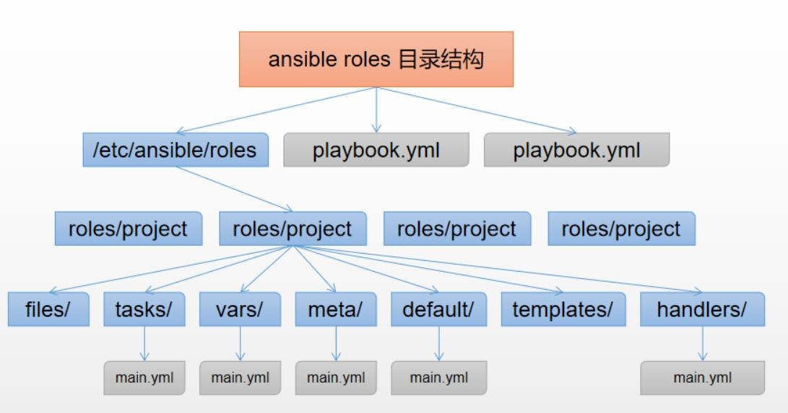

# AUTOMATION

## Ansible简介

IT运维是目前IT服务中的重要组成部分

运维方式：

- 传统运维
  - 手动操作：很多任务需要手动完成，包括系统部署、配置和故障排查等
  - 资源密集型：依赖大量人力投入，容易受到人为因素的影响
  - 反应式：更多地是根据问题出现后再进行处理和修复，缺乏主动性和预防性
  - 时间成本高：由于手动操作和反应式处理，时间成本相对较高，而且容易出现人为失误
- 自动化运维
  - 自动化工具：广泛使用自动化工具来完成系统管理、部署、监控和故障处理等任务
  - 自动化流程：通过编写脚本或使用自动化平台来实现工作流程的自动化，减少人工干预
  - 预防性维护：更注重预防性维护，通过自动化监控和报警系统，能够在问题出现前进行预警和处理
  - 时间成本低：自动化运维能够大大降低时间成本，提高效率，减少人为错误

总的来说，掌握自动化运维有助于提高工作效率，简化运维工作


#### 自动化运维工具

- Puppet：
  - Puppet 是一个基于客户端/服务器模型的自动化配置管理工具
  - 使用Ruby语言开发
  - 基于SSL，远程执行命令能力较弱能
- Chef：
  - Chef 使用 Ruby 语言编写配置文件
  - 能够实现基础设施的自动化部署、配置和管理
- SaltStack：
  - SaltStack 是一个快速、灵活的系统管理和自动化软件
  - 使用 Python 编开发
  - 支持远程执行命令、配置管理等功能
- Ansible
  - 目前应用最为广泛的自动化运维工具
  - 2012年首次发布，2015年被RedHat收购
  - 基于 Python的paramiko 开发，分布式
  - 基于SSH进行远程管理，被控节点无需额外安装任何客户端软件，轻量级
  - 配置语法使用 YMAL 及 Jinja2 模板语言
  - 使用模块管理被控节点，具备更强的远程命令执行操作能力

#### Ansible使用环境

- 控制节点
  - 安装Ansible软件
  - Python环境支持：Python>=2.6
  - 必要的模块：如PyYAML等
- 被控节点
  - 启用SSH服务
  - 允许控制节点登录，通常设置免密登录
  - Python环境支持


## Ansible部署配置

#### 配置系统源 和 自定义Ansible软件YUM源

```bash
## 自定义Ansible软件yum源

# 配置系统YUM源
[root@pubserver ~]# yum -y install vsftpd               #安装vsftpd软件
[root@pubserver ~]# vim /etc/vsftpd/vsftpd.conf         #编辑vsftpd配置启用匿名用户访问
12 anonymous_enable=YES
[root@pubserver ~]# systemctl enable --now vsftpd       #加入开机自启并立即启动
[root@pubserver ~]# ss -antlp | grep 21                 #确认21端口被监听
LISTEN 0      32                 *:21              *:*    users:(("vsftpd",pid=752,fd=3))

[root@pubserver ~]# mkdir /var/ftp/dvd                  #创建ISO文件挂载目录
[root@pubserver ~]# vim /etc/fstab                      #编辑fstab文件实现开机自动挂载
...
/dev/cdrom      /var/ftp/dvd/   iso9660 defaults 0 0
[root@pubserver ~]# mount -a                            #确认fstab配置

[root@pubserver ~]# vim /etc/yum.repos.d/local.repo     #修改local.repo文件使用本机
[local_BaseOS]
name=Rocky Linux $releasever - BaseOS
baseurl="ftp://192.168.88.240/dvd/BaseOS"       #更改
enabled=1
gpgcheck=0                                      #更改

[local_AppStream]
name=Rocky Linux $releasever - AppStream
baseurl="ftp://192.168.88.240/dvd/AppStream"    #更改
enabled=1
gpgcheck=0                                      #更改
[root@pubserver ~]# yum clean all; yum repoinfo         #确认本机网络yum源可用
...
Total packages: 8,265

# 上传Ansible相关软件到pubserver主机
[root@pubserver ~]# mkdir /var/ftp/rpms                 #创建rpm包存放目录

[root@server1 ~]# scp /linux-soft/s2/zzg/ansible_soft/* root@192.168.88.240:/var/ftp/rpms/                      #上传Ansible相关软件

[root@pubserver ~]# yum -y install createrepo_c     #安装createrepo命令包
[root@pubserver ~]# createrepo /var/ftp/rpms/           #创建软件仓库信息
[root@pubserver ~]# ls /var/ftp/rpms/
ansible-6.3.0-1.el8.noarch.rpm  
ansible-core-2.13.3-1.el8.x86_64.rpm  
cowsay-3.04-16.el8.noarch.rpm  
repodata        #确保有该目录

# 配置自定义yum源
[root@pubserver ~]# vim /etc/yum.repos.d/local.repo     #增加自定义yum源配置，在文件最后追加
...
[ansible-rpms]
name=ansible-rpms
baseurl="ftp://192.168.88.240/rpms"
enabled=1
gpgcheck=0
[root@pubserver ~]# yum clean all; yum repoinfo
...
Total packages: 8,268

# 同步repo文件到所有被控节点
[root@pubserver ~]# for i in 192.168.88.1{1..3}
 do
 scp /etc/yum.repos.d/local.repo root@$i:/etc/yum.repos.d/
 done
```

#### 被控节点基础配置

```bash
## 配置hosts文件，确保控制节点通过主机名访问到被控节点
[root@pubserver ~]# vim /etc/hosts                      #编辑hosts文件配置主机名解析
192.168.88.240  pubserver
192.168.88.11   web1
192.168.88.12   web2
192.168.88.13   db1
#测试hosts文件配置
[root@pubserver ~]# for i in pubserver web1 web2 db1    
 do
 ping -c 2 $i
 done
```

- 配置免密登录被控节点

```bash
## 配置控制节点免密登录被控节点
[root@pubserver ~]# ssh-keygen -t rsa -f /root/.ssh/id_rsa -N ''    #非交互生成秘钥对
#发送公钥到被控节点
[root@pubserver ~]# for i in web1 web2 db1              
 do
 ssh-copy-id root@$i
 done
 
#确认免密登录，结果显示web1，web2，db1
[root@pubserver ~]# for i in web1 web2 db1              
 do 
 ssh root@$i "hostname"
 done
```

#### 被控节点Ansible管理环境配置

- 配置目标

  - 使用同一套Ansible软件管理多个环境，如开发环境、测试环境、生产环境

  - 多用户使用同一个控制节点管理不同主机
  - 每个用户有属于自己的配置环境(工作目录)

- Ansible配置文件查找顺序

  - 首先检测ANSIBLE_CONFIG变量定义的配置文件

  ```bash
  ##配置ANSIBLE_CONFIG变量
  #1）
  export ANSIBLE_CONFIG=/root/ansible/ansible.cfg
  
  #2）或者永久设置
  [root@pubserver ansible]# vim ~/.bashrc
  export ANSIBLE_CONFIG=/root/ansible/ansible.cfg
  [root@pubserver ansible]# source ~/.bashrc
  
  #取消变量设置
  unset ANSIBLE_CONFIG
  ```

  - 其次检查当前目录下的./ansible.cfg文件
  - 再次检查当前用户家目录下的~/ansible.cfg文件
  - 最后检查/etc/ansible/ansible.cfg文件

- 控制节点配置

```bash
## 根据上述结果，创建自定义Ansible工作目录
# 查看默认配置文件
[root@pubserver ~]# cat /etc/ansible/ansible.cfg            #查看默认配置，通常不用该文件
[root@pubserver ~]# ansible-config init     #根据提示查看配置条目
# 自定义Ansible工作目录
[root@pubserver ~]# mkdir ansible       #自定义工作目录，名称自定义
[root@pubserver ~]# cd ansible/         #进入工作目录，以后关于ansible操作均在此目录下进行
# 配置Ansible工具
[root@pubserver ansible]# vim ansible.cfg               #编辑配置文件         
[defaults]                  #通用配置
inventory = inventory       #主机清单列表文件
host_key_checking = false   #不检查主机秘钥，=两边有无空格均可

[root@pubserver ansible]# vim inventory     #编辑主机清单列表文件
[webservers]        #定义主机组，名称自定义
web[1:2]            #[1:2]表示从1到2

[dbs]
db1

[cluster:children]  #cluster为组名，:children为固定写法，表示为cluster的子组
webservers
dbs

## 确认配置结果
# 命令操作一定在工作目录下执行
[root@pubserver ansible]# ansible all --list-hosts          #查看所有被控主机列表
  hosts (3):
    web1
    web2
    db1
[root@pubserver ansible]# ansible webservers --list-hosts   #查看webservers组主机列表
  hosts (2):
    web1
    web2
```


### Ansible使用方法

#### 使用方法介绍

- ad-hoc临时命令
  - 在命令行下使用ansible命令调用Ansible模块，实现被控节点远程管理
  - 通常用于查询信息或临时简易操作
- Playbook剧本
  - 把管理任务以特定的格式编辑在文件中，通过ansible-playbook命令远程管理被控节点
  - 通常用于复杂任务设计及远程执行

#### 使用方法样例

- ad-hoc临时命令

```bash
## 语法
# ansible [主机或组列表] -m 模块 -a "参数"
# 常用额外选项：
    # -i：指定主机清单列表文件
    # -k：使用密码登录远程主机，通常用于某个特殊被控节点未做免密登录的场景下
    
## 样例：ping模块用于测试是否可以SSH远程登录被控节点主机
[root@pubserver ansible]# ansible all -m ping
web1 | SUCCESS => {
    "ansible_facts": {
        "discovered_interpreter_python": "/usr/libexec/platform-python"
    },
    "changed": false,
    "ping": "pong"
}
...
# 返回结果为绿色的SUCCESS状态信息则为成功
# 返回结果为红色的UNREACHABLE则为失败，需要检测管理节点与被控节点网络统计和是否可以免密登录
```

- Playbook剧本(暂时先了解)

```bash
## 语法
# ansible-playbook 剧本名称
## 样例：ping模块测试
[root@pubserver ansible]# vim ping.yaml
---
- name: test connection
  hosts: all
  tasks:
    - name: test ssh connection
      ping:
[root@pubserver ansible]# ansible-playbook ping.yaml 

PLAY [test connection] *******************************************************************************

TASK [Gathering Facts] *******************************************************************************
ok: [web2]
ok: [web1]
ok: [db1]

TASK [test ssh connection] ***************************************************************************
ok: [web1]
ok: [web2]
ok: [db1]

PLAY RECAP *******************************************************************************************
db1                        : ok=2    changed=0    unreachable=0    failed=0    skipped=0    rescued=0    ignored=0   
web1                       : ok=2    changed=0    unreachable=0    failed=0    skipped=0    rescued=0    ignored=0   
web2                       : ok=2    changed=0    unreachable=0    failed=0    skipped=0    rescued=0    ignored=0 
```


## Ansible常用模块

#### 模块是什么

- Ansible在使用过程中通过模块来完成指定任务
- Ansible模块的本质是一个文件，通常是为实现具体功能的Python脚本
- Ansible已经有很多开发好的模块，可以直接调用，具备开发能力也可以自行开发
- 多数模块都支持使用参数，需要使用的时候指定参数
- 主要学习已有的常用模块的用途及常用参数

#### 模块如何查询

- 一定要掌握ansible-doc命令

```bash
## ansible-doc命令使用方法
# 列出目前全部可用Ansible模块，按空格键向下翻页，按q退出返回命令行
[root@pubserver ansible]# ansible-doc -l

# 统计已有模块数量，WARNING信息直接忽略即可
[root@pubserver ansible]# ansible-doc -l | wc -l
7214
# 查看包含yum的模块
[root@pubserver ansible]# ansible-doc -l | grep yum

# 查看指定模块的帮助文档，按空格键向下翻页，按q退出返回命令行
[root@pubserver ansible]# ansible-doc yum
```

#### Linux系统命令相关模块

- **command模块**
  - Ansible使用的默认模块，用于在被控节点执行Linux命令
  - 不支持bash特性，如管道、重定向

```bash
# 样例
[root@pubserver ansible]# ansible web1 -m command -a "hostname" #获取被控节点主机名
[root@pubserver ansible]# ansible web1 -a "ip a s"              #获取被控节点IP地址信息

[root@pubserver ansible]# ansible web1 -a "ip a s | head -2"        #加入|后报错
web1 | FAILED | rc=255 >>
Error: either "dev" is duplicate, or "head" is a garbage.non-zero return code

[root@pubserver ansible]# ansible web1 -a "ip a s > /opt/ip.txt"    #加入>后报错
web1 | FAILED | rc=255 >>
Error: either "dev" is duplicate, or "/opt/ip.txt" is a garbage.non-zero return code
```

- **shell模块**
  - 用于在被控节点执行Linux命令
  - 支持bash特性

```bash
## 样例
# 获取IP信息前两行
[root@pubserver ansible]# ansible web1 -m shell -a "ip a s | head -2"

# 将IP地址信息重定向保存到指定文件
[root@pubserver ansible]# ansible web1 -m shell -a "ip a s > /opt/ip.txt"

# 确认重定向结果
[root@pubserver ansible]# ansible web1 -m shell -a "cat /opt/ip.txt"

# 可以修改配置文件调整默认模块
[root@pubserver ansible]# vim ansible.cfg 
[defaults]
inventory = inventory
host_key_checking = false
module_name = shell         #加入此行设置默认模块
```

- **script模块**
  - 用于在被控节点执行脚本
  - 不局限于Shell脚本

```bash
# Shell脚本
[root@pubserver ansible]# vim test.sh                               #编写shell脚本，创建张三用户，设置密码
#!/bin/bash
useradd zhangsan
echo "123456" | passwd --stdin zhangsan
[root@pubserver ansible]# ansible webservers -m script -a "test.sh" #执行test.sh脚本
[root@pubserver ansible]# ansible webservers -a "id zhangsan"       #确认执行结果

# Python脚本(可借助ChatGPT帮忙生成)
[root@pubserver ansible]# vim test.py                               #编写Python脚本
#!/usr/bin/env python3
import subprocess

username = "lisi"
password = "123456"
subprocess.run(['sudo', 'useradd', '-m', username])
subprocess.run(['sudo', 'passwd', username], input=password.encode())
print(f"用户 {username} 已创建，并设置密码成功")
[root@pubserver ansible]# ansible webservers -m script -a "test.py" #执行test.py脚本
[root@pubserver ansible]# ansible webservers -a "id lisi"           #确认执行结果
```

#### Linux文件操作相关模块

- **file模块**
  - 用于在被控节点创建文件、目录、链接文件等
  - 还可以修改权限、归属
  - 幂等性 ：执行同样等操作不会有额外的影响

```bash
## 常用参数
    path：指定文件路径
    owner：设置文件所有者
    group：设置文件所属组
    state：状态。touch表示创建文件，directory表示创建目录，link表示创建软链接，absent表示删除
    mode：设置权限
    src：source的简写，源
    dest：destination的简写，目标
## 样例
# 获取file模块帮助信息
[root@pubserver ansible]# ansible-doc file
...

# 使用file模块创建文件、目录、软链接
[root@pubserver ansible]# ansible webservers -m file -a "path=/tmp/file.txt state=touch"    #touch指文件不存在则创建，存在则刷新时间戳
[root@pubserver ansible]# ansible webservers -m file -a "path=/tmp/demo state=directory"
[root@pubserver ansible]# ansible webservers -m file -a "src=/etc/hosts dest=/tmp/hosts.txt state=link"
[root@pubserver ansible]# ansible webservers -a "ls -l /tmp/"

# 使用file模块修改文件权限和归属
[root@pubserver ansible]# ansible webservers -a "ls -l /tmp/file.txt"
[root@pubserver ansible]# ansible webservers -m file -a "path=/tmp/file.txt owner=sshd group=adm mode=0777"
[root@pubserver ansible]# ansible webservers -a "ls -l /tmp/file.txt"

# 使用file模块删除被控节点指定文件、目录、软链接
[root@pubserver ansible]# ansible webservers -m file -a "path=/tmp/file.txt state=absent"
[root@pubserver ansible]# ansible webservers -m file -a "path=/tmp/demo state=absent"
[root@pubserver ansible]# ansible webservers -m file -a "path=/tmp/hosts.txt state=absent"
```

- **copy模块**
  - 用于将控制节点指定文件发送被被控节点
  - 可理解为上传操作

```bash
## 常用参数
    src：源。控制端的文件路径
    dest：目标。被控制端的文件路径
    content：内容。需要写到文件中的内容
    
## 样例
# 获取copy模块帮助信息
[root@pubserver ansible]# ansible-doc copy
...

# 使用copy模块发送控制节点指定文件到被控节点指定目录并重命名(如果dest指定到目录则文件名不变)
[root@pubserver ansible]# ansible webservers -m copy -a "src=test.sh dest=/tmp/adduser.sh"
[root@pubserver ansible]# ansible webservers -a "ls /tmp/adduser.sh"

# 使用copy模块发送指定内容到被控节点并存储在文件中
[root@pubserver ansible]# ansible webservers -m copy -a "content='Hello World' dest=/tmp/mytest.txt"
[root@pubserver ansible]# ansible webservers -a "cat /tmp/mytest.txt"
```

- **fetch模块**
  - 用于将被控节点指定文件发送到控制节点
  - 可理解为下载操作

```bash
## 常用参数
    src：源。被控制端的文件路径
    dest：目标。控制端的文件路径

## 样例
# 获取fetch模块帮助信息
[root@pubserver ansible]# ansible-doc fetch
...

# 使用fetch模块收集被控节点指定文件到控制节点(默认在控制节点生成/dest_path/主机名/src_path/file)
[root@pubserver ansible]# ansible webservers -m fetch -a "src=/etc/hostname dest=~/"
[root@pubserver ansible]# ls /root/web1/etc/
hostname
[root@pubserver ansible]# ls /root/web2/etc/
hostname
[root@pubserver ansible]# rm -rf /root/web*

# 使用fetch模块收集被控节点指定文件到控制节点(不生成目录结构，只保留文件到指定目录)
[root@pubserver ansible]# ansible web1 -m fetch -a "src=/etc/hosts dest=~/ flat=yes"
[root@pubserver ansible]# ls /root/hosts 
/root/hosts
[root@pubserver ansible]# rm -rf /root/hosts 
```

- lineinfile模块
  - 用于确保被控节点指定文件内有指定行
  - 替换场景下替换内容为整行内容

```bash
## 常用参数
    path：待修改的文件路径
    line：写入文件的一行内容
    regexp：正则表达式，用于查找文件中的内容

## 样例
# 确保/etc/issue文件中有Hello World行，如果不存在则追加到文件末尾
[root@pubserver ansible]# ansible webservers -a "cat /etc/issue"
[root@pubserver ansible]# ansible webservers -m lineinfile -a "path=/etc/issue line='Hello World'"
[root@pubserver ansible]# ansible webservers -a "cat /etc/issue"

# 替换/etc/issue文件中带Hello的行为Hello Linux
[root@pubserver ansible]# ansible webservers -m lineinfile -a "path=/etc/issue regexp='Hello' line='Hello Linux'"
[root@pubserver ansible]# ansible webservers -a "cat /etc/issue"
```

- replace模块
  - 用于关键词匹配替换

```bash
## 常用参数
    path：待修改的文件路径
    replace：将正则表达式查到的内容，替换成replace的内容
    regexp：正则表达式，用于查找文件中的内容
    
## 样例
# 替换/etc/issue文件中包含Hello的行中Hello为Hi
[root@pubserver ansible]# ansible webservers -m replace -a "path=/etc/issue regexp='Hello' replace='Hi'"
[root@pubserver ansible]# ansible webservers -a "cat /etc/issue"
```


#### Linux用户管理相关模块

- **user模块**
  - 用于实现Linux用户管理

```bash
## 常用参数
    name：待创建的用户名
    uid：用户ID
    group：设置主组
    groups：设置附加组
    home：设置家目录
    password：设置用户密码
    state：状态。present表示创建，它是默认选项。absent表示删除
    remove：删除家目录、邮箱等。值为yes或true都可以

## 样例
# 使用user模块创建用户
[root@pubserver ansible]# ansible webservers -m user -a "name=tom"
[root@pubserver ansible]# ansible webservers -a "id tom"

# 使用user模块创建用户并设置用户属性，group是属组，groups是附加组
[root@pubserver ansible]# ansible webservers -m user -a "name=jim uid=1010 group=adm groups=daemon,root home=/home/jim"
[root@pubserver ansible]# ansible webservers -a "id jim"

# {{}}是固定格式，表示执行命令
# password_hash()是函数，sha512是加密算法
[root@pubserver ansible]# ansible webservers -m user -a "name=tom password={{'123456'|password_hash('sha512')}}"

[root@pubserver ansible]# ansible webservers -m user -a "name=tom state=absent"
[root@pubserver ansible]# ansible webservers -m user -a "name=jim state=absent remove=true"
```

- **group模块**
  - 用于实现Linux组管理

```bash
## 常用参数
    name：待创建的组名
    gid：组的ID号
    state：present表示创建，它是默认选项。absent表示删除

## 样例
# 使用group模块创建devops组
[root@pubserver ansible]# ansible webservers -m group -a "name=devops"
[root@pubserver ansible]# ansible webservers -a "cat /etc/group | grep devops"

# 使用group模块删除devops组
[root@pubserver ansible]# ansible webservers -m group -a "name=devops state=absent"
[root@pubserver ansible]# ansible webservers -a "cat /etc/group | grep devops"
```


#### Linux软件管理相关模块

- yum_repository模块
  - 用于管理被控节点YUM源配置文件(repo文件)

```bash
## 常用选项
    file：指定repo文件名，如果不写则以name字段为标准
    name：仓库唯一标识符
    description：仓库描述信息
    baseurl：仓库地址
    enabled：是否启用该仓库
    gpgcheck：是否校验秘钥
    state：文件状态

## 样例
# 添加BaseOS源
[root@pubserver ~]# cd /root/ansible/
[root@pubserver ansible]# ansible webservers -m yum_repository -a "file=myrepo name='BaseOS' description='Rocky Linux BaseOS' baseurl='ftp://192.168.88.240/dvd/BaseOS/' gpgcheck=false enabled=true"
[root@pubserver ansible]# ansible webservers -a "cat /etc/yum.repos.d/myrepo.repo"

# 添加AppStream源，添加到同一个文件中，会追加到文件的最后
[root@pubserver ansible]# ansible webservers -m yum_repository -a "file=myrepo name='AppStream' description='Rocky Linux AppStream' baseurl='ftp://192.168.88.240/dvd/AppStream/' gpgcheck=false enabled=true"
[root@pubserver ansible]# ansible webservers -a "cat /etc/yum.repos.d/myrepo.repo"

# 清理指定文件中的源(如果清理指定name的源文件内还有其他源则文件保留，如果无其他源则同时删除文件)
[root@pubserver ansible]# ansible webservers -m yum_repository -a "file=myrepo name=BaseOS state=absent"
[root@pubserver ansible]# ansible webservers -m yum_repository -a "file=myrepo name=AppStream state=absent"
```

- yum模块
  - 用于管理被控节点的rpm包，如安装、升级、卸载等

```bash
## 常用参数
    name：包名
    state：状态
        present表示安装，如果已安装则忽略
        latest表示安装或升级到最新版本
        absent表示卸载
## 样例
# 使用yum模块安装单个包，如已安装则忽略
[root@pubserver ansible]# ansible webservers -m yum -a "name=tar state=present"

# 使用yum模块安装多个包，包名之间使用,分隔
[root@pubserver ansible]# ansible webservers -m yum -a "name=wget,net-tools state=present"

# 使用yum模块卸载单个包
[root@pubserver ansible]# ansible webservers -m yum -a "name=wget state=absent"
```


#### Linux服务管理相关模块

- service模块
  - 用于管理Linux系统服务，如启动、关闭、重启、是否开机自启动

```bash
## 常用参数
    name：控制的服务名
    state：started表示启动；stopped表示关闭；restarted表示重启
    enabled：yes表示设置开机自启；no表示设置开机不要自启

## 样例
# 使用yum模块安装nginx服务
[root@pubserver ansible]# ansible webservers -m yum -a "name=nginx state=latest"

# 使用service模块管理nginx服务,启动nginx，加入开机自启
[root@pubserver ansible]# ansible webservers -m service -a "name=nginx state=started enabled=true"

# 验证被控节点nginx服务是否启动且设置为开机自启动
[root@pubserver ansible]# ansible webservers -a "systemctl is-active nginx"
[root@pubserver ansible]# ansible webservers -a "systemctl is-enabled nginx"
```

#### Linux磁盘/逻辑卷/文件系统管理相关模块

- parted模块
  - 用于管理被控磁盘分区

```bash
## 常用参数
    device：待分区的设备
    number：分区编号
    state：present表示创建，absent表示删除
    part_start：分区的起始位置，不写表示从开头
    part_end：表示分区的结束位置，不写表示到结尾
    label：表示标签，要使用的磁盘标签类型，分区表

## 样例
# 将web1虚拟机关机，添加两块20G的虚拟磁盘(该步骤自行操作)
[root@pubserver ansible]# ansible web1 -a "lsblk"
web1 | CHANGED | rc=0 >>
NAME   MAJ:MIN RM SIZE RO TYPE MOUNTPOINT
vda    253:0    0  20G  0 disk 
└─vda1 253:1    0  20G  0 part /
vdb    253:16   0  20G  0 disk 
vdc    253:32   0  20G  0 disk 
# 磁盘分区知识点回顾
    常用的分区表类型有：MBR（主引导记录）、GPT（GUID分区表）
    MBR最多支持4个主分区，或3个主分区加1个扩展分区。最大支持2.2TB左右的硬盘
    GPT最多支持128个主分区。支持大硬盘

# 使用parted模块对/dev/vdb磁盘进行分区操作
[root@pubserver ansible]# ansible web1 -m parted -a "device=/dev/vdb number=1 part_end=5GiB label=gpt state=present"        #不指定part_start则从0%开始
[root@pubserver ansible]# ansible web1 -m parted -a "device=/dev/vdb number=2 part_start=5GiB label=gpt state=present"      #不指定part_end则到100%为止
[root@pubserver ansible]# ansible web1 -a "lsblk"
web1 | CHANGED | rc=0 >>
NAME   MAJ:MIN RM SIZE RO TYPE MOUNTPOINT
vda    253:0    0  20G  0 disk 
└─vda1 253:1    0  20G  0 part /
vdb    253:16   0  20G  0 disk 
├─vdb1 253:17   0   5G  0 part 
└─vdb2 253:18   0  15G  0 part 
vdc    253:32   0  20G  0 disk 
```

- lvg模块
  - 用于管理卷组，包括创建、删除等

```bash

## 常用参数
    vg：定义卷组名。vg：volume group
    pvs：由哪些物理卷构成。pvs：physical volumes
    pesize：指定物理区块大小，默认4M。pe：physical extent
    state：present创建卷组；absent删除卷组
## 样例
# 使用yum模块安装lvm2相关软件包
[root@pubserver ansible]# ansible web1 -m yum -a "name=lvm2 state=present"

# 使用lvg模块创建myvg卷组，卷组由/dev/vdb1组成
[root@pubserver ansible]# ansible web1 -m lvg -a "vg=myvg pvs=/dev/vdb1"
[root@pubserver ansible]# ansible web1 -a "vgs"
web1 | CHANGED | rc=0 >>
  VG   #PV #LV #SN Attr   VSize  VFree 
  myvg   1   0   0 wz--n- <5.00g <5.00g

# 使用lvg模块扩容myvg卷组，卷组由/dev/vdb1和/dev/vdb2组成(扩容时需要指定所有物理卷)
[root@pubserver ansible]# ansible web1 -m lvg -a "vg=myvg pvs=/dev/vdb1,/dev/vdb2"
[root@pubserver ansible]# ansible web1 -a "vgs"
web1 | CHANGED | rc=0 >>
  VG   #PV #LV #SN Attr   VSize  VFree 
  myvg   2   0   0 wz--n- 19.99g 19.99g
```

- lvol模块
  - 用于管理逻辑卷，包括创建、删除、修改逻辑卷大小

```bash
## 常用参数
    vg：指定在哪个卷组上创建逻辑卷
    lv：创建的逻辑卷名。lv：logical volume
    size：逻辑卷的大小，不写单位，以M为单位
    state：present创建逻辑卷；absent删除逻辑卷
    
## 样例
# 使用lvol模块创建mylv逻辑卷，vg=myvg在哪个卷组创建，lv=mylv指定逻辑卷的名字，size=2G逻辑卷的大小
[root@pubserver ansible]# ansible web1 -m lvol -a "vg=myvg lv=mylv size=2G"
[root@pubserver ansible]# ansible web1 -a "lvs"
web1 | CHANGED | rc=0 >>
  LV   VG   Attr       LSize Pool Origin Data%  Meta%  Move Log Cpy%Sync Convert
  mylv myvg -wi-a----- 2.00g                                                    

# 使用lvol模块扩容mylv逻辑卷，扩容直接更改大小即可，如size=4G
[root@pubserver ansible]# ansible web1 -m lvol -a "vg=myvg lv=mylv size=4G"
[root@pubserver ansible]# ansible web1 -a "lvs"
web1 | CHANGED | rc=0 >>
  LV   VG   Attr       LSize Pool Origin Data%  Meta%  Move Log Cpy%Sync Convert
  mylv myvg -wi-a----- 4.00g
```

- filesystem模块
  - 用于格式化分区，即创建文件系统

```bash
## 常用参数
    fstype：指定文件系统类型
    dev：指定要格式化的设备，可以是分区，可以是逻辑卷
    state：present用于创建文件系统；absent用于擦除文件系统
    force：用于强制操作
    
## 样例
# 使用filesystem模块格式化mylv逻辑卷，文件系统类型为ext4
[root@pubserver ansible]# ansible web1 -m filesystem -a "dev=/dev/myvg/mylv fstype=ext4 state=present"

#查看结果
[root@pubserver ansible]# ansible web1 -a "blkid /dev/myvg/mylv"
web1 | CHANGED | rc=0 >>
/dev/myvg/mylv: UUID="3d2730be-1eaf-4ec1-9340-03f86deba8fc" BLOCK_SIZE="4096" TYPE="ext4"

# 使用filesystem模块强制格式化mylv逻辑卷，文件系统类型调整为xfs
[root@pubserver ansible]# ansible web1 -m filesystem -a "dev=/dev/myvg/mylv fstype=xfs force=yes"

#查看结果
[root@pubserver ansible]# ansible web1 -a "blkid /dev/myvg/mylv"
web1 | CHANGED | rc=0 >>
/dev/myvg/mylv: UUID="8d32db4d-3412-498e-94a9-82df5e0b9e50" BLOCK_SIZE="512" TYPE="xfs"
```

- mount模块
  - 用于挂载指定分区

```bash
## 常用参数
    path：挂载点。如果挂载点不存在，自动创建。
    src：待挂载的设备
    fstype：文件系统类型
    state：mounted表示永久挂载；unmounted表示临时卸载；present表示临时挂载；absent表示永久卸载

## 样例
# 使用mount模块实现mylv逻辑卷永久挂载
[root@pubserver ansible]# ansible web1 -m mount -a "src=/dev/myvg/mylv path=/data fstype=xfs state=mounted"
[root@pubserver ansible]# ansible web1 -a "df -hT | grep data"  #查看结果
web1 | CHANGED | rc=0 >>
/dev/mapper/myvg-mylv xfs       4.0G   61M  4.0G   2% /data
[root@pubserver ansible]# ansible web1 -a "tail -1 /etc/fstab"  #已经写入fstab文件
web1 | CHANGED | rc=0 >>
/dev/myvg/mylv /data xfs defaults 0 0

# 使用mount模块实现mylv逻辑卷永久卸载
[root@pubserver ansible]# ansible web1 -m mount -a "path=/data state=absent"
[root@pubserver ansible]# ansible web1 -a "ls /data"            #挂载点已经直接删除，查看失败
[root@pubserver ansible]# ansible web1 -a "cat /etc/fstab"      #已经清理fstab文件，挂载的mylv已经清理

# 使用lvol模块删除mylv逻辑卷，force=yes：这个参数用于强制执行，如在删除逻辑卷时，即使它处于活动状态也会被强制删除
[root@pubserver ansible]# ansible web1 -m lvol -a "vg=myvg lv=mylv state=absent force=yes"

# 使用lvg模块删除myvg卷组
[root@pubserver ansible]# ansible web1 -m lvg -a "vg=myvg state=absent"
[root@pubserver ansible]# ansible web1 -a "lvs"     #没有内容显示
[root@pubserver ansible]# ansible web1 -a "vgs"     #没有内容显示
```

## Test练习

**ansible管理远程主机有哪些方式？**

答：ad-hoc临时命令、playbook剧本

**ansible ad-hoc语法格式是什么样的？**

答：语法格式为：ansible [options] pattern [-m module_name] [-a args]

pattern指定要执行任务的主机或主机组，module_name指定要使用的模块，args指定模块的参数。


## Ansible Playbook剧本

#### 使用Playbook剧本的目的

- 将需要经常执行的任务写入一个文件(剧本)，适用于周期性执行的复杂任务
- 剧本中可以包含多个任务并可以重复使用
- Playbook剧本要求按照YAML格式编写

#### YAML是什么

- YAML（YAML Ain't Markup Language）
  - 是一种人类可读性高且面向数据序列化的格式
  - 是一种格式而不是语言
  - 具备易读性、简洁和可扩展性，对人类友好，支持跨语言操作
  - 常用于配置文件、数据传输等场景
- YAML语法格式
  - 文件以 .yaml 或 .yml 扩展名为常见
  - 文件一般以`---`作为第一行，不是必须的，但是常用
  - 键值对使用冒号`:`表示，冒号后面必须有空格
  - 数组使用`-`表示，`-`后面必须有空格
  - 相同的层级必须有相同的缩进。如果缩进不对，则有语法错误。每一级缩进，建议2个空格
  - 全文不能使用tab，必须使用空格
- YAML格式数据样例


#### 配置VIM编辑器

```bash
## 编辑vimrc文件，配置yml编写约束
[root@pubserver ansible]# vim ~/.vimrc
set ai et ts=2       #ai:自动缩进 et：空格代替Tab ts：设置Tab宽度为2个空格
set cursorline		 #cursorline：高亮显示光标所在行
set cursorcolumn	 #cursorcolumn：高亮显示光标所在列
```

#### Playbook基础语法

```bash
## 编写Playbook使用ping模块测试网络连通
[root@pubserver ansible]# vim test_ping.yml
---
- name: test network        #剧本名称(可选项)
  hosts: all                #作用主机(组)
  tasks:                    #任务
    - name: test via ping   #任务1(名称可选，可以写中文)
      ping:                 #使用的模块
      
[root@pubserver ansible]# ansible-playbook --syntax-check test_ping.yml #检查文件语法
playbook: test_ping.yml
[root@pubserver ansible]# ansible-playbook test_ping.yml     #执行剧本
```


## Test练习

- 在slave组的主机上创建/tmp/slaves目录，权限是0755
- 将控制端/etc/hosts拷贝到目标主机的/tmp/slaves中

```yml
- name: Create
  hosts: slave
  tasks:
    - name: Create
      file: 
        path: /tmp/slaves
      	state: directory
      	mode: '0755'
    - name: Copy
      copy:
        src: /etc/hosts
        dest: /tmp/slaves
```

- 在slave组中的主机上创建natasha用户
- uid是3000，主组是adm，密码为123

```yml
- name: Create
  hosts: slave
  become: true   ##提升权限
  tasks: 
    - name: Create
      user:
        name: natasha
        uid: 3000
        group: adm
        password: "{{'123' | password_hash('sha512')}}"
```


## Ansible变量

#### Ansible中的facts变量

- Ansible Facts是什么
  - facts组件是Ansible用于采集被管理机器设备信息的一个功能
  - 用于采集的被控节点的设备信息
  - 主要包含IP地址、操作系统、以太网设备、mac 地址、时间/日期相关数据，硬件信息等
  - facts变量可以理解为Ansible中的预定义变量
  - facts对我们是很有帮助的，省去了我们好多工作，大大提高了工作效率
- 查看Facts变量
  - 使用setup模块，用于获取所有facts信息

```bash
## 常用参数
    filter：用于过滤指定信息
## 样例
# 通过setup模块查看所有facts信息
[root@pubserver ~]# cd /root/ansible/
[root@pubserver ansible]# ansible webservers -m setup

# facts变量是一个大的由{}构成的键值对字典
# 在{}中，有很多层级的嵌套。可以通过参数过滤出第一个层级的内容
[root@pubserver ansible]# ansible webservers -m setup -a "filter=ansible_all_ipv4_addresses"
[root@pubserver ansible]# ansible webservers -m setup -a "filter=ansible_bios_version"
[root@pubserver ansible]# ansible webservers -m setup -a "filter=ansible_hostname"
[root@pubserver ansible]# ansible webservers -m setup -a "filter=ansible_mem*"
```

- 剧本中使用facts变量
  - 剧本中可以使用debug模块打印变量信息
  - 剧本中默认有Gathering Facts的任务，收集到Facts信息后可以使用该模块打印
  - 剧本中调用变量格式：{{ 变量名 }}

```bash
## 常用参数
    msg：打印变量值，格式为：{{ 变量名 }}
    var：打印变量值，格式为：变量名
## 样例
# 命令行
[root@pubserver ansible]# ansible webservers -m debug   #默认返回值为"Hello World!"
# 剧本
[root@pubserver ansible]# vim debug1.yml 
---
- name: test debug
  hosts: webservers
  tasks:
    - name: test debug msg
      debug:
        msg: "hostname: {{ ansible_hostname }}, mem: {{ ansible_memtotal_mb }}"
[root@pubserver ansible]# ansible-playbook debug1.yml 

#扩展用法
[root@pubserver ansible]# vim debug2.yml 
---
- name: test debug
  hosts: webservers
  tasks:
    - name: test debug var
      debug:
        var: ansible_hostname, ansible_bios_version
[root@pubserver ansible]# ansible-playbook debug2.yml 
```

#### Ansible中的自定义变量

- 通过变量的使用可以让剧本更加灵活，多次运行剧本的时候只需要调整变量名即可
- Ansible支持十几种变量定义方式
- Ansible变量定义的位置，下列变量优先级从低到高
  - role defaults ：roles defaults目录下的变量
  - inventory vars：inventory文件中定义的变量
  - inventory group_vars：inventory文件组的变量
  - inventory host_vars：inventory文件主机的变量
  - playbook group_vars：剧本中组的变量
  - playbook host_vars：剧本中主机的变量
  - host facts：事实变量
  - play vars：vars定义的变量
  - play vars_prompt：vars_prompt定义的变量
  - play vars_files：vars_files导入的变量
  - registered vars：注册变量
  - role and include vars：roles中单独定义的及导入的变量
  - block vars (only for tasks in block)：block中定义的变量
  - task vars (only for the task)：任务中定义的变量
  - extra vars (always win precedence)：命令行指定的变量

#### Ansible变量测试

- 主机清单变量

```bash
## 在inventory文件中定义变量
# 主机变量
[root@pubserver ansible]# vim inventory 
[webservers]
web[1:2]

[dbs]
db1 username="liubei"   #定义属于db1主机的变量

[cluster:children]
webservers
dbs
[root@pubserver ansible]# vim var1.yml
---
- name: create user with host vars
  hosts: db1
  tasks:
    - name: test host vars
      user:
        name: "{{ username }}"
        state: present
[root@pubserver ansible]# ansible-playbook var1.yml     #运行剧本
[root@pubserver ansible]# ansible db1 -a "id liubei"    #测试结果
db1 | CHANGED | rc=0 >>
uid=1000(liubei) gid=1000(liubei) groups=1000(liubei)
[root@pubserver ansible]# 

# 组变量
[root@pubserver ansible]# vim inventory 
[webservers]
web[1:2]

[dbs]
db1 username="liubei"

[cluster:children]
webservers
dbs

[webservers:vars]   #定义属于组的变量，:vars是固定格式
username="guanyu"
[root@pubserver ansible]# vim var2.yml
---
- name: create user with group vars
  hosts: webservers
  tasks:
    - name: test group vars
      user:
        name: "{{ username }}"
        state: present
[root@pubserver ansible]# ansible-playbook var2.yml             #运行剧本
[root@pubserver ansible]# ansible webservers -a "id guanyu"     #验证结果
web1 | CHANGED | rc=0 >>
uid=1041(guanyu) gid=1041(guanyu) groups=1041(guanyu)
web2 | CHANGED | rc=0 >>
uid=1041(guanyu) gid=1041(guanyu) groups=1041(guanyu)
```

- 剧本变量

```bash
## 在Playbook中定义变量
# 变量矩阵
[root@pubserver ansible]# vim var3.yml
---
- name: create user with play vars
  hosts: webservers
  vars:                     #剧本中定义变量
    username: "zhangfei"    #定义变量
    password: "123456"      #定义变量，数字作为密码必须用引号，表示字符串
  tasks:
    - name: test play vars
      user:
        name: "{{ username }}"
        password: "{{ password|password_hash('sha512')}}"
        state: present
[root@pubserver ansible]# ansible-playbook var3.yml 

# 变量文件
[root@pubserver ansible]# vim fvars.yml
---
username: "lvbu"
password: "654321"
[root@pubserver ansible]# vim var4.yml
---
- name: create user with vars files
  hosts: webservers
  vars_files: fvars.yml     #调用定义变量的文件
  tasks:
    - name: test vars file
      user:
        name: "{{ username }}"  
        password: "{{ password | password_hash('sha512')}}"
        state: present
[root@pubserver ansible]# ansible-playbook var4.yml         #运行剧本   
[root@pubserver ansible]# ansible webservers -a "id lvbu"   #验证结果
web2 | CHANGED | rc=0 >>
uid=1043(lvbu) gid=1043(lvbu) groups=1043(lvbu)
web1 | CHANGED | rc=0 >>
uid=1043(lvbu) gid=1043(lvbu) groups=1043(lvbu)
```

- Facts变量

```bash
## 调用Facts变量
# 一定要开启Facts信息收集，gather_facts: yes
[root@pubserver ansible]# vim var5.yml
---
- name: copy file with facts
  hosts: webservers
  tasks:
    - name: use facts
      copy:
        content: "hostname: {{ ansible_hostname }}\nbios_version: {{ ansible_bios_version }}"
        dest: /tmp/facts.txt
[root@pubserver ansible]# ansible-playbook var5.yml 
[root@pubserver ansible]# ansible webservers -a "cat /tmp/facts.txt"
web2 | CHANGED | rc=0 >>
hostname: web2
bios_version: rel-1.15.0-0-g2dd4b9b3f840-prebuilt.qemu.org
web1 | CHANGED | rc=0 >>
hostname: web1
bios_version: rel-1.15.0-0-g2dd4b9b3f840-prebuilt.qemu.org 
```

#### Ansible补充模块

##### 补充模块

- Firewalld模块
  - 该模块用于配置firewalld防火墙规则
  - 防火墙一般默认拒绝访问，对于明确允许的服务进行放行操作
  - 有一些服务有名字，有些服务没有名字。但是最终都是基于TCP或UDP的某些端口
  - 比如http服务基于TCP80端口。服务名和端口号对应关系的说明文件是：/etc/services

```bash
## 常用参数
    port：声明端口
    permanent：永久生效，但不会立即生效
    immediate：立即生效，临时生效
    state：enabled，放行；disabled拒绝

## 样例
# 在webservers主机组安装nginx软件、启动服务并测试访问
# 在webservers主机组安装firewalld防火墙软件、启动服务并访问测试
# 设置防火墙放行http访问

# 安装nginx启动服务并访问测试
[root@pubserver ansible]# vim firewall.yml
---
- name: test firewalld
  hosts: webservers
  tasks:
    - name: install nginx
      yum:
        name: nginx
        state: present

    - name: start nginx
      service:
        name: nginx
        state: started
        enabled: true
[root@pubserver ansible]# ansible-playbook firewall.yml 

[root@pubserver ansible]# curl -I http://web1       #访问成功
HTTP/1.1 200 OK
...
[root@pubserver ansible]# curl -I http://web2       #访问成功
HTTP/1.1 200 OK
...

# 安装firewalld启服务并访问测试
[root@pubserver ansible]# vim firewall.yml 
---
- name: test firewalld
  hosts: webservers
  tasks:
    - name: install nginx
      yum:
        name: nginx
        state: present

    - name: start nginx
      service:
        name: nginx
        state: started
        enabled: true

    - name: install firewalld
      yum:
        name: firewalld
        state: present

    - name: start firewalld
      service:
        name: firewalld
        state: started
        enabled: true
[root@pubserver ansible]# ansible-playbook firewall.yml 

[root@pubserver ansible]# curl -I http://web1       #访问失败
curl: (7) Failed to connect to web1 port 80: No route to host
[root@pubserver ansible]# curl -I http://web2       #访问失败
curl: (7) Failed to connect to web2 port 80: No route to host

# 配置Firewalld放行规则
[root@pubserver ansible]# vim firewall.yml 
---
- name: test firewalld
  hosts: webservers
  tasks:
    - name: install nginx
      yum:
        name: nginx
        state: present

    - name: start nginx
      service:
        name: nginx
        state: started
        enabled: true

    - name: install firewalld
      yum:
        name: firewalld
        state: present

    - name: start firewalld
      service:
        name: firewalld
        state: started
        enabled: true

    - name: allow http
      firewalld:
        port: 80/tcp
        permanent: true
        immediate: true
        state: enabled
[root@pubserver ansible]# ansible-playbook firewall.yml 

[root@pubserver ansible]# curl -I http://web1       #访问成功
HTTP/1.1 200 OK
...
[root@pubserver ansible]# curl -I http://web1       #访问成功
HTTP/1.1 200 OK
```

- Template模块
  - 用于上传具备特殊格式的文件(如文件中包含变量)，文件的语法叫Jinja2
  - 被控节点接收到文件时，模板文件中的变量名会被替换成具体的值
  - 相比于copy模块更加灵活

```bash
## 常用参数
    src：要上传的文件
    dest：目标文件路径

## 样例

# 编写index.html文件模板
[root@pubserver ansible]# vim index.html.j2
Welcome to {{ ansible_hostname }} on {{ ansible_eth0.ipv4.address }}

# 编写Playbook
[root@pubserver ansible]# vim tem.yml
---
- name: upload index
  hosts: webservers
  tasks:
    - name: create web index
      template:
        src: index.html.j2
        dest: /usr/share/nginx/html/index.html
[root@pubserver ansible]# ansible-playbook tem.yml 

[root@pubserver ansible]# curl http://web1      #访问测试
Welcome to web1 on 192.168.88.11    
[root@pubserver ansible]# curl http://web2      #访问测试
Welcome to web2 on 192.168.88.12
```


## Ansible Playbook进阶语法

#### 错误处理机制

- 当Playbook中有多个task时，其中某个任务执行过程中失败则后续任务将被终止执行
- 使用ignore_errors对可能出现错误的task进行忽略处理
- ignore_errors可以应用于tasks级别作用于忽略指定任务，也可以用于全局作用于所有任务

```bash
## 样例

# 当task1失败则task2被终止
[root@pubserver ansible]# vim myerr.yml
---
- name: test error task
  hosts: webservers
  tasks:
    - name: start mysqld
      service: 
        name: mysqld
        state: started
        enabled: true

    - name: touch file
      file:
        path: /tmp/mysql.txt
        state: touch
[root@pubserver ansible]# ansible-playbook myerr.yml    #由于task1失败，task2不执行

# 指定任务忽略错误
[root@pubserver ansible]# vim myerr.yml 
---
- name: test error task
  hosts: webservers
  tasks:
    - name: start mysqld
      service: 
        name: mysqld
        state: started
        enabled: true
      ignore_errors: true       #任务级

    - name: touch file
      file:
        path: /tmp/mysql.txt
        state: touch
[root@pubserver ansible]# ansible-playbook myerr.yml 

# 全局级忽略错误
[root@pubserver ansible]# vim myerr.yml 
---
- name: test error task
  hosts: webservers
  ignore_errors: true       #全局级
  tasks:
    - name: start mysqld
      service: 
        name: mysqld
        state: started
        enabled: true

    - name: touch file
      file:
        path: /tmp/mysql.txt
        state: touch
[root@pubserver ansible]# ansible-playbook myerr.yml 
```

#### 触发执行任务

- 通过handlers定义一组任务
- 仅当某个任务触发（notify）handlers时才会执行相应任务
- 如果有多个notify触发执行handlers任务，也仅执行一次
- 仅当任务的执行状态为changed是handlers任务才执行
- handlers任务在所有其他任务都执行后才执行

```bash

## 样例

# 获取nginx配置文件
[root@pubserver ansible]# vim get_conf.yml
---
- name: get nginx config file
  hosts: webservers
  tasks:
    - name: fetch nginx config file
      fetch:
        src: /etc/nginx/nginx.conf
        dest: ./
        flat: yes   #只获取文件
[root@pubserver ansible]# ansible-playbook get_conf.yml 

# 编辑nginx配置文件中的服务端口，将端口调整为变量
[root@pubserver ansible]# vim +39 nginx.conf
...
        listen       {{ http_port }} default_server;
        listen       [::]:{{http_port}} default_server;
...

# 修改nginx服务端口为8000并重启服务
[root@pubserver ansible]# vim trigger.yml
---
- name: configure nginx
  hosts: webservers
  vars:
    http_port: 8000
  tasks:
    - name: upload nginx.conf
      template:
        src: nginx.conf
        dest: /etc/nginx/nginx.conf

    - name: restart nginx
      service:
        name: nginx
        state: restarted

# 第一次执行该剧本两个任务都是黄色的changed
[root@pubserver ansible]# ansible-playbook trigger.yml
# 第二次执行该剧本重启nginx的任务还是黄色的changed，由于配置文件未修改，则不应该重启服务
[root@pubserver ansible]# ansible-playbook trigger.yml

# 加入handlers触发器，实现只有配置文件修改了才重启服务
[root@pubserver ansible]# vim trigger.yml 
---
- name: configure nginx
  hosts: webservers
  vars:
    http_port: 80
  tasks:
    - name: upload nginx.conf
      template:
        src: nginx.conf
        dest: /etc/nginx/nginx.conf
      notify: restart nginx     #任务状态为changed时触发指定任务执行

  handlers:
    - name: restart nginx
      service:
        name: nginx
        state: restarted

# 第一次执行由于nginx配置文件发生改变即upload任务为changed状态，两个任务都是changed状态
[root@pubserver ansible]# ansible-playbook trigger.yml 
# 第二次执行由于nginx配置文件没改变，upload任务状态为ok，则restart任务不被触发
[root@pubserver ansible]# ansible-playbook trigger.yml 
```

#### when条件判断

- 当满足某些条件时才执行任务
- 多任务使用and或or进行连接，表达逻辑关系
- 注意：when表达式中的变量不需要使用{{}}

```bash
## 常用操作符
==：相等
!=：不等
>：大于
<：小于
<=：小于等于
>=：大于等于

## 样例

# 单条件测试：当目标主机内存至少4G时安装MySQL软件
[root@pubserver ansible]# vim when1.yml
---
- name: test when
  hosts: dbs
  tasks:
    - name: install mysql soft
      yum:
        name: mysql-server
        state: present
      when:
        ansible_memtotal_mb >= 4096
[root@pubserver ansible]# ansible dbs -m setup -a "filter=ansible_memtotal_mb"
[root@pubserver ansible]# ansible-playbook when1.yml    #条件不满足跳过任务执行
```


#### register注册变量

- register是用于捕获和保存任务执行结果的，它允许将其他任务的输出作为变量使用
- register是一个关键字，可以将任务执行的结果赋值给指定的变量名称
- 这个变量可以在后续任务中使用
- register模块可以捕获各种类型的输出，包括stdout、stderr、rc、changed等
- 可以与其他模块一起使用，例如"when"条件、"loop"循环等

```bash
## 样例
# 在web1主机执行创建/tmp/reg1.txt，捕获命令执行结果并打印
[root@pubserver ansible]# vim reg1.yml 
---
- name: test register
  hosts: web1
  tasks:
    - name: create file
      file:
        path: /tmp/reg1.txt
        state: touch
      register: result

    - name: display result
      debug:
        msg: "{{result}}"
[root@pubserver ansible]# ansible-playbook reg1.yml 

# 在web1主机上执行任务，创建文件/tmp/abcdemo/abc。如果创建不成功，则通过debug输出create failed
[root@pubserver ansible]# vim reg2.yml
---
- name: test register
  hosts: web1
  ignore_errors: true   #如果不忽略则任务2无法执行
  tasks:
    - name: create file
      file:
        path: /tmp/abcdemo/abc
        state: touch
      register: result

    - name: debug out
      debug:
        msg: "create failed"
      when: result.failed
[root@pubserver ansible]# ansible-playbook reg2.yml 
```


## Test练习

```yml
- name: Install
  hosts: slave01
  tasks: 
  	- name: Install package group
  	package: 
  	  name: "@Server with GUI"
	  state: present
	- name: Update system
	  yum: 
	  	name: '*'
	  	state: latest
```

```

```


## Ansible Playbook进阶语法

#### 任务块

- block任务块
  - 可以通过block关键字，将多个任务组合到一起
  - 可以将整个block任务组，一起控制是否要执行

```bash
## 样例

# 判断webservers主机组内主机系统发行版为Rocky的主机，安装nginx并启动服务
[root@pubserver ansible]# vim block1.yml
---
- name: block tasks
  hosts: webservers
  tasks:
    - name: group tasks
      block:
        - name: install nginx
          yum:
            name: nginx
            state: present

        - name: start nginx
          service:
            name: nginx
            state: started
            enabled: true

      when: ansible_distribution == "Rocky"     #条件作用与整组任务
[root@pubserver ansible]# ansible-playbook block1.yml 
```

- rescue和always
  - 主要用于补充block任务
  - block中的任务都执行成功则rescue中的任务不执行
  - block中的任务出现失败则执行rescue中的任务
  - always中的任务总会执行

```bash
## 样例

# 测试block任务执行成功
[root@pubserver ansible]# vim block2.yml
---
- name: test block/rescue/always
  hosts: webservers
  tasks:
    - name: test
      block:
        - name: touch file1
          file:
            path: /tmp/test1.txt
            state: touch
      rescue:
        - name: touch file2
          file:
            path: /tmp/test2.txt
            state: touch
      always:
        - name: touch file3
          file:
            path: /tmp/test3.txt
            state: touch
[root@pubserver ansible]# ansible-playbook block2.yml 
[root@pubserver ansible]# ansible webservers -a "ls /tmp/test*" #未创建/tmp/test2.txt
web1 | CHANGED | rc=0 >>
/tmp/test1.txt
/tmp/test3.txt
web2 | CHANGED | rc=0 >>
/tmp/test1.txt
/tmp/test3.txt

# 测试block任务执行失败
[root@pubserver ansible]# vim block3.yml
---
- name: test block/rescue/always
  hosts: webservers
  tasks:
    - name: test 
      block:
        - name: touch file11
          file:
            path: /tmp/abcd/test11.txt
            state: touch
      rescue:
        - name: touch file22
          file:
            path: /tmp/test22.txt
            state: touch
      always:
        - name: test file33
          file:
            path: /tmp/test33.txt
            state: touch
[root@pubserver ansible]# ansible-playbook block3.yml 
[root@pubserver ansible]# ansible webservers -a "ls /tmp/test*"
web1 | CHANGED | rc=0 >>
/tmp/test1.txt
/tmp/test22.txt
/tmp/test33.txt
/tmp/test3.txt
web2 | CHANGED | rc=0 >>
/tmp/test1.txt
/tmp/test22.txt
/tmp/test33.txt
/tmp/test3.txt
```

#### loop循环

- 用法相当于使用shell中的for循环
- 特点是loop中的变量名固定为：item

```bash
## 变量定义方法
    简单变量：单个元素赋值给item
        loop: [a,b,c,d]
        loop:
          - a
          - b
          - c
    复杂变量：整体赋值给item，可以用item.key获取指定value
        loop: 
          - {"key": "value", "key": "value"}
          
## 样例
# 简单变量
[root@pubserver ansible]# vim loop1.yml
---
- name: create dirs
  hosts: webservers
  tasks:
    - name: create dir with loop
      file:
        path: /tmp/{{item}}
        state: directory
      loop: [aa,bb,cc]
[root@pubserver ansible]# ansible-playbook loop1.yml 

# 复杂变量
[root@pubserver ansible]# vim loop2.yml
---
- name: create users
  hosts: webservers
  tasks:
    - name: create user with loop
      user:
        name: "{{item.iname}}"
        password: "{{item.ipass|password_hash('sha512')}}"
        state: present
      loop:
        - {"iname":"sunwukong", "ipass":"123456"}
        - {"iname":"zhubajie", "ipass":"654321"}
[root@pubserver ansible]# ansible-playbook loop2.yml 
[root@pubserver ansible]# ansible webservers -a "id sunwukong;id zhubajie"
```

## Ansible角色

#### Roles产生原因

- 在实际生产环境中，为了实现不同功能，我们会编写大量的Playbook文件
- 每个Playbook文件可能还会调用其他文件，如变量文件
- 对于海量的、无规律的文件，管理起来是一件非常困难的事情

#### 什么是Roles

- ansible自1.2版本引入的新特性，用于层次性、结构化地组织playbook
- roles能够根据层次型结构自动装载变量文件、tasks以及handlers等
- 要使用roles只需要在playbook中使用include指令引入即可
- 简单来讲，roles就是通过分别将变量、文件、任务、模板及处理器放置于单独的目录中，并可以便捷的include它们的一种机制
- 角色一般用于基于主机构建服务的场景中，但也可以是用于构建守护进程等场景中
- playbook局限在于如果文件较多的情况，不清楚哪些主机执行了哪些状态的yml文件，roles能清楚哪些主机应用哪些角色，主要使用场景代码复用度较高的情况下

#### Roles目录结构



```bash
roles:                  #角色必须放在roles目录下，可以自定义位置，默认/etc/ansible/roles/
    project:            #角色项目名称
        files:          #用于存放静态文件，如copy或script模块需要调用的文件
        templates:      #用于存放动态文件，即jinja2模板，template模块会自动到此目录下寻找模板文件
        tasks:          #定义任务列表的地方
            main.yml        #任务列表内容编写在此文件中
        handlers:       #定义触发器的地方
            main.yml        #触发器内容编写在此文件中
        vars:           #定义变量的地方（优先级高）
            main.yml        #变量定义在此文件中
        defaults:       #定义变量缺省值的地方（优先级低）
            main.yml
        meta:           #定义作者、版本等描述信息、依赖关系等
            main.yml
        README.md       #整个角色的描述信息
```

#### Roles使用

- 不使用Roles完成文件同步

```bash
## 使用Playbook结合template文件完成文件同步

# 编写j2模板
[root@pubserver ansible]# vim motd.j2
Hostname: "{{ansible_hostname }}"
Date: "{{ansible_date_time.date}}"
Contact to: "{{admin}}"

# 编写Playbook
[root@pubserver ansible]# vim motd.yml
---
- name: modify /etc/motd
  hosts: webservers
  vars:
    admin: root@tedu.cn
  tasks:
    - name: modify motd
      template:
        src: motd.j2
        dest: /etc/motd
        
# 执行剧本测试结果
[root@pubserver ansible]# ansible-playbook motd.yml 
[root@pubserver ansible]# ansible webservers -a "cat /etc/motd"
web2 | CHANGED | rc=0 >>
Hostname: "web2"
Date: "2024-03-28"
Contact to: "root@tedu.cn"
web1 | CHANGED | rc=0 >>
Hostname: "web1"
Date: "2024-03-28"
Contact to: "root@tedu.cn"
[root@pubserver ansible]# 
```

- 使用Roles完成文件同步

```bash
## 使用角色完成文件分发

# 修改配置文件
[root@pubserver ansible]# mkdir roles
[root@pubserver ansible]# vim ansible.cfg 
[defaults]
inventory = inventory
host_key_checking = false
module_name = shell
roles_path = ./roles

## 创建角色
[root@pubserver ansible]# ansible-galaxy init roles/motd
- Role roles/motd was created successfully
[root@pubserver ansible]# tree roles/motd/
roles/motd/
├── defaults
│   └── main.yml
├── files
├── handlers
│   └── main.yml
├── meta
│   └── main.yml
├── README.md
├── tasks
│   └── main.yml
├── templates
├── tests
│   ├── inventory
│   └── test.yml
└── vars
    └── main.yml

8 directories, 8 files
[root@pubserver ansible]# ansible-galaxy list
# /root/ansible/roles
- motd, (unknown version)

## 配置角色
# 创建模板文件
[root@pubserver ansible]# vim roles/motd/templates/motd.j2
Hostname: "{{ansible_hostname}}"
Date: "{{ansible_date_time.date}}"
Contact to: "{{admin}}"

# 创建变量
[root@pubserver ansible]# vim roles/motd/vars/main.yml 
---
# vars file for roles/motd
admin: "test@tedu.cn"

# 创建任务
[root@pubserver ansible]# vim roles/motd/tasks/main.yml 
---
# tasks file for roles/motd
- name: modify motd
  template:
    src: motd.j2
    dest: /etc/motd

## 使用角色
[root@pubserver ansible]# vim role_motd.yml
---
- name: modify motd with role
  hosts: webservers
  roles:
    - motd
[root@pubserver ansible]# ansible-playbook role_motd.yml 
[root@pubserver ansible]# ansible webservers -a "cat /etc/motd"
web2 | CHANGED | rc=0 >>
Hostname: "web2"
Date: "2024-03-28"
Contact to: "test@tedu.cn"
web1 | CHANGED | rc=0 >>
Hostname: "web1"
Date: "2024-03-28"
Contact to: "test@tedu.cn"
```


## Ansible加密解密文件

#### ansible-vault命令

- 该命令用于实现数据加密/解密

```bash
## 常用选项
    encrypt：加密
    decrypt：解密
    view：查看
    rekey：重置密码

## 样例

# 创建测试文件
[root@pubserver ansible]# echo "Hello World" > hello.txt
[root@pubserver ansible]# cat hello.txt 
Hello World

# 加密文件
[root@pubserver ansible]# ansible-vault encrypt hello.txt 
New Vault password: 1234
Confirm New Vault password: 1234
Encryption successful
[root@pubserver ansible]# cat hello.txt 
$ANSIBLE_VAULT;1.1;AES256
33303462363266366362613937393833383635386234616464663462613234373436323761666238
3835323361616133346632323066313432316666343565390a306563313233353362333735316563
34646361633331386438393963376535386431303230613338626464323637336363346362623039
6262663438613938310a376238636462633638663338663239376137386230306463613533323663
3635

# 解密文件
[root@pubserver ansible]# ansible-vault decrypt hello.txt 
Vault password: 1234
Decryption successful
[root@pubserver ansible]# cat hello.txt 
Hello World

# 重置密码
[root@pubserver ansible]# ansible-vault encrypt hello.txt 
New Vault password: 1234
Confirm New Vault password: 1234
Encryption successful
[root@pubserver ansible]# ansible-vault rekey hello.txt 
Vault password: 1234
New Vault password: abcd
Confirm New Vault password: abcd
Rekey successful
[root@pubserver ansible]# 

# 不解密文件查看内容
[root@pubserver ansible]# cat hello.txt 
$ANSIBLE_VAULT;1.1;AES256
63326162313136393234623264366364363464653536303666656631653433356236366162643834
6430303335333666626632396433653838653236303734390a383038653832636437616563383738
32323135353865613334633731323166376535313033653463353730306266653035663439633435
3637326363393833660a393364343839393766326436393035336265343639356333633736343366
3331
[root@pubserver ansible]# ansible-vault view hello.txt 
Vault password: abcd
Hello World
[root@pubserver ansible]# cat hello.txt 
$ANSIBLE_VAULT;1.1;AES256
63326162313136393234623264366364363464653536303666656631653433356236366162643834
6430303335333666626632396433653838653236303734390a383038653832636437616563383738
32323135353865613334633731323166376535313033653463353730306266653035663439633435
3637326363393833660a393364343839393766326436393035336265343639356333633736343366
3331

# 使用密码文件
[root@pubserver ansible]# echo "tedu.cn" > pass.txt
[root@pubserver ansible]# echo "Hello Linux" > data.txt
[root@pubserver ansible]# ansible-vault encrypt --vault-password-file=pass.txt data.txt 
Encryption successful
[root@pubserver ansible]# cat data.txt 
$ANSIBLE_VAULT;1.1;AES256
64383062326638366339383539663866636665396131316166396230633130313064376532626331
3634393066383031313930363834383266363934356666390a373832303537366664333861373562
66653863353862316232333161333637306535373931393262346231613832363065353863313433
3464393964666330390a393362383034626238653566643065346439643732393738653663363836
3765
[root@pubserver ansible]# ansible-vault view --vault-password-file=pass.txt data.txt 
Hello Linux
[root@pubserver ansible]# ansible-vault decrypt --vault-password-file=pass.txt data.txt 
Decryption successful
[root@pubserver ansible]# cat data.txt 
Hello Linux
```

- 使用Playbook管理被控节点，如果剧本中有敏感数据(如密码等)则需要对剧本加密
- 执行剧本时通过--ask-vault-password选项提示数据密码

```bash
## 样例
# 编写测试剧本
[root@pubserver ansible]# vim user_test.yml
---
- name: create user
  hosts: webservers
  tasks:
    - name: create tangsanzang
      user:
        name: tangsanzang
        password: "{{'123'|password_hash('sha512')}}"
        state: present
# 加密剧本
[root@pubserver ansible]# ansible-vault encrypt user_test.yml 
New Vault password: 123456
Confirm New Vault password: 123456
Encryption successful
# 测试剧本执行
[root@pubserver ansible]# ansible-playbook user_test.yml    #报错无法执行
ERROR! Attempting to decrypt but no vault secrets found
# 执行加密剧本
[root@pubserver ansible]# ansible-playbook --ask-vault-password user_test.yml 
Vault password: 123456
...
# 确认结果
[root@pubserver ansible]# ansible webservers -a "id tangsanzang"
web1 | CHANGED | rc=0 >>
uid=1046(tangsanzang) gid=1046(tangsanzang) groups=1046(tangsanzang)
web2 | CHANGED | rc=0 >>
uid=1046(tangsanzang) gid=1046(tangsanzang) groups=1046(tangsanzang)
```


## sudo提权

#### sudo提权概念

- 什么是sudo提权
  - superuser or another do
  - 以超级管理或其他人的身份执行命令
- 为什么要提权
  - Linux系统维护过程中如果一直用root用户权限过大
  - 允许root用户远程登录存在风险
- 提权流程
  - 管理员授权（修改/etc/sudoers文件）
  - 普通用户以sudo的形式执行命令
  - 可以通过sudo -l查看授权情况
- sudo提权配置方式（修改/etc/sudoers文件）
  - 修改授权方法
    - visudo（带语法检查，默认没有颜色提示）
    - vim /etc/sudoers（不带语法检查，默认有颜色提示）
  - 授权格式

```
用户名或组名(%groupname)      在集中认证域中有效，单机忽略      可以执行的命令列表
用户/组                        ALL=(ALL)                   NOPASSWD: ALL
```

#### Ansible配置sudo提权

```bash
## 样例
# 被控节点创建用户并配置sudo提权
[root@pubserver ansible]# vim sudouser.yml 
---
- name: sudo user
  hosts: all
  tasks:
    - name: create sudo user
      user:
        name: alice
        password: "{{'123456'|password_hash('sha512')}}"
        state: present
    - name: config sudo
      lineinfile:
        path: /etc/sudoers
        line: "alice ALL=(ALL) NOPASSWD: ALL"
        state: present
[root@pubserver ansible]# ansible-playbook sudouser.yml 

# 修改ansible配置文件
[root@pubserver ansible]# vim ansible.cfg 
[defaults]
inventory = inventory
host_key_checking = false
module_name = shell
roles_path = ./roles
remote_user = alice
[privilege_escalation]
become = true
become_method = sudo
become_user = root
become_ask_pass = false

# 配置ssh使用alice用户免密登录，alice密码123456
[root@pubserver ansible]# for i in web1 web2 db1
 do
 ssh-copy-id alice@$i
 done

# 测试
[root@pubserver ansible]# ansible all -m ping
```


#### ansible.cfg 配置文件解释

```bash
[defaults] 部分
1. inventory = inventory
   含义：指定默认的库存文件路径。
   作用：如果运行 Ansible 命令时未通过 -i 参数指定库存文件，Ansible 将使用此路径下的文件作为库存文件。
   在这里，inventory 是一个相对路径，表示当前目录下的 inventory 文件。

2. host_key_checking = false
   含义：禁用 SSH 主机密钥检查。
   作用：默认情况下，SSH 会检查目标主机的公钥是否在 ~/.ssh/known_hosts 文件中。如果主机未被信任，连接会被拒绝。
   设置为 false 后，Ansible 不会检查主机密钥，适用于测试环境或自动化场景。

3. module_name = shell
   含义：设置默认模块。
   作用：当运行 ansible 命令时，如果没有明确指定模块（如 -m 参数），Ansible 将使用此处定义的模块。在这里，默认模块被设置为 shell，即运行命令时会默认调用 shell 模块。

4. roles_path = ./roles
   含义：指定角色的搜索路径。
   作用：Ansible 角色（Roles）是组织任务、变量、文件等的标准方式。
   此选项指定了 Ansible 查找角色的路径。在这里，角色路径被设置为当前目录下的 roles 文件夹。
   示例： 如果你有角色 myrole 存放在 ./roles/myrole 中，可以通过以下方式引用：

5. remote_user = alice
   含义：设置远程主机的默认用户。
   作用：Ansible 会以该用户身份连接到远程主机。在这里，默认用户被设置为 alice。
   如果需要以其他用户身份连接，可以在库存文件中覆盖此设置，例如：

[privilege_escalation] 部分
1. become = true
   含义：启用权限提升。
   作用：become 是 Ansible 提供的权限提升机制，允许普通用户以更高权限（如 root）执行任务。
   设置为 true 后，Ansible 默认会尝试提升权限。

2. become_method = sudo
   含义：指定权限提升的方法。
   作用：在这里，权限提升方法被设置为 sudo，即通过 sudo 命令提升权限。
   其他可选值包括 su、pbrun、pfexec 等，具体取决于目标系统的配置。

3. become_user = root
   含义：指定提升权限后的目标用户。
   作用：在这里，权限提升后将以 root 用户身份执行任务。
   如果需要以其他用户身份执行任务，可以在 Playbook 或命令行中覆盖此设置。

4. become_ask_pass = false
   含义：是否提示输入权限提升密码。
   作用：设置为 false 表示不会提示输入密码，通常与无密码 sudo 配合使用。
   如果设置为 true，Ansible 会在运行时提示输入权限提升密码。
```


## 特殊的主机清单变量

#### 特殊情况处理

- 如某个被控节点不能免密登录、ssh服务端口不是标准22端口等情况
- 则需要配置特殊的主机清单变量

```bash
## 常用配置
    ansible_ssh_host：指定被控节点服务器IP地址
    ansible_ssh_user：指定登陆远程主机的用户名
    ansible_ssh_pass：指定登陆远程主机的密码
    ansible_ssh_port：指定登陆远程主机的端口号
## 样例
# 调整web1主机配置用于测试
[root@web1 ~]# rm -rf /root/.ssh/authorized_keys            #清理公钥恢复密码登录
[root@web1 ~]# systemctl disable --now firewalld            #关闭防火墙
[root@web1 ~]# vim +17 /etc/ssh/sshd_config                 #配置ssh端口为2222
Port 2222
[root@web1 ~]# systemctl restart sshd                       #重启sshd服务

# 调整pubserver的hosts文件注释web1主机名解析
[root@pubserver ansible]# vim /etc/hosts
...
#192.168.88.11  web1
...

# 创建新工作目录并配置Ansible
[root@pubserver ansible]# cd
[root@pubserver ~]# mkdir myansible
[root@pubserver ~]# cd myansible/
[root@pubserver myansible]# vim ansible.cfg 
[defaults]
inventory = inventory
[root@pubserver myansible]# vim inventory 
[group1]
web1
web2
db1

# 测试Ansible使用
[root@pubserver myansible]# ansible all -m ping #web1主机连接失败
web1 | UNREACHABLE! => {
    "changed": false,
    "msg": "Failed to connect to the host via ssh: ssh: Could not resolve hostname web1: Name or service not known",
    "unreachable": true
}
...

# 配置特殊的主机清单变量
[root@pubserver myansible]# vim inventory 
[group1]
web1 ansible_ssh_host=192.168.88.11 ansible_ssh_port=2222 ansible_ssh_user=root ansible_ssh_pass=a
web2
db1

# 测试特殊的主机清单变量，可以成功
[root@pubserver myansible]# ansible all -m ping
```

知识点思维导图：https://flowus.cn/share/7875c0e1-ebbd-4dad-aa7e-f40e6ed6c6d3


