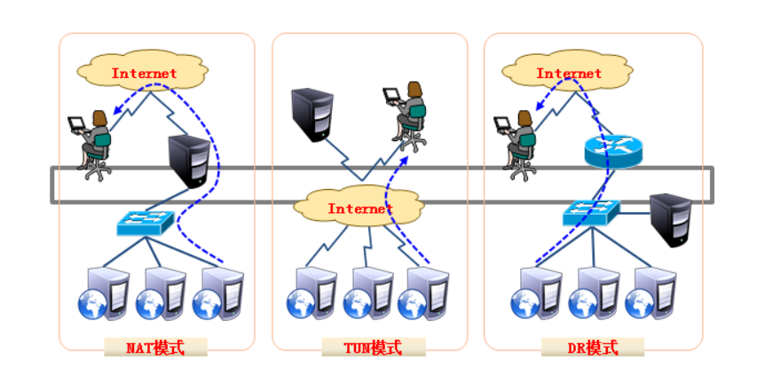
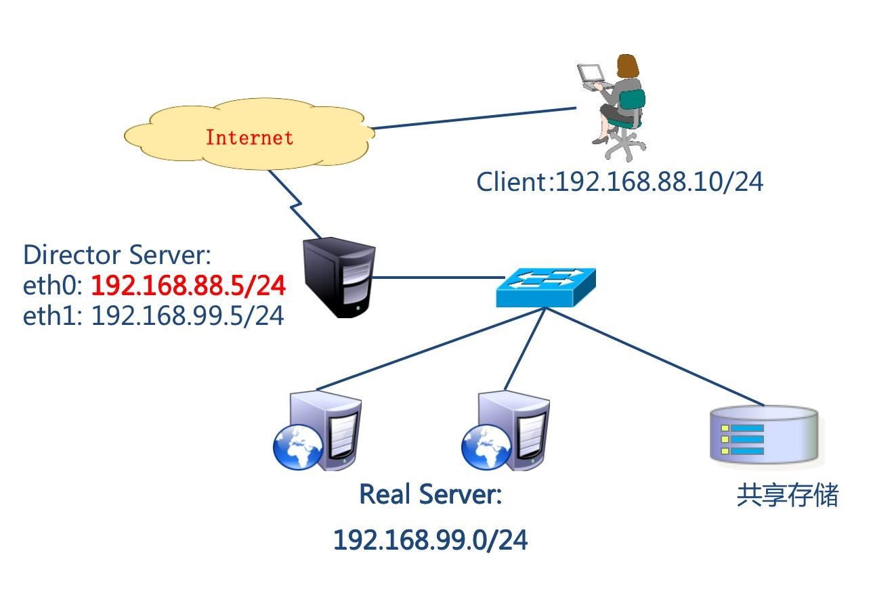
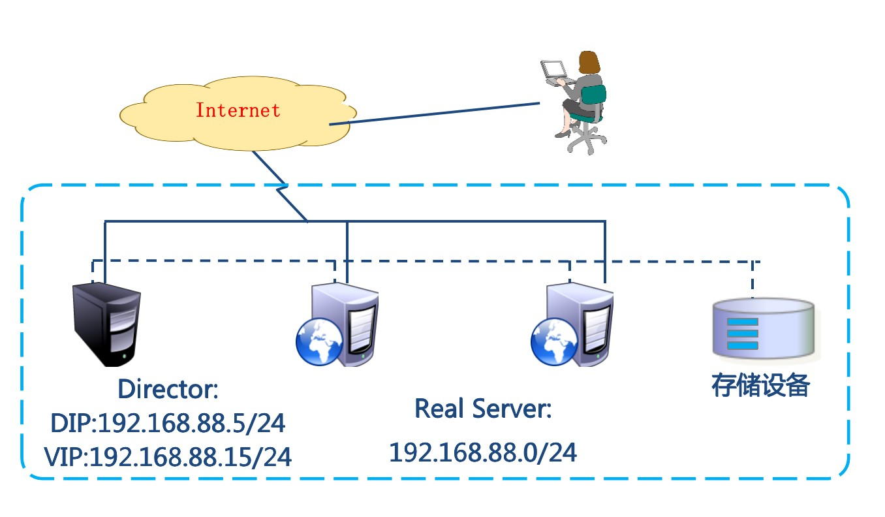
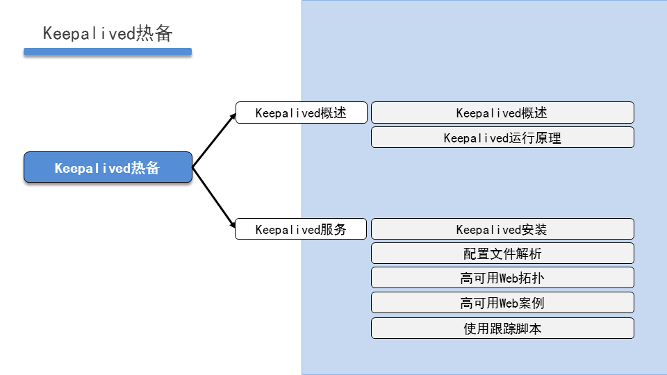
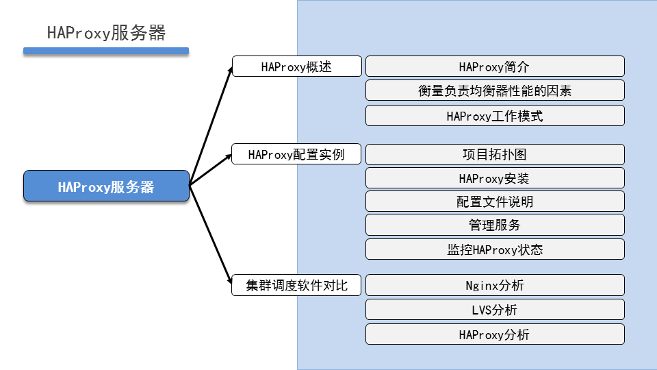
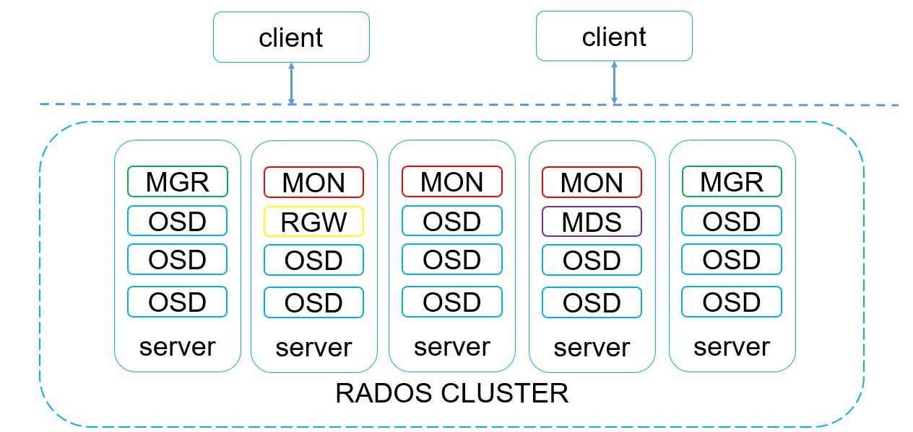
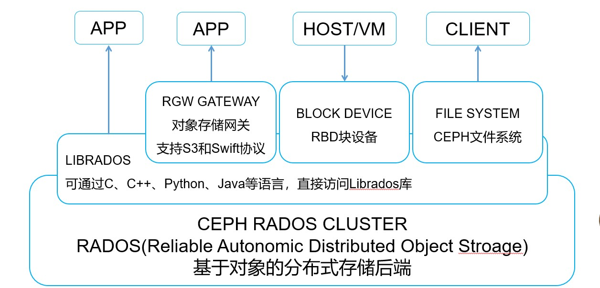
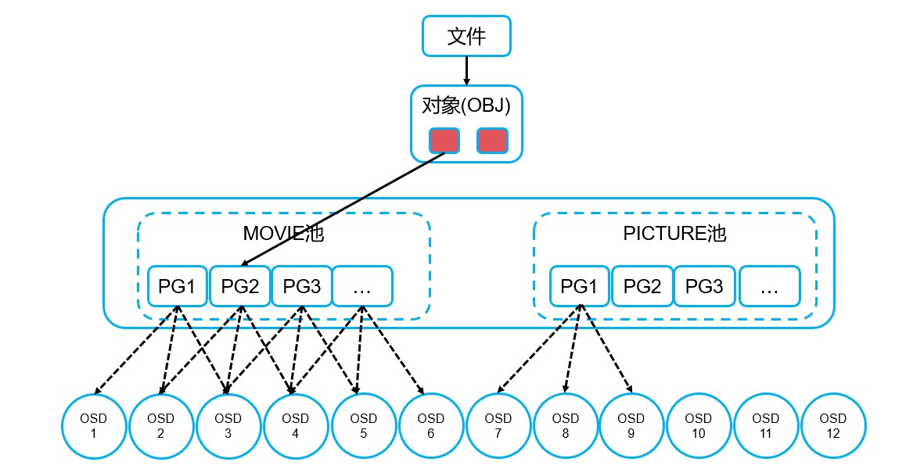

# CLUSTER

## 集群

### 概念解析

- 集群（CLUSTER）概念
  - 集群就是一组计算机，它们作为一个整体向用户提供一组网络资源
- 集群核心：任务调度
- 集群目的
  - 提高性能：如计算密集型应用
  - 降低成本：相对超级计算机价格低廉
  - 提高可扩展性：只要增加集群节点即可
  - 增强可靠性：多个节点完成相同功能，有效避免单点
- 集群分类
  - HA：高可用集群（High Availability Cluster）
  - LBC：负载均衡集群/负载均衡系统（Load Balance Cluster）
  - HPC：
    - 科学计算集群（High Performance Computing Cluster）
    - 高性能计算集群（High Performance Computing）


## LVS

### 概念解析

- LVS：Linux Virtual Server，Linux虚拟服务器
  - Linux虚拟服务器（LVS）是章文嵩在国防科技大学就读博士期间研发的
  - 由于性能过于强悍被Linux内核维护组织收录，从2.4版本内核开始嵌入
- 功能
  - 实现高可用的、可伸缩的Web、Mail、Cache和Media等网络服务
- 目标
  - 利用Linux操作系统和LVS集群软件实现一个高可用、高性能、低成本的服务器应用集群
- 组件
  - 工作在内核空间的IPVS模块
  - 工作在用户空间的ipvsadm管理工具
- LVS的工作模式：
  - NAT：网络地址转换
  - DR：路由模式
  - TUN：隧道模式
- 术语：
  - 调度器：LVS服务器
  - 真实服务器Real Server：提供服务的服务器
  - VIP：虚拟地址，提供给用户访问的地址
  - DIP：指定地址，LVS服务器上与真实服务器通信的地址
  - RIP：真实地址，真实服务器的地址
- 常见的调度算法，共10个，常用的有4个：
  - 轮询rr：Real Server轮流提供服务
  - 加权轮询wrr：根据服务器性能设置权重，权重大的得到的请求更多
  - 最少连接lc：根据Real Server的连接数分配请求
  - 加权最少连接wlc：类似于wrr，根据权重分配请求

#### LVS-NAT模式

##### 实验环境准备

| 主机名              | IP地址                                        | 角色        |
| ------------------- | --------------------------------------------- | ----------- |
| pubserver（已存在） | eth0：192.168.88.240 eth1->192.168.99.240     | ansible主机 |
| client              | eth0->192.168.88.10 网关：192.168.88.5        | 客户端      |
| lvs1                | eth0 -> 192.168.88.5 eth1->192.168.99.5       | lvs服务器   |
| web1                | eth1->192.168.99.100 网关：192.168.99.5       | web服务器   |
| web2                | web2：eth1->192.168.99.200 网关：192.168.99.5 | web服务器   |

##### LVS工作模式




##### LVS-NAT实验拓扑图




```bash
## 实验环境准备
# 创建虚拟机
[root@server1 ~]# vm clone client lvs1 web1 web2
[root@server1 ~]# virsh list --all              #查看结果
 Id   Name        State
---------------------------
 3    pubserver   running
 4    client      running
 5    lvs1        running
 6    web1        running
 7    web2        running

# pubserver主机配置IP地址
[root@server1 ~]# vm setip pubserver 192.168.99.240     #88.240 ip之前的环境已经配置

# client主机配置IP地址
[root@server1 ~]# vm setip client 192.168.88.10
[root@server1 ~]# ssh 192.168.88.10
[root@client ~]# nmcli connection modify "System eth0" ipv4.gateway 192.168.88.5 
[root@client ~]# nmcli connection up "System eth0" 
[root@client ~]# route -n
Kernel IP routing table
Destination     Gateway         Genmask         Flags Metric Ref    Use Iface
0.0.0.0         192.168.88.5    0.0.0.0         UG    100    0        0 eth0
192.168.88.0    0.0.0.0         255.255.255.0   U     100    0        0 eth0

# lvs1主机配置IP地址
[root@server1 ~]# vm setip lvs1 192.168.88.5
[root@server1 ~]# vm setip lvs1 192.168.99.5

# web1主机配置eth1网关
[root@server1 ~]# vm setip web1 192.168.99.100
[root@server1 ~]# ssh 192.168.99.100
[root@web1 ~]# nmcli connection show 
NAME         UUID                                  TYPE      DEVICE 
System eth0  5fb06bd0-0bb0-7ffb-45f1-d6edd65f3e03  ethernet  eth0   
System eth1  9c92fad9-6ecb-3e6c-eb4d-8a47c6f50c04  ethernet  eth1   
[root@web1 ~]# nmcli connection modify "System eth0" ipv4.method disabled autoconnect no
[root@web1 ~]# nmcli connection down "System eth0"
[root@web1 ~]# nmcli connection modify "System eth1" ipv4.gateway 192.168.99.5
[root@web1 ~]# nmcli connection up "System eth1" 
[root@web1 ~]# route -n
Kernel IP routing table
Destination     Gateway         Genmask         Flags Metric Ref    Use Iface
0.0.0.0         192.168.99.5    0.0.0.0         UG    100    0        0 eth1
192.168.99.0    0.0.0.0         255.255.255.0   U     100    0        0 eth1
[root@web1 ~]# reboot

# web2主机配置eth1网关
[root@server1 ~]# vm setip web2 192.168.99.200
[root@server1 ~]# ssh 192.168.99.200
[root@web2 ~]# nmcli connection show 
NAME         UUID                                  TYPE      DEVICE 
System eth0  5fb06bd0-0bb0-7ffb-45f1-d6edd65f3e03  ethernet  eth0   
System eth1  9c92fad9-6ecb-3e6c-eb4d-8a47c6f50c04  ethernet  eth1   
[root@web2 ~]# nmcli connection modify "System eth0" ipv4.method disabled autoconnect no 
[root@web2 ~]# nmcli connection down "System eth0" 
[root@web2 ~]# nmcli connection modify "System eth1" ipv4.gateway 192.168.99.5
[root@web2 ~]# nmcli connection up "System eth1" 
[root@web2 ~]# route -n
Kernel IP routing table
Destination     Gateway         Genmask         Flags Metric Ref    Use Iface
0.0.0.0         192.168.99.5    0.0.0.0         UG    100    0        0 eth1
192.168.99.0    0.0.0.0         255.255.255.0   U     100    0        0 eth1
[root@web2 ~]# reboot

# 测试LVS-NAT拓扑网络通信情况
[root@lvs1 ~]# cat /proc/sys/net/ipv4/ip_forward        #检查lvs1主机是否开启路由转发
1       #如果得到1则无需调整，如果得到0则执行下一步临时开启路由转发功能

[root@lvs1 ~]# echo 1 > /proc/sys/net/ipv4/ip_forward
[root@lvs1 ~]# cat /proc/sys/net/ipv4/ip_forward
1

#client主机测试
[root@client ~]# ping -c 2 192.168.99.100              #cleint可以ping通web1

[root@client ~]# ping -c 2 192.168.99.200              #client可以ping通web2
```

- Ansible配置

```bash
## 配置Ansible
# 创建单独工作目录
[root@pubserver ~]# mkdir cluster
[root@pubserver ~]# cd cluster/

# 编写ansible配置文件和主机清单列表文件
[root@pubserver cluster]# vim ansible.cfg 
[defaults]
inventory = inventory
host_key_checking = false
module_name = shell

[root@pubserver cluster]# vim inventory 
[clients]
client ansible_ssh_host=192.168.88.10

[webservers]
web1 ansible_ssh_host=192.168.99.100
web2 ansible_ssh_host=192.168.99.200

[lbs]
lvs1 ansible_ssh_host=192.168.88.5

[all:vars]
ansible_ssh_user=root
ansible_ssh_pass=a

# 测试ansible配置
[root@pubserver cluster]# ansible all -m ping

# 准备repo文件
[root@pubserver cluster]# mkdir files
[root@pubserver cluster]# vim files/local88.repo
[BaseOS]
name=BaseOS
baseurl=ftp://192.168.88.240/dvd/BaseOS/
enabled=1
gpgcheck=0
[AppStream]
name=AppStream
baseurl=ftp://192.168.88.240/dvd/AppStream/
enabled=1
gpgcheck=0
[RPMS]
name=rpms
baseurl=ftp://192.168.88.240/rpms/
enabled=1
gpgcheck=0

[root@pubserver cluster]# cp files/local88.repo files/local99.repo 
[root@pubserver cluster]# sed -i '/88/s/88/99/' files/local99.repo 
[root@pubserver cluster]# cat files/local99.repo 
```

- 配置测试NAT模式

```bash
## 配置LVS-NAT模式

# 同步yum源文件
[root@pubserver cluster]# vim 01_config_yum.yml
---
- name: config yum
  hosts: all
  tasks:
    - name: rm dir      #删除/etc/yum.repos.d/目录
      file:
        path: /etc/yum.repos.d/
        state: absent
    - name: create dir  #创建/etc/yum.repos.d/目录
      file:
        path: /etc/yum.repos.d/
        mode: '0755'
        state: directory

- name: upload 88 yum
  hosts: clients,lbs
  tasks:
    - name: copy repo   #发送repo文件到目标主机
      copy:
        src: files/local88.repo
        dest: /etc/yum.repos.d/

- name: upload 99 yum
  hosts: webservers
  tasks:
    - name: copy repo   #发送repo文件到目标主机
      copy:
        src: files/local99.repo
        dest: /etc/yum.repos.d/
[root@pubserver cluster]# ansible-playbook 01_config_yum.yml 

# 配置web服务器组
[root@pubserver cluster]# vim files/index.html.j2
Welcome to {{ ansible_hostname }}
[root@pubserver cluster]# vim 02_config_web.yml 
---
- name: config web
  hosts: webservers
  tasks:
    - name: install nginx   #安装nginx
      yum:
        name: nginx
        state: present
    - name: copy index      #发送index.html.j2生成index.html文件
      template:
        src: files/index.html.j2
        dest: /usr/share/nginx/html/index.html
    - name: start nginx     #启动nginx服务
      service:
        name: nginx
        state: started
        enabled: true
[root@pubserver cluster]# ansible-playbook 02_config_web.yml 

[root@pubserver cluster]# curl http://192.168.99.100/
Welcome to web1
[root@pubserver cluster]# curl http://192.168.99.200/
Welcome to web2

# 配置LVS服务器
[root@pubserver cluster]# sysctl -a
[root@pubserver cluster]# ansible lvs1 -a "sysctl -a | grep ip_forward"
[root@pubserver cluster]# vim 03_config_nat_sysctl.yml
---
- name: config sysctl
  hosts: lbs
  tasks:
    - name: modify kernel args          #持久开启Linux路由转发功能
      sysctl:
        name: net.ipv4.ip_forward
        value: '1'
        sysctl_set: true
        sysctl_file: /etc/sysctl.conf
      notify: flush args
  handlers:
    - name: flush args                  #刷新sysctl.conf文件
      shell: "sysctl -p"
[root@pubserver cluster]# ansible-playbook 03_config_nat_sysctl.yml 
[root@pubserver cluster]# ansible lvs1 -a "cat /proc/sys/net/ipv4/ip_forward"
lvs1 | CHANGED | rc=0 >>
1

[root@pubserver cluster]# vim 04_install_lvs.yml
---
- name: install lvs
  hosts: lbs
  tasks:
    - name: install soft    #安装ipvsadm软件
      yum:
        name: ipvsadm
        state: present
[root@pubserver cluster]# ansible-playbook 04_install_lvs.yml 

# ipvsadm命令常用选项
    -A: 添加虚拟服务器
    -E: 编辑虚拟服务器
    -D: 删除虚拟服务器
    -C: 删除所有虚拟服务器
    -t: 添加tcp服务器
    -u: 添加udp服务器
    -s: 指定调度算法。如轮询rr/加权轮询wrr/最少连接lc/加权最少连接wlc

    -a: 添加虚拟服务器后，向虚拟服务器中加入真实服务器
    -d: 删除真实服务器
    -r: 指定真实服务器
    -w: 设置权重,默认为1
    -m: 指定工作模式为NAT
    -i：TUN模式
    -g: 指定工作模式为DR
    
# 配置LVS-NAT模式规则
[root@lvs1 ~]# ipvsadm -Ln      #-n为显示具体IP地址
IP Virtual Server version 1.2.1 (size=4096)
Prot LocalAddress:Port Scheduler Flags
  -> RemoteAddress:Port           Forward Weight ActiveConn InActConn
[root@lvs1 ~]# ipvsadm -A -t 192.168.88.5:80 -s rr
[root@lvs1 ~]# ipvsadm -a -t 192.168.88.5:80 -r 192.168.99.100:80 -w 1 -m   
[root@lvs1 ~]# ipvsadm -a -t 192.168.88.5:80 -r 192.168.99.200:80 -w 2 -m
[root@lvs1 ~]# ipvsadm -Ln      
IP Virtual Server version 1.2.1 (size=4096)
Prot LocalAddress:Port Scheduler Flags
  -> RemoteAddress:Port           Forward Weight ActiveConn InActConn
TCP  192.168.88.5:80 rr
  -> 192.168.99.100:80            Masq    1      0          0         
  -> 192.168.99.200:80            Masq    2      0          0         

# 调整LVS-NAT规则
[root@lvs1 ~]# ipvsadm -E -t 192.168.88.5:80 -s wrr
[root@lvs1 ~]# ipvsadm -Ln
IP Virtual Server version 1.2.1 (size=4096)
Prot LocalAddress:Port Scheduler Flags
  -> RemoteAddress:Port           Forward Weight ActiveConn InActConn
TCP  192.168.88.5:80 wrr    #算法为wrr后权重生效
  -> 192.168.99.100:80            Masq    1      0          3         
  -> 192.168.99.200:80            Masq    2      0          3         

```

#### LVS-DR模式

##### 实验环境准备

LVS DR模式，LVS主机和web服务器都是单网卡，它们连在同一网络中

| 主机名              | IP地址                            | 角色        |
| ------------------- | --------------------------------- | ----------- |
| pubserver（已存在） | eth0：192.168.88.240              | ansible主机 |
| client（已存在）    | eth0：192.168.88.10               | 客户端      |
| lvs1（已存在）      | eth0：192.168.88.5 ech1：关闭网卡 | lvs服务器   |
| web1（已存在）      | eth0：192.168.88.100              | web服务器   |
| web2（已存在）      | eth0：192.168.88.100              | web服务器   |

##### LVS-DR实验拓扑图



```bash
## 实验环境准备

# 重新创建web主机
[root@server1 ~]# vm remove web1 web2
[root@server1 ~]# vm clone web1
[root@server1 ~]# vm clone web2

# web1主机配置eth0网卡IP地址
[root@server1 ~]# vm setip web1 192.168.88.100

# web2主机配置eth0网卡IP地址
[root@server1 ~]# vm setip web2 192.168.88.200

# 清理LVS-NAT规则
[root@server1 ~]# ssh 192.168.88.5
[root@lvs1 ~]# ipvsadm -Ln
IP Virtual Server version 1.2.1 (size=4096)
Prot LocalAddress:Port Scheduler Flags
  -> RemoteAddress:Port           Forward Weight ActiveConn InActConn
TCP  192.168.88.5:80 wrr
  -> 192.168.99.100:80            Masq    1      0          0         
  -> 192.168.99.200:80            Masq    2      0          0         
[root@lvs1 ~]# ipvsadm -C           #清理已有的所有LVS规则
[root@lvs1 ~]# ipvsadm -Ln
IP Virtual Server version 1.2.1 (size=4096)
Prot LocalAddress:Port Scheduler Flags
  -> RemoteAddress:Port           Forward Weight ActiveConn InActConn

# lvs1主机关闭eth1网卡
[root@lvs1 ~]# nmcli connection show 
NAME         UUID                                  TYPE      DEVICE 
System eth0  5fb06bd0-0bb0-7ffb-45f1-d6edd65f3e03  ethernet  eth0   
System eth1  9c92fad9-6ecb-3e6c-eb4d-8a47c6f50c04  ethernet  eth1   
[root@lvs1 ~]# nmcli connection modify "System eth1" ipv4.addresses '' ipv4.method disabled autoconnect no
[root@lvs1 ~]# nmcli connection down "System eth1" 
[root@lvs1 ~]# ip a s | grep 192
    inet 192.168.88.5/24 brd 192.168.88.255 scope global noprefixroute eth0
```


## Keepalived

### 概念

- keepalived 是Linux下一个轻量级的高可用解决方案
- 主要是通过虚拟路由冗余协议(VRRP)来实现高可用功能
- Virtual Router Redundancy Protocol
- 起初就是为了补充LVS功能而设计的，用于监控LVS集群内后端真实服务器状态
- 后来加入了VRRP的功能，它出现的目的是为了解决静态路由出现的单点故障问题

### 功能

- LVS规则管理
- LVS集群真实服务器状态监测
- 管理VIP




### 配置文件解析

```bash
[root@lvs1 ~]# vim /etc/keepalived/keepalived.conf 
global_defs {
...
   router_id lvs1           #集群节点唯一标识
   vrrp_iptables            #手工添加与vrrp_strict协同工作，自动放行iptables规则
   ...
   vrrp_strict              #严格遵守VRRP规则
   ...
}

vrrp_instance VI_1 {
    state MASTER            #状态，主服务器为MASTER，辅助为BACKUP
    interface eth0          #网卡
    virtual_router_id 51    #虚拟路由唯一标识符
    priority 100            #优先级
    advert_int 1            #心跳包间隔时间
    authentication {        #认证方式
        auth_type PASS      #密码认证
        auth_pass 1111      #集群密码
    }
    virtual_ipaddress {     #定义VIP
        192.168.88.15/24 dev eth0 label eth0:0  #VIP地址及绑定网卡和虚接口标签
    }
}

virtual_server 192.168.88.15 80 {   #定义LVS虚拟服务器
    delay_loop 6                    #健康检查延时6s开始
    lb_algo wrr                     #调度算法
    lb_kind DR                      #LVS工作模式
    persistence_timeout 50          #50s内相同客户端发起请求由同一服务器处理
    protocol TCP                    #虚拟服务器协议

    real_server 192.168.88.100 80 { #定义真实服务器
        weight 1                    #权重
        TCP_CHECK {                 #健康检查方式
            connect_timeout 3       #连接超时时间为3s
            nb_get_retry 3          #连续3次访问失败则认为真实服务器故障
            delay_before_retry 3    #健康检查包时间间隔
        }
    }

    real_server 192.168.88.200 80 {
        weight 2
        TCP_CHECK {
            connect_timeout 3
            nb_get_retry 3
            delay_before_retry 3
        }
    }
}

```


## Haproxy负载均衡集群

### Haproxy相关概念

- 概念
  - HAProxy是可提供高可用性、负载均衡以及基于TCP和HTTP应用的代理
  - 是免费、快速并且可靠的一种解决方案
  - HAProxy非常适用于并发大（并发达1w以上）web站点，这些站点通常又需要会话保持或七层处理
  - 可以很简单安全的整合至当前的架构中，同时可以保护web服务器不被暴露到公网
- 工作模式
  - mode http：只适用于web服务
  - mode tcp：适用于各种服务
  - mode health：仅做健康检查，很少使用
- 调度算法
  - roundrobin：轮询
  - static-rr：加权轮询
  - leastconn：最少连接者先处理  
  - source：根据请求源IP，类似于nginx的ip_hash  
  - ri：根据请求的URI  
  - rl_param：根据请求人URL参数'balance url_param'  
  - rdp-cookie(name) ：根据cookie(name)来锁定并哈希每一次的TCP请求  
  - hdr(name) ：根据HTTP请求头来锁定每一次HTTP请求




## 存储概念解析

### 分布式存储

#### 概念

- 是一种独特的系统架构
- 由一组能够通过网络连通，为了完成共同任务而协调任务的计算机节点组成
- 分布式是为了使用廉价的普通的计算机完成复杂的计算和存储任务
- 目的就是利用更多的机器处理更多的数据或任务

#### 特性

- 可扩展：分布式存储系统可以扩展到几百台甚至几千台的集群规模，而且随着集群规模的增长，系统整体性能表现为线性增长
- 低成本：分布式存储系统的自动容错、自动负载均衡机制使其可以构建在普通的PC机之上。另外，线性扩展能力也使得增加、减少机器非常方便，可以实现自动运维
- 高性能：无论是针对整个集群还是单台服务器，都要求分布式存储系统具备高性能
- 易用：分布式存储系统需要能够提供易用的对外接口，另外，也要求具备完善的监控、运维工具，并与其他系统集成
- 分布式算法
  - 哈希分布
  - 顺序分布
- 常用分布式存储方案
  - Lustre
  - Hadoop
  - FastDFS
  - GlusterFS
  - Ceph


## Ceph概述

### Ceph概念

#### 什么是Ceph

- Ceph是一个分布式存储系统，具有高扩展、高可用、高性能等特点
- Ceph可以提供块存储、文件存储、对象存储
- Ceph支持EB级别的存储空间
- 作为软件定义存储(Software Define Storage)的优秀解决方案在行业中已得到广泛应用

#### Ceph架构图



## Ceph组件及协同工作

### 核心组件

- 监视器：MON(Monitor)
  - Monitor负责管理Ceph集群的整体状态、配置信息和监控数据
  - 维护集群状态图和管理守护程序和客户端之间的身份验证
  - 它们定期选举一个Leader来协调集群中的其他节点，并接收和处理客户端和OSD的请求
  - 为了冗余和高可用性，通常至少需要三台Monitor
- 管理器：MGR(Manager)
  - Manager提供集群管理功能，包括集群状态监控、元数据管理、REST API接口等
  - 托管基于python的模块来管理和公开Ceph集群信息，包括基于web的Ceph仪表板和REST API
  - 以便管理员和用户可视化地管理和操作Ceph集群
  - 高可用性通常需要至少两台Manager
- OSD（Object Storage Daemon）
  - OSD是Ceph存储集群的核心组件
  - 负责存储数据和处理数据的复制、恢复和再平衡
  - 通过检查其他Ceph OSD守护进程的心跳来为Ceph监视器和管理器提供一些监视信息
  - 每个OSD节点都有一个或多个OSD进程来管理对应的存储设备
  - 为了实现冗余和高可用性，通常至少需要三个Ceph OSD
- MDS（Metadata Server）
  - MDS用于支持Ceph文件系统 (CephFS)
  - 负责维护文件系统的元数据
  - 回答客户端的访问请求，负责文件名到inode的映射，以及跟踪文件锁
- RGW（RADOS Gateway）
  - RGW是Ceph提供的对象存储网关，兼容S3和Swift协议
  - 它为用户提供了通过RESTful API与Ceph存储集群进行交互的能力

### 辅助工具

- Rados
  - RADOS（可靠、自适应分布式对象存储）是底层的分布式对象存储系统
  - 作为Ceph存储引擎的一部分，提供高性能、可扩展的对象存储服务
- CephFS
  - CephFS是Ceph的分布式文件系统
  - 通过将文件存储在RADOS中实现了文件级别的访问
- Librados
  - librados是Ceph提供的客户端库，允许开发人员编写基于Ceph的应用程序


### Ceph工作图



### Ceph数据存储

- 名词解释

  - Object：对象
    - Ceph最底层的存储单元
    - 每个Object包含元数据和数据
  - Pool：存储池
    - 是存储对象的逻辑区分
    - 规定了数据冗余的类型和对应的副本分布策略
    - 支持两种类型：副本和纠删码，目前基本上使用的都是3副本类型
  - PG（Placement Groups）：数据放置组
    - 是一个逻辑概念
    - 引入这一层是为了更好的分配和定位数据
  - CRUSH：算法
    - 是Ceph使用的数据分布算法	
    - 确保数据分配到预期的地方
    - 是容灾级别的控制策略
    - 支持Ceph存储集群动态扩展、重新平衡和恢复

  Ceph数据存储



## ceph搭建

### 实验环境准备

关闭防火墙和SELinux

| 主机名              | IP地址               | 角色        | 内存/硬盘             |
| ------------------- | -------------------- | ----------- | --------------------- |
| pubserver（已存在） | eth0：192.168.88.240 | ansible主机 | 无须更改              |
| client（已存在）    | eth0：192.168.88.10  | 客户端      | 无须更改              |
| ceph1               | eth0：192.168.88.11  | ceph集群    | 4G / 额外加3块20G硬盘 |
| ceph2               | eth0：192.168.88.12  | ceph集群    | 4G / 额外加3块20G硬盘 |
| ceph3               | eth0：192.168.88.13  | ceph集群    | 4G / 额外加3块20G硬盘 |

```
## 配置Ansible

# 编写Ansible相关配置
[root@pubserver ~]# mkdir ceph
[root@pubserver ~]# cd ceph/
[root@pubserver ceph]# vim ansible.cfg 
[defaults]
inventory = inventory
module_name = shell
host_key_checking = false
roles_path = roles
[root@pubserver ceph]# mkdir roles
[root@pubserver ceph]# vim inventory 
[ceph]
ceph1 ansible_ssh_host=192.168.88.11
ceph2 ansible_ssh_host=192.168.88.12
ceph3 ansible_ssh_host=192.168.88.13

[clients]
client ansible_ssh_host=192.168.88.10

[all:vars]
ansible_ssh_user=root
ansible_ssh_pass=a

# 验证Ansible配置，确认CEPH节点内存和硬盘信息
[root@pubserver ceph]# ansible all -m ping
[root@pubserver ceph]# ansible ceph -a "free -h"
ceph3 | CHANGED | rc=0 >>
              total        used        free      shared  buff/cache   available
Mem:          3.7Gi       125Mi       3.5Gi        16Mi       111Mi       3.4Gi
Swap:            0B          0B          0B
ceph2 | CHANGED | rc=0 >>
              total        used        free      shared  buff/cache   available
Mem:          3.7Gi       125Mi       3.5Gi        16Mi       111Mi       3.4Gi
Swap:            0B          0B          0B
ceph1 | CHANGED | rc=0 >>
              total        used        free      shared  buff/cache   available
Mem:          3.7Gi       125Mi       3.5Gi        16Mi       111Mi       3.4Gi
Swap:            0B          0B          0B
[root@pubserver ceph]# ansible ceph -a "lsblk"
ceph1 | CHANGED | rc=0 >>
NAME   MAJ:MIN RM SIZE RO TYPE MOUNTPOINT
vda    253:0    0  20G  0 disk 
└─vda1 253:1    0  20G  0 part /
vdb    253:16   0  20G  0 disk 
vdc    253:32   0  20G  0 disk 
vdd    253:48   0  20G  0 disk 
ceph3 | CHANGED | rc=0 >>
NAME   MAJ:MIN RM SIZE RO TYPE MOUNTPOINT
vda    253:0    0  20G  0 disk 
└─vda1 253:1    0  20G  0 part /
vdb    253:16   0  20G  0 disk 
vdc    253:32   0  20G  0 disk 
vdd    253:48   0  20G  0 disk 
ceph2 | CHANGED | rc=0 >>
NAME   MAJ:MIN RM SIZE RO TYPE MOUNTPOINT
vda    253:0    0  20G  0 disk 
└─vda1 253:1    0  20G  0 part /
vdb    253:16   0  20G  0 disk 
vdc    253:32   0  20G  0 disk 
vdd    253:48   0  20G  0 disk 
```

### 基础准备工作

- 更新自定义yum源，加入Ceph相关软件

- 配置所有节点主机名解析

```bash
# blockinfile模块跟lineinfile基本一样，向指定文件内加入一段内容
# 192.168.88.240必须解析为quay.io！！！
[root@pubserver ceph]# vim 01_update_hosts.yml
---
- name: update hosts
  hosts: all
  tasks:
    - name: add host resolv     #修改/etc/hosts文件添加主机名映射
      blockinfile:
        path: /etc/hosts
        block: |
          192.168.88.10 client
          192.168.88.11 ceph1
          192.168.88.12 ceph2
          192.168.88.13 ceph3
          192.168.88.240  quay.io
[root@pubserver ceph]# ansible-playbook 01_update_hosts.yml
[root@pubserver ceph]# ansible all -a "tail -7 /etc/hosts"
```

- 配置时间同步服务

```bash
## 配置时间同步服务Chronyd
# 配置服务端
[root@pubserver ~]# timedatectl                                 #查看系统时间配置
[root@pubserver ~]# timedatectl set-timezone Asia/Shanghai      #设置时区为上海

[root@pubserver ~]# date    
[root@pubserver ~]# date -s "年-月-日 时:分:秒"                   #如果日期时间不对则修改

[root@pubserver ~]# yum -y install chrony                       #已经安装
[root@pubserver ~]# vim /etc/chrony.conf
...
 25 allow 192.168.88.0/24   #允许88网段主机同步时间
 26  
 27 # Serve time even if not synchronized to a time source.
 28 local stratum 10        #向下10层同步时间
...
[root@pubserver ~]# systemctl enable chronyd            #设置服务开机自启动
[root@pubserver ~]# systemctl restart chronyd           #重启chronyd服务
[root@pubserver ~]# ss -antlpu | grep chronyd
udp   UNCONN 0  0  127.0.0.1:323   0.0.0.0:*    users:(("chronyd",pid=9225,fd=5))
udp   UNCONN 0  0    0.0.0.0:123   0.0.0.0:*    users:(("chronyd",pid=9225,fd=6))
[root@pubserver ~]# 

# 配置客户端(使用系统角色)
[root@pubserver ~]# yum -y install rhel-system-roles
[root@pubserver ceph]# cp -r /usr/share/ansible/roles/rhel-system-roles.timesync/ ./roles/timesync
[root@pubserver ceph]# ansible-galaxy list
# /root/ceph/roles
- timesync, (unknown version)
[root@pubserver ceph]# vim 03_timesync.yml 
---
- name: config ntp  #利用timesync角色配置时间服务
  hosts: all
  vars:
    timesync_ntp_servers:
      - hostname: 192.168.88.240
        iburst: yes 
  roles:
    - timesync
[root@pubserver ceph]# ansible-playbook 03_timesync.yml 
[root@pubserver ceph]# ansible all -a "chronyc sources"
ceph1 | CHANGED | rc=0 >>
MS Name/IP address         Stratum Poll Reach LastRx Last sample               
===============================================================================
^* quay.io                       4   6   177    10    +12us[  +20us] +/-   39ms
ceph3 | CHANGED | rc=0 >>
MS Name/IP address         Stratum Poll Reach LastRx Last sample               
===============================================================================
^* quay.io                       4   6   177    11    -29us[  -31us] +/-   38ms
ceph2 | CHANGED | rc=0 >>
MS Name/IP address         Stratum Poll Reach LastRx Last sample               
===============================================================================
^* quay.io                       4   6   177    11    +17us[  +37us] +/-   38ms
client | CHANGED | rc=0 >>
MS Name/IP address         Stratum Poll Reach LastRx Last sample               
===============================================================================
^* quay.io                       4   6   177    10    -10us[  -21us] +/-   38ms
```

- Ceph节点安装必要软件

- 搭建私有Ceph镜像仓库

```bash
## 搭建私有容器镜像仓库

# 部署Ceph-Quincy集群需要使用cephadm工具，该工具为一个Python脚本
# 部署过程中需要连接到公网quay.io站点下载Ceph相关镜像
# 为规避无法连接外网或同一时间大量下载造成网络卡顿，故需自己部署一个私有站点quay.io欺骗cephadm工具

# 上传Ceph集群相关文件(cephadm脚本和Ceph镜像)
[root@server1 ~]# scp -r /linux-soft/s2/zzg/ceph_soft/ceph-server/ root@192.168.88.240:/root

# 搭建私有镜像仓库
[root@pubserver ceph]# cd /root/ceph-server/
[root@pubserver ceph-server]# yum -y install docker-distribution-2.6.2-2.git48294d9.el7.x86_64.rpm 
[root@pubserver ceph-server]# vim /etc/docker-distribution/registry/config.yml 
version: 0.1
log:
  fields:
    service: registry
storage:
    cache:
        layerinfo: inmemory
    filesystem:
        rootdirectory: /var/lib/registry
http:
    addr: :80       #端口由5000调整为80，必须调整，否则后续下载镜像时会有报错
[root@pubserver ceph-server]# systemctl enable --now docker-distribution.service 
[root@pubserver ceph-server]# ss -antpul | grep :80 #确认80端口被registry进程占用
tcp   LISTEN 0 128     *:80   *:*    users:(("registry",pid=11002,fd=3))
[root@pubserver ceph-server]# curl http://localhost/v2/_catalog
{"repositories":[]}     #此时仓库为空

# 导入Ceph镜像
[root@pubserver ceph-server]# vim /etc/hosts
192.168.88.240 quay.io
[root@pubserver ceph-server]# yum -y install podman
[root@pubserver ceph-server]# vim /etc/containers/registries.conf       #配置私有仓库，文件最后追加
...
[[registry]]
location = "quay.io"    #私有仓库地址 
insecure = true         #可以使用http协议

#导入Ceph相关镜像到本地
[root@pubserver ceph-server]# for i in *.tar
 do
 podman load -i $i
 done
[root@pubserver ceph-server]# podman images
REPOSITORY                        TAG         IMAGE ID      CREATED        SIZE
quay.io/ceph/ceph                 v17         cc65afd6173a  17 months ago  1.4 GB
quay.io/ceph/ceph-grafana         8.3.5       dad864ee21e9  24 months ago  571 MB
quay.io/prometheus/prometheus     v2.33.4     514e6a882f6e  2 years ago    205 MB
quay.io/prometheus/node-exporter  v1.3.1      1dbe0e931976  2 years ago    22.3 MB
quay.io/prometheus/alertmanager   v0.23.0     ba2b418f427c  2 years ago    58.9 MB

# 推送镜像到私有仓库
[root@pubserver ceph-server]# podman push quay.io/ceph/ceph:v17 
[root@pubserver ceph-server]# podman push quay.io/ceph/ceph-grafana:8.3.5 
[root@pubserver ceph-server]# podman push quay.io/prometheus/prometheus:v2.33.4
[root@pubserver ceph-server]# podman push quay.io/prometheus/node-exporter:v1.3.1
[root@pubserver ceph-server]# podman push quay.io/prometheus/alertmanager:v0.23.0 

# 验证私有仓库中Ceph镜像保存情况
[root@pubserver ceph-server]# curl http://quay.io/v2/_catalog
{"repositories":["ceph/ceph","ceph/ceph-grafana","prometheus/alertmanager","prometheus/node-exporter","prometheus/prometheus"]}

# 配置Ceph节点使用私有镜像仓库
[root@pubserver ~]# cd /root/ceph
[root@pubserver ceph]# vim 05_config_priv_registry.yml
---
- name: config private registry
  hosts: ceph
  tasks:
    - name: add quay.io #配置私有registry仓库
      blockinfile:
        path: /etc/containers/registries.conf
        block: |
          [[registry]]
          location = "quay.io"
          insecure = true
[root@pubserver ceph]# ansible-playbook 05_config_priv_registry.yml 
[root@pubserver ceph]# ansible ceph  -a 'tail -5 /etc/containers/registries.conf'
ceph1 | CHANGED | rc=0 >>
# BEGIN ANSIBLE MANAGED BLOCK
[[registry]]
location = "quay.io"
insecure = true
# END ANSIBLE MANAGED BLOCK
ceph2 | CHANGED | rc=0 >>
# BEGIN ANSIBLE MANAGED BLOCK
[[registry]]
location = "quay.io"
insecure = true
# END ANSIBLE MANAGED BLOCK
ceph3 | CHANGED | rc=0 >>
# BEGIN ANSIBLE MANAGED BLOCK
[[registry]]
location = "quay.io"
insecure = true
# END ANSIBLE MANAGED BLOCK

# 建议搭建Ceph集群前临时撤掉Ceph节点网关，禁止Ceph节点连接公网
# 目的是防止因准备步骤有误造成去公网拉取镜像造成网络阻塞甚至导致集群初始化或扩容失败
[root@pubserver ceph]# ansible ceph -a "route del default gw 192.168.88.254"
```

- Cephadm工具
  - Cephadm使用容器和systemd安装和管理Ceph集群，并与CLI（命令行）和dashboard GUI紧密	集成
  - cephadm与新的编排API完全集成，并完全支持新的CLI和仪表板功能来管理集群部署
  - cephadm需要容器支持(podman或docker)和Python 3
  - cephadm是一个用于管理Ceph集群的实用程序。可以使用它：
    - 将Ceph容器添加到集群中
    - 从群集中删除一个Ceph容器
    - 更新Ceph容器

### 创建ceph集群

```bash
## 搭建Ceph集群

# Ceph1节点作为初始化节点
# Ceph在使用过程中是无中心化结构，但搭建过程中选择集群某一个节点作为初始化管理节点，然后扩容其他节点

# 上传cephadm脚本
[root@server1 ~]# scp /linux-soft/s2/zzg/ceph_soft/ceph-server/cephadm root@192.168.88.11:/root

# 使用cephadm初始化Ceph集群
[root@ceph1 ~]# ls -l cephadm 
-rwxr-xr-x 1 root root 357805 May 21 18:04 cephadm
[root@ceph1 ~]# chmod +x cephadm            #如果没有x权限则执行本命令赋予脚本x权限

[root@ceph1 ~]# sed -i '/5000/s/:5000//' cephadm    #必须操作，调整镜像地址！！
[root@ceph1 ~]# sed -rn '46,60p' cephadm            #确认cephadm脚本中:5000被去掉
# Default container images -----------------------------------------------------
DEFAULT_IMAGE = 'quay.io/ceph/ceph:v17'
DEFAULT_IMAGE_IS_MASTER = False
DEFAULT_IMAGE_RELEASE = 'quincy'
DEFAULT_PROMETHEUS_IMAGE = 'quay.io/prometheus/prometheus:v2.33.4'
DEFAULT_LOKI_IMAGE = 'docker.io/grafana/loki:2.4.0'
DEFAULT_PROMTAIL_IMAGE = 'docker.io/grafana/promtail:2.4.0'
DEFAULT_NODE_EXPORTER_IMAGE = 'quay.io/prometheus/node-exporter:v1.3.1'
DEFAULT_ALERT_MANAGER_IMAGE = 'quay.io/prometheus/alertmanager:v0.23.0'
DEFAULT_GRAFANA_IMAGE = 'quay.io/ceph/ceph-grafana:8.3.5'
DEFAULT_HAPROXY_IMAGE = 'quay.io/ceph/haproxy:2.3'
DEFAULT_KEEPALIVED_IMAGE = 'quay.io/ceph/keepalived:2.1.5'
DEFAULT_SNMP_GATEWAY_IMAGE = 'docker.io/maxwo/snmp-notifier:v1.2.1'
DEFAULT_REGISTRY = 'docker.io'   # normalize unqualified digests to this
# ------------------------------------------------------------------------------

[root@ceph1 ~]# ./cephadm bootstrap  --mon-ip 192.168.88.11 --initial-dashboard-password=123456 --dashboard-password-noupdate       #指定初始化节点IP地址，指定dashboard面板密码，不更新dashboard面板密码

# 等待三分钟左右，确认初始化结果(Ceph1节点下载5个镜像，启动7个容器)
[root@ceph1 ~]# podman images
REPOSITORY                        TAG         IMAGE ID      CREATED        SIZE
quay.io/ceph/ceph                 v17         cc65afd6173a  17 months ago  1.4 GB
quay.io/ceph/ceph-grafana         8.3.5       dad864ee21e9  24 months ago  571 MB
quay.io/prometheus/prometheus     v2.33.4     514e6a882f6e  2 years ago    205 MB
quay.io/prometheus/node-exporter  v1.3.1      1dbe0e931976  2 years ago    22.3 MB
quay.io/prometheus/alertmanager   v0.23.0     ba2b418f427c  2 years ago    58.9 MB
[root@ceph1 ~]# podman ps
CONTAINER ID  IMAGE                                                                                      COMMAND               CREATED             STATUS                 PORTS       NAMES
bba0d99ea82d  quay.io/ceph/ceph:v17                                                                      -n mon.ceph1 -f -...  3 minutes ago       Up 3 minutes ago                   ceph-25abe31e-f0a1-11ee-865f-52540064d52b-mon-ceph1
6941cbfb4cd8  quay.io/ceph/ceph:v17                                                                      -n mgr.ceph1.zmgy...  3 minutes ago       Up 3 minutes ago                   ceph-25abe31e-f0a1-11ee-865f-52540064d52b-mgr-ceph1-zmgyyq
a83997481c89  quay.io/ceph/ceph@sha256:acdebfa95714d289fe1491195d0a88d9f0d518d2e4b3eaab4dac0ce276c4c568  -n client.crash.c...  About a minute ago  Up About a minute ago              ceph-25abe31e-f0a1-11ee-865f-52540064d52b-crash-ceph1
48a02cec3420  quay.io/prometheus/node-exporter:v1.3.1                                                    --no-collector.ti...  About a minute ago  Up About a minute ago              ceph-25abe31e-f0a1-11ee-865f-52540064d52b-node-exporter-ceph1
0ca222a96e34  quay.io/prometheus/prometheus:v2.33.4                                                      --config.file=/et...  48 seconds ago      Up 48 seconds ago                  ceph-25abe31e-f0a1-11ee-865f-52540064d52b-prometheus-ceph1
b983a78a9e02  quay.io/prometheus/alertmanager:v0.23.0                                                    --cluster.listen-...  33 seconds ago      Up 33 seconds ago                  ceph-25abe31e-f0a1-11ee-865f-52540064d52b-alertmanager-ceph1
9b946f0ea966  quay.io/ceph/ceph-grafana:8.3.5                                                            /bin/bash             29 seconds ago      Up 29 seconds ago                  ceph-25abe31e-f0a1-11ee-865f-52540064d52b-grafana-ceph1

## 管理Ceph集群
# 方法一：./cephadm shell进入管理容器，无需额外装包但命令行无法补全
# 方法二：安装ceph-common包，额外装包但命令行可以补全

[root@ceph1 ~]# yum -y install ceph-common.x86_64   #装完包后重新登录终端刷新bash环境
[root@ceph1 ~]# ceph -s                             #查看Ceph集群状态
  cluster:
    id:     2ca9f32a-f0a3-11ee-83c6-52540081f933
    health: HEALTH_WARN     #此时状态为WARN，因为还没部署osd组件
            OSD count 0 < osd_pool_default_size 3
 
  services:
    mon: 1 daemons, quorum ceph1 (age 2h)
    mgr: ceph1.qgermx(active, since 2h)
    osd: 0 osds: 0 up, 0 in
 
  data:
    pools:   0 pools, 0 pgs
    objects: 0 objects, 0 B
    usage:   0 B used, 0 B / 0 B avail
    pgs:     
 
[root@ceph1 ~]# ceph orch ls    #查看Ceph集群容器信息，n/m的含义是"正在运行/预期运行"
NAME           PORTS        RUNNING  REFRESHED  AGE  PLACEMENT  
alertmanager   ?:9093,9094      1/1  8m ago     2h   count:1    
crash                           1/1  8m ago     2h   *          
grafana        ?:3000           1/1  8m ago     2h   count:1    
mgr                             1/2  8m ago     2h   count:2    
mon                             1/5  8m ago     2h   count:5    
node-exporter  ?:9100           1/1  8m ago     2h   *          
prometheus     ?:9095           1/1  8m ago     2h   count:1    

# 同步ceph公钥(Quincy版本的Ceph使用自己的ssh秘钥，用于后续操作扩容进集群的节点)
[root@ceph1 ~]# ssh-copy-id -f -i /etc/ceph/ceph.pub root@ceph1
[root@ceph1 ~]# ssh-copy-id -f -i /etc/ceph/ceph.pub root@ceph2
[root@ceph1 ~]# ssh-copy-id -f -i /etc/ceph/ceph.pub root@ceph3

# Ceph集群扩容
[root@ceph1 ~]# ceph orch host ls
HOST   ADDR           LABELS  STATUS  
ceph1  192.168.88.11  _admin          
1 hosts in cluster
[root@ceph1 ~]# ceph orch host add ceph2 192.168.88.12  #将ceph2加入集群
[root@ceph1 ~]# ceph orch host add ceph3 192.168.88.13  #将ceph3加入集群
[root@ceph1 ~]# ceph orch host ls                       #确认Ceph集群扩容情况
HOST   ADDR           LABELS  STATUS  
ceph1  192.168.88.11  _admin          
ceph2  192.168.88.12                  
ceph3  192.168.88.13                  
3 hosts in cluster
# 注：删除错误的主机命令为：ceph orch host rm 主机名 --force

# 确认扩容结果，扩容后等待一会儿，新节点要下载镜像启动容器
[root@ceph1 ~]# ceph orch ls                        #crash为3/3则集群扩容成功
NAME           PORTS        RUNNING  REFRESHED  AGE  PLACEMENT  
alertmanager   ?:9093,9094      1/1  3m ago     2h   count:1    
crash                           3/3  3m ago     2h   *          
grafana        ?:3000           1/1  3m ago     2h   count:1    
mgr                             2/2  3m ago     2h   count:2    
mon                             3/5  3m ago     2h   count:5    
node-exporter  ?:9100           3/3  3m ago     2h   *          
prometheus     ?:9095           1/1  3m ago     2h   count:1    

# 调整mon和mgr数量
[root@ceph1 ~]# ceph orch apply mon --placement="3 ceph1 ceph2 ceph3"
[root@ceph1 ~]# ceph orch apply mgr --placement="3 ceph1 ceph2 ceph3"

# 等待一会儿确认调整结果，集群需要重新调度容器，mon和mgr均为3/3则调整成功
[root@ceph1 ~]# ceph orch ls
NAME           PORTS        RUNNING  REFRESHED  AGE  PLACEMENT                  
alertmanager   ?:9093,9094      1/1  26s ago    2h   count:1                    
crash                           3/3  30s ago    2h   *                          
grafana        ?:3000           1/1  26s ago    2h   count:1                    
mgr                             3/3  30s ago    19s  ceph1;ceph2;ceph3;count:3  
mon                             3/3  30s ago    36s  ceph1;ceph2;ceph3;count:3  
node-exporter  ?:9100           3/3  30s ago    2h   *                          
prometheus     ?:9095           1/1  26s ago    2h   count:1                    
[root@ceph1 ~]# ceph -s
  cluster:
    id:     2ca9f32a-f0a3-11ee-83c6-52540081f933
    health: HEALTH_WARN #尚未启动OSD造成WARN状态
            OSD count 0 < osd_pool_default_size 3
 
  services:
    mon: 3 daemons, quorum ceph1,ceph2,ceph3 (age 2m)
    mgr: ceph1.qgermx(active, since 2h), standbys: ceph2.itkjyd, ceph3.asqmxz
    osd: 0 osds: 0 up, 0 in
 
  data:
    pools:   0 pools, 0 pgs
    objects: 0 objects, 0 B
    usage:   0 B used, 0 B / 0 B avail
    pgs:     

# 启动OSD，绑定Ceph节点上的硬盘设备(每个硬盘设备对应一个OSD守护进程)
[root@ceph1 ~]# ceph orch daemon add osd ceph1:/dev/vdb
[root@ceph1 ~]# ceph orch daemon add osd ceph1:/dev/vdc
[root@ceph1 ~]# ceph orch daemon add osd ceph1:/dev/vdd
[root@ceph1 ~]# ceph orch daemon add osd ceph2:/dev/vdb
[root@ceph1 ~]# ceph orch daemon add osd ceph2:/dev/vdc
[root@ceph1 ~]# ceph orch daemon add osd ceph2:/dev/vdd
[root@ceph1 ~]# ceph orch daemon add osd ceph3:/dev/vdb
[root@ceph1 ~]# ceph orch daemon add osd ceph3:/dev/vdc
[root@ceph1 ~]# ceph orch daemon add osd ceph3:/dev/vdd

#以上9条命令可以直接使用这条命令添加
[root@ceph1 ~]# ceph orch apply osd --all-available-devices     

# 检查Ceph相关进程状态和数量
[root@ceph1 ~]# ceph orch ls
NAME           PORTS        RUNNING  REFRESHED  AGE  PLACEMENT                  
alertmanager   ?:9093,9094      1/1  75s ago    3h   count:1                    
crash                           3/3  6m ago     3h   *                          
grafana        ?:3000           1/1  75s ago    3h   count:1                    
mgr                             3/3  6m ago     18m  ceph1;ceph2;ceph3;count:3  
mon                             3/3  6m ago     19m  ceph1;ceph2;ceph3;count:3  
node-exporter  ?:9100           3/3  6m ago     3h   *                          
osd                               9  6m ago     -    <unmanaged>                
prometheus     ?:9095           1/1  75s ago    3h   count:1                    
[root@ceph1 ~]# ceph orch ps                    #查看Ceph集群所有的容器
[root@ceph1 ~]# ceph orch ps --daemon-type=mon  #3个容器
[root@ceph1 ~]# ceph orch ps --daemon-type=mgr  #3个容器
[root@ceph1 ~]# ceph orch ps --daemon-type=osd  #9个容器

# 确认Ceph集群状态，至此Ceph集群已搭建完成
[root@ceph1 ~]# ceph -s
  cluster:
    id:     2ca9f32a-f0a3-11ee-83c6-52540081f933
    health: HEALTH_OK   #此时Ceph集群状态已经是OK
 
  services:
    mon: 3 daemons, quorum ceph1,ceph2,ceph3 (age 20m)
    mgr: ceph1.qgermx(active, since 3h), standbys: ceph2.itkjyd, ceph3.asqmxz
    osd: 9 osds: 9 up (since 45s), 9 in (since 90s)
 
  data:
    pools:   1 pools, 1 pgs
    objects: 2 objects, 449 KiB
    usage:   167 MiB used, 160 GiB / 160 GiB avail
    pgs:     1 active+clean
 

## 故障排查
查看服务状态：
[ceph: root@ceph1 /]# ceph orch ps

如果有error（比如node-exporter.ceph2），则把相应的服务删除：
[ceph: root@ceph1 /]# ceph orch daemon rm node-expoter.ceph2

然后重新配置：
[ceph: root@ceph1 /]# ceph orch daemon reconfig node-exporter.ceph2
# 或
[ceph: root@ceph1 /]# ceph orch daemon redeploy node-exporter.ceph2
如果是mgr这样的服务出故障，删除后，部署的命令是：

[ceph: root@ceph1 /]# ceph orch daemon reconfig mgr ceph2
# 或
[ceph: root@ceph1 /]# ceph orch daemon redeploy mgr ceph2
```


## Ceph块存储

### 块存储相关概念

- 块存储
  - 就是可以提供像硬盘一样的设备
  - 使用块存储的节点，第一次连接块设备，需要对块设备进行分区、格式化，然后挂载使用

```
crw-rw-rw- 1 root tty 5, 0 Apr  2 14:26 /dev/tty
[root@ceph1 ~]# ll /dev/tty     #c表示character，字符设备
brw-rw---- 1 root disk 253, 0 Apr  2 11:38 /dev/vda
[root@ceph1 ~]# ll /dev/vda     #b表示block，块设备
```

- Ceph块存储
  - Ceph中的块设备叫做rbd，是rados block device的简写，表示ceph的块设备
  - rados是Reliable, Autonomic Distributed Object Store的简写，意思是可靠、自主的分布式对象存储
  - Ceph块设备采用精简配置，可调整大小，并将数据存储在多个OSD上
  - RBD驱动已经很好的集成在了Linux内核中
  - RBD提供了企业功能，如快照、COW克隆等，RBD还支持内存缓存，从而能够大大提高性能

### Ceph提供块存储

- 管理存储池
  - 存储池是Ceph存储数据的逻辑区分，关联于OSD设备
  - 支持数据校验，有副本和纠删码两种策略，默认3副本

```bash
## Ceph中的存储池
# 查看Ceph存储空间：共180G空间，默认3副本，最大存储60G数据
[root@ceph1 ~]# ceph df                                     #查看Ceph集群存储情况
--- RAW STORAGE --- 
CLASS     SIZE    AVAIL     USED  RAW USED  %RAW USED
hdd    180 GiB  180 GiB  187 MiB   187 MiB       0.10
TOTAL  180 GiB  180 GiB  187 MiB   187 MiB       0.10
 
--- POOLS ---
POOL  ID  PGS   STORED  OBJECTS     USED  %USED  MAX AVAIL
.mgr   1    1  449 KiB        2  449 KiB      0     57 GiB
[root@ceph1 ~]# ceph osd pool get .mgr size                 #获取存储池副本数
size: 3

# 创建存储池
[root@ceph1 ~]# ceph osd pool ls
.mgr
[root@ceph1 ~]# ceph osd pool create rbd 64                 #创建名为rbd的存储池
pool 'rbd' created
[root@ceph1 ~]# ceph osd pool application enable rbd rbd    #设置存储池类型为rbd
enabled application 'rbd' on pool 'rbd'
[root@ceph1 ~]# ceph osd pool ls
.mgr
rbd
[root@ceph1 ~]# ceph df
--- RAW STORAGE ---
CLASS     SIZE    AVAIL     USED  RAW USED  %RAW USED
hdd    180 GiB  180 GiB  190 MiB   190 MiB       0.10
TOTAL  180 GiB  180 GiB  190 MiB   190 MiB       0.10
 
--- POOLS ---
POOL  ID  PGS   STORED  OBJECTS     USED  %USED  MAX AVAIL
.mgr   1    1  897 KiB        2  2.6 MiB      0     57 GiB
rbd    2   64      0 B        0      0 B      0     57 GiB
```


- 管理镜像
  - 在存储池中划分空间提供给客户端作为硬盘使用
  - 划分出来的空间，术语叫做镜像

```bash
## Ceph中的镜像管理
# 镜像管理命令rbd
# 该命令默认操作名为rbd的存储池，如果自定义存储池名称，操作时需带上--pool poolname
# 查看镜像
[root@ceph1 ~]# rbd ls              #返回空结果
[root@ceph1 ~]# rbd ls --pool rbd
# 创建镜像
[root@ceph1 ~]# rbd create img1 --size 10G
[root@ceph1 ~]# rbd ls --pool rbd   #如果操作的存储池名称不是rbd则需要使用--pool指定名称
img1
# 查看镜像详情
[root@ceph1 ~]# rbd info img1
# 镜像扩容/缩容
[root@ceph1 ~]# rbd resize img1 --size 200G                 #扩容，并不会立即分配所有空间
[root@ceph1 ~]# rbd resize img1 --size 20G --allow-shrink   #缩容，基本用不到
# 删除镜像
[root@ceph1 ~]# rbd remove img1                             #删除指定镜像
```


- 客户端使用Ceph块设备

```bash
## 客户端配置
# 装包
[root@client ~]# yum -y install ceph-common

# 获取集群配置文件和用户认证文件
[root@client ~]# scp root@192.168.88.11:/etc/ceph/ceph.conf /etc/ceph/
[root@client ~]# scp root@192.168.88.11:/etc/ceph/ceph.client.admin.keyring /etc/ceph/
[root@client ~]# ceph -s    #客户端已经可以操作Ceph集群
  cluster:
    id:     2ca9f32a-f0a3-11ee-83c6-52540081f933
    health: HEALTH_OK
    ...

# 客户端使用Ceph块设备
[root@client ~]# rbd create img1 --size 10G     #创建块设备
[root@client ~]# rbd ls                         #查看块设备
[root@client ~]# rbd info img1                  #查看img1设备信息
[root@client ~]# rbd status img1                #查看img1状态
[root@client ~]# rbd map img1                   #映射Ceph镜像到本地
[root@client ~]# lsblk                          #本地多出rbd类型硬盘
[root@client ~]# rbd showmapped                 #查看映射关系
[root@client ~]# rbd status img1                #查看img1状态
[root@client ~]# mkdir /data                    #创建挂载测试目录
[root@client ~]# mkfs.xfs /dev/rbd0             #格式化硬盘
[root@client ~]# mount /dev/rbd0 /data/         #挂载硬盘
[root@client ~]# df -hT | grep rbd
[root@client ~]# umount /dev/rbd0               #卸载块设备
[root@client ~]# rbd unmap img1                 #取消映射关系
[root@client ~]# rbd remove img1                #删除镜像
```

##### 镜像快照

- 快照可以保存某一时间点时的状态数据
- 快照是映像在特定时间点的只读逻辑副本
- 希望回到以前的一个状态，可以恢复快照
- 使用镜像、快照综合示例

```bash
##相关命令
# 创建镜像
[root@client ~]# rbd ls
[root@client ~]# rbd create img1 --size 10G         #创建img1大小为10G
# 映射镜像到本地并格式化挂载

[root@client ~]# rbd map img1                       #映射img1镜像到本地
[root@client ~]# mkfs.xfs /dev/rbd0                 #格式化rbd0设备
[root@client ~]# mount /dev/rbd0 /mnt/              #挂载rbd0设备到/mnt目录
[root@client ~]# cp /etc/hosts /etc/passwd /mnt/    #存储数据
[root@client ~]# ls /mnt/
hosts  passwd

# 创建快照
[root@client ~]# rbd snap create img1 --snap img1-sn    #创建快照
[root@client ~]# rbd snap ls img1                       #查看img1镜像已有快照

# 测试快照回滚数据
[root@client ~]# rm -rf /mnt/*                          #模拟误操作删除数据
[root@client ~]# ls /mnt/
[root@client ~]# umount /mnt                            #卸载rbd0设备，必须卸载后才能回滚
[root@client ~]# rbd unmap img1                         #取消映射关系
[root@client ~]# rbd snap rollback img1 --snap img1-sn  #回滚到指定快照
[root@client ~]# rbd map img1                           #映射img1镜像到本地
[root@client ~]# mount /dev/rbd0 /mnt/                  #挂载镜像
[root@client ~]# ls /mnt/                               #确认数据恢复
hosts  passwd

# 保护快照防止误删除
[root@client ~]# rbd snap protect img1 --snap img1-sn   #保护指定快照
[root@client ~]# rbd snap ls img1
[root@client ~]# rbd snap rm img1 --snap img1-sn        #删除失败

# 删除快照和镜像
[root@client ~]# rbd snap unprotect img1 --snap img1-sn #取消快照保护模式
[root@client ~]# rbd snap rm img1 --snap img1-sn            #删除指定快照
Removing snap: 100% complete...done.
[root@client ~]# umount /mnt                            #卸载设备
[root@client ~]# rbd unmap img1                             #取消映射关系
[root@client ~]# rbd remove img1                            #删除镜像
Removing image: 100% complete...done.
```


##### 镜像快照克隆

- 不能将一个镜像同时挂载到多个节点，如果这样操作，将会损坏数据
- 如果希望不同的节点，拥有完全相同的数据盘，可以使用克隆技术
- 克隆是基于快照的，不能直接对镜像克隆
- 快照必须是受保护的快照，才能克隆
- 克隆流程


```bash
## 给多个客户端生成相同的数据盘
# 创建快照
[root@client ~]# rbd snap ls img2
[root@client ~]# rbd snap create img2 --snap img2-sn    #创建img2-sn快照
Creating snap: 100% complete...done.

# 保护快照
[root@client ~]# rbd snap protect img2 --snap img2-sn
[root@client ~]# rbd snap ls img2
SNAPID  NAME      SIZE    PROTECTED  TIMESTAMP               
     6  img2-sn  10 GiB  yes        Tue Apr  2 16:26:13 2024

# 克隆镜像
[root@client ~]# rbd clone img2 --snap img2-sn img2-sn-1    #克隆镜像img2-sn-1
[root@client ~]# rbd clone img2 --snap img2-sn img2-sn-2    #克隆镜像img2-sn-2
[root@client ~]# rbd ls
img2
img2-sn-1
img2-sn-2

# 客户端测试镜像
[root@client ~]# rbd map img2-sn-1
/dev/rbd0
[root@client ~]# mount /dev/rbd0 /data/     #直接挂载
[root@client ~]# ls /data/                  #查看rbd镜像中数据
file10.txt  file1.txt  file2.txt  file3.txt  file4.txt  file5.txt  file6.txt  file7.txt  file8.txt  file9.txt

# ceph1主机测试镜像
[root@ceph1 ~]# rbd map img2-sn-2
/dev/rbd0
[root@ceph1 ~]# mount /dev/rbd0 /mnt/       #直接挂载
[root@ceph1 ~]# ls /mnt/                    #查看rbd镜像中数据
file10.txt  file1.txt  file2.txt  file3.txt  file4.txt  file5.txt  file6.txt  file7.txt  file8.txt  file9.txt

# 客户端镜像信息
[root@client ~]# rbd info img2
[root@client ~]# rbd info img2-sn-1
[root@client ~]# rbd info img2-sn-2
rbd image 'img2-sn-2':
        size 10 GiB in 2560 objects
        order 22 (4 MiB objects)
        snapshot_count: 0
        id: 3b10254dc187
        block_name_prefix: rbd_data.3b10254dc187
        format: 2
        features: layering, exclusive-lock, object-map, fast-diff, deep-flatten
        op_features: 
        flags: 
        create_timestamp: Tue Apr  2 16:27:26 2024
        access_timestamp: Tue Apr  2 16:27:26 2024
        modify_timestamp: Tue Apr  2 16:27:26 2024
        parent: rbd/img2@img2-sn    #父镜像和快照
        overlap: 10 GiB

# 合并父子镜像
[root@client ~]# rbd flatten img2-sn-2              #将img2所有的数据拷贝到克隆镜像
Image flatten: 100% complete...done.
[root@client ~]# rbd info img2-sn-2             #已经无parent信息
rbd image 'img2-sn-2':
        size 10 GiB in 2560 objects
        order 22 (4 MiB objects)
        snapshot_count: 0
        id: 3b10254dc187
        block_name_prefix: rbd_data.3b10254dc187
        format: 2
        features: layering, exclusive-lock, object-map, fast-diff, deep-flatten
        op_features: 
        flags: 
        create_timestamp: Tue Apr  2 16:27:26 2024
        access_timestamp: Tue Apr  2 16:27:26 2024
        modify_timestamp: Tue Apr  2 16:27:26 2024

# 清理镜像/快照
[root@client ~]# umount /data                               #卸载rbd设备
[root@client ~]# rbd unmap img2-sn-1                        #取消映射关系
[root@client ~]# rbd rm img2-sn-1                           #删除克隆镜像

[root@client ~]# rbd snap unprotect img2 --snap img2-sn #取消快照保护
[root@client ~]# rbd snap rm img2 --snap img2-sn            #删除快照
[root@client ~]# rbd rm img2                                #删除镜像

[root@client ~]# rbd ls                                     #查看镜像
img2-sn-2       #已成为独立镜像，img2删除后无影响
```

##### 镜像开机自动挂载

```bash
# 配置开机自动映射镜像
[root@client ~]# vim /etc/ceph/rbdmap 
rbd/img1        id=admin,keyring=/etc/ceph/ceph.client.admin.keyring
[root@client ~]# systemctl enable --now rbdmap

# 配置rbd设备开机自动挂载
[root@client ~]# vim /etc/fstab 
/dev/rbd/rbd/img1   /data/  xfs    noauto 0 0   #noauto 等服务启动后再挂载
# 测试开机自动映射并挂载rbd设备
[root@client ~]# reboot
[root@client ~]# df -hT | grep data
/dev/rbd0      xfs        10G  105M  9.9G   2% /data
```


## Ceph文件存储

##### 文件系统

- 文件系统是操作系统用于明确存储设备或分区上的文件的方法和数据结构
- 即在存储设备上组织文件的方法
- 操作系统中负责管理和存储文件信息的软件机构称为文件管理系统，简称文件系统

##### 数据与元数据

- 数据是文件的主要内容
- 元数据则是描述这些数据的附加信息，如属主、属组、权限等

##### CephFS配置及使用

- 创建CephFS文件系统

```bash
## CephFS中数据与元数据独立存储于不同的存储池
# 创建存储池(一个元数据池可以对应多个数据池)
[root@ceph1 ~]# ceph osd pool ls                        #查看已有存储池
.mgr
rbd
[root@ceph1 ~]# ceph osd pool create data01 128         #创建数据池
pool 'data01' created       
[root@ceph1 ~]# ceph osd pool create metadata01 128     #创建元数据池
pool 'metadata01' created

# 创建文件系统
[root@ceph1 ~]# ceph fs new myfs01 metadata01 data01
new fs with metadata pool 4 and data pool 3
[root@ceph1 ~]# ceph fs ls
name: myfs01, metadata pool: metadata01, data pools: [data01 ]

# 启用MDS组件
[root@ceph1 ~]# ceph -s
  cluster:
    id:     2ca9f32a-f0a3-11ee-83c6-52540081f933
    health: HEALTH_ERR  #尚未启动MDS造成ERR状态
            1 filesystem is offline
            1 filesystem is online with fewer MDS than max_mds
    ...
    
[root@ceph1 ~]# ceph orch apply mds myfs01 --placement='3 ceph1 ceph2 ceph3'
[root@ceph1 ~]# ceph orch ls | grep mds   #值为3/3
[root@ceph1 ~]# ceph -s
  cluster:
    id:     2ca9f32a-f0a3-11ee-83c6-52540081f933
    health: HEALTH_OK
    ...
```


## Ceph对象存储

##### 对象存储

- 概念
  - 对象存储（Object Storage）是一种用于存储大量非结构化数据的架构模型
  - 它使用简单的HTTP或HTTPS协议进行文件访问，而不是传统的文件系统API
  - 与传统的文件系统存储方式不同，对象存储不是将数据存储在目录或文件夹中，而是将数据存储为独立的数据对象，每个对象都包含数据本身、元数据（描述数据的属性）以及唯一标识符
- Ceph对象存储
  - RGW（RADOWS GATEWAY）
  - RGW是Ceph对象存储的网关
  - 用于向客户端应用呈现存储界面
  - 提供RESTful API访问接口

##### Ceph-rgw配置及使用

- 启动rgw服务

```bash
## 集群配置RGW网关

[root@ceph1 ~]# ceph -s
  cluster:
    id:     2ca9f32a-f0a3-11ee-83c6-52540081f933
    health: HEALTH_OK
    ...
[root@ceph1 ~]# ceph orch apply rgw myrgw --placement="3 ceph1 ceph2 ceph3" --port 8080
Scheduled rgw.myrgw update...
[root@ceph1 ~]# ceph orch ls
NAME           PORTS        RUNNING  REFRESHED  AGE  PLACEMENT                  
alertmanager   ?:9093,9094      1/1  7m ago     6h   count:1                    
crash                           3/3  8m ago     6h   *                          
grafana        ?:3000           1/1  7m ago     6h   count:1                    
mds.myfs01                      3/3  8m ago     31m  ceph1;ceph2;ceph3;count:3  
mgr                             3/3  8m ago     3h   ceph1;ceph2;ceph3;count:3  
mon                             3/3  8m ago     3h   ceph1;ceph2;ceph3;count:3  
node-exporter  ?:9100           3/3  8m ago     6h   *                          
osd                               9  8m ago     -    <unmanaged>                
prometheus     ?:9095           1/1  7m ago     6h   count:1                    
rgw.myrgw      ?:8080           3/3  -          8s   ceph1;ceph2;ceph3;count:3   
```

- 客户端使用rgw
  - ceph对象存储提供了一个与亚马逊S3（Amazon Simple Storage Service）兼容的接口
  - 在S3中，对象被存储在一个称作桶（bucket）的器皿中。这就好像是本地文件存储在目录中一样


```bash
## 客户端使用s3cmd或者awscli工具
# 创建对象存储用户
[root@client ~]# radosgw-admin user create --uid=testuser --display-name="Test User" --email=test@tedu.cn --access-key=12345 --secret-key=67890
[root@client ~]# radosgw-admin user info --uid=testuser

# 安装Amazon S3 cli工具
[root@client ~]# yum -y install awscli

# 配置s3 cli工具
[root@client ~]# aws configure --profile=ceph
AWS Access Key ID [None]: 12345         #输入access_key
AWS Secret Access Key [None]: 67890     #输入secret_key
Default region name [None]: #回车
Default output format [None]: #回车
[root@client ~]# cat /root/.aws/config 
[profile ceph]
[root@client ~]# cat /root/.aws/credentials 
[ceph]
aws_access_key_id = 12345
aws_secret_access_key = 67890

# 创建桶
[root@client ~]# aws --profile=ceph --endpoint=http://192.168.88.11:8080 s3 mb s3://testbucket
make_bucket: testbucket

# 测试ceph上传下载
## 使用Ceph存储图片
[root@server1 ~]# scp /linux-soft/s0/pic/food1.jpg 192.168.88.10:/root  #如果没有找到图片，可以自己执行find / -name "*.jpg"，查找一张图片，然后上传到client主机

[root@client ~]# aws --profile=ceph --endpoint=http://192.168.88.11:8080 s3 cp /root/food1.jpg s3://testbucket/  --acl=public-read-write
upload: ./desktop.jpg to s3://testbucket/food1.jpg 

[root@client ~]# aws --profile=ceph --endpoint=http://192.168.88.11:8080 s3 ls s3://testbucket/

#下载测试
[root@client ~]# yum -y install wget
[root@client ~]# wget -O f1.jpg http://192.168.88.11:8080/testbucket/food1.jpg
[root@client ~]# ls 
```


#### Ceph-Dashboard

- 通过浏览器访问`https://192.168.88.11:8443`，用户名为admin，密码是安装时指定的123456

------

> 知识点思维导图：https://flowus.cn/share/7875c0e1-ebbd-4dad-aa7e-f40e6ed6c6d3


## Test练习

### 使用快照还原数据

- 创建rbd镜像
- 使用镜像存储数据
- 创建快照
- 删除数据
- 通过还原快照还原数据

```bash
#创建镜像myimg01
rbd create myimg01 --size 10G
#映射镜像，格式化ext4，挂载到 /mydata
rbd map myimg01
mkfs.ext4 /dev/rbd0
mkdir /mydata
mount /dev/rbd0 /mydata

#写入数据 /etc/issue
cp /etc/issue /mydata
#创建快照
rbd snap create myimg01 --snap myimg01-sn1
#模拟数据丢失
rm -rf /mydata
#还原数据
umount /mydata
rbd unmap myimg01
rdb snap rollback  myimg01   --snap myimg01-sn1
#查看结果
rbd map myimg01
mount /dev/rbd0 /mydata
ls /mydata
```

#### 快照克隆

- 准备一个名为myimg02的镜像
- 向镜像中写入数据
- 为myimg02创建三个子镜像，分别挂载到三台主机上

```bash
#创建镜像myimg02
rbd create 
#映射、格式化、挂载到/mnt 、 复制/etc/security

#创建快照myimg02-sn1 \ 保护快照

#创建子镜像 myimg02-sub1、2、3

#挂载子镜像


```


