# SECURITY

## 监控概述

- 对服务的管理，不能仅限于可用性。
- 还需要服务可以安全、稳定、高效地运行。
- 监控的目的：早发现、早治疗。
- 被监控的资源类型：
  - 公开数据：对外开放的，不需要认证即可获取的数据
  - 私有数据：对外不开放，需要认证、权限才能获得的数据

## 监控命令

```bash
# uptime可以查看系统已经运行了多久。最后的3个数字分别是CPU最近1分钟、5分钟、15分钟的平均负载。平均负载的值，不应该大于总核心数。
[root@myhost ~]# uptime 
 09:28:25 up 53 days, 27 min,  0 users,  load average: 0.09, 0.08, 0.03

[root@myhost ~]# free -h      # 主要用于查看内存
[root@myhost ~]# swapon -s    # 查看swap空间
[root@myhost ~]# df -h        # 查看硬盘使用情况
[root@myhost ~]# ping -c2 www.baidu.com   # 发2个包，测试网络
```

## zabbix知识点速成

1. **核心组件**
   - **Zabbix Server**：负责接收监控数据、触发告警、存储数据到数据库13。
   - **Zabbix Agent**：部署在被监控主机上，采集本地数据（如CPU、内存、磁盘等）并发送给Server13。
   - **Zabbix Web**：图形化管理界面，用于配置监控项、查看数据和告警1。
   - **Zabbix Proxy**：分布式监控中用于分担Server压力，负责局部数据收集并转发给Server35。
   - **数据库**：存储配置和监控数据（推荐MySQL、PostgreSQL）1。
2. **监控模式**
   - **主动模式**：Agent主动向Server发送数据，适合大规模监控36。
   - **被动模式**：Server主动向Agent拉取数据3。
3. **关键术语**
   - **Host**（主机）: 被监控的目标设备（如服务器、交换机）。
   - **Item**（监控项）: 具体要监控的内容，如 CPU 使用率、内存使用量、磁盘空间等。
   - **Trigger**（触发器）: 基于监控项的条件判断，当条件满足时触发告警。
   - **Action**（动作）: 触发器触发后执行的操作，如发送邮件、短信通知。
   - **Template**（模板）: 包含一组预定义的监控项、触发器、图形等内容，用于快速应用到多个主机。
   - **Graph**（图形）: 可视化展示监控数据的趋势。
   - **Map**（拓扑图）: 显示主机及其关系的网络拓扑图。
4. **通信方式**
   Zabbix支持多种协议监控设备，包括Agent、SSH/Telnet、SNMP（网络设备）、IPMI（硬件传感器）、JMX（Java应用）等35。

**环境准备**

```bash
#安装依赖
sudo yum install -y epel-release httpd mariadb-server php php-mysqlnd php-gd php-xml
##添加Zabbix仓库并安装Server
sudo rpm -Uvh https://repo.zabbix.com/zabbix/6.0/rhel/7/x86_64/zabbix-release-6.0-4.el7.noarch.rpm
sudo yum install -y zabbix-server-mysql zabbix-web-mysql zabbix-agent
##配置数据库
##修改/etc/zabbix/zabbix_server.conf，设置数据库连接信息。

##启动服务
sudo systemctl start zabbix-server zabbix-agent httpd mariadb
sudo systemctl enable zabbix-server zabbix-agent httpd

##浏览器访问http://<服务器IP>/zabbix，按向导完成配置（默认账号：Admin，密码：zabbix）
```

**添加监控主机**

```bash
##在被监控主机安装Agent
sudo yum install zabbix-agent
##配置Agent，
##修改/etc/zabbix/zabbix_agentd.conf，设置Server（Server IP）和Hostname（需与Web端一致）12。

##Web端添加主机
##进入“Configuration > Hosts > Create Host”，填写主机名、IP地址和分组1。
```


## zabbix

- 实施监控的几个方面：
  - 数据采集：使用agent（可安装软件的系统上）、SNMP（简单网络管理协议，用于网络设备的数据采集）
  - 数据存储：使用mysql数据库
  - 数据展示：通过web页面
- zabbix通过在远程主机上安装agent进行数据采集，存储到mysql数据库，通过web页面进行展示。

### 安装zabbix 6.0

- 安装说明：https://www.zabbix.com/download?zabbix=6.0&os_distribution=rocky_linux&os_version=8&components=server_frontend_agent&db=mysql&ws=nginx
- 中文手册：https://www.zabbix.com/documentation/6.0/zh

- 安装zabbix

```bash
# 1. 拷贝zabbix软件包到pubserver
[root@zabbixserver ~]# scp /linux-soft/s2/zzg/zabbix_soft/*.rpm 192.168.88.240:/var/ftp/rpms
# 2. 更新yum仓库配置
[root@pubserver ~]# createrepo -v /var/ftp/rpms/
# 3. 在pubserver上创建ansible工作环境
[root@pubserver ~]# mkdir -p zabbix/files
[root@pubserver ~]# cd zabbix/
[root@pubserver zabbix]# vim ansible.cfg 
[defaults]
inventory = inventory
host_key_checking = false

[root@pubserver zabbix]# vim inventory 
[zabbix]
zabbixserver ansible_host=192.168.88.5

[webservers]
web1 ansible_host=192.168.88.100
web2 ansible_host=192.168.88.200

[all:vars]
ansible_ssh_user=root
ansible_ssh_pass=a

# 4. 为各台主机配置yum
[root@pubserver zabbix]# vim files/local88.repo 
[BaseOS]
name = BaseOS
baseurl = ftp://192.168.88.240/dvd/BaseOS
enabled = 1
gpgcheck = 0

[AppStream]
name = AppStream
baseurl = ftp://192.168.88.240/dvd/AppStream
enabled = 1
gpgcheck = 0

[rpms]
name = rpms
baseurl = ftp://192.168.88.240/rpms
enabled = 1
gpgcheck = 0

[root@pubserver zabbix]# vim 01-upload-repo.yml 
---
- name: config repos.d
  hosts: all
  tasks:
    - name: delete repos.d
      file:
        path: /etc/yum.repos.d
        state: absent

    - name: create repos.d
      file:
        path: /etc/yum.repos.d
        state: directory
        mode: '0755'

    - name: upload local88
      copy:
        src: files/local88.repo
        dest: /etc/yum.repos.d/
[root@pubserver zabbix]# ansible-playbook 01-upload-repo.yml 

# 5. 在zabbixserver上安装相应软件包
[root@pubserver zabbix]# vim 02-inst-zabbix.yml
---
- name: install zabbix
  hosts: zabbix
  tasks:
    - name: install zabbix    # 安装软件包
      yum:
        name:
          - zabbix-server-mysql
          - zabbix-web-mysql
          - zabbix-nginx-conf
          - zabbix-sql-scripts
          - zabbix-selinux-policy
          - zabbix-agent
          - mysql-server
          - langpacks-zh_CN
        state: present
[root@pubserver zabbix]# ansible-playbook 02-inst-zabbix.yml

# 6. 启动mysqld服务
[root@pubserver zabbix]# vim 03-start-mysqld.yml
---
- name: config mysqld
  hosts: zabbix
  tasks:
    - name: start mysqld      # 启动mysqld服务
      service:
        name: mysqld
        state: started
        enabled: yes
[root@pubserver zabbix]# ansible-playbook 03-start-mysqld.yml 

# 7. 在zabbix上创建连接数据库的用户
[root@zabbixserver ~]# mysql
mysql> create database zabbix character set utf8mb4 collate utf8mb4_bin;
# 在binlog日志开启的情况下，打开函数生成器
mysql> set global log_bin_trust_function_creators = 1; #允许执行创建函数
mysql> create user zabbix@localhost identified by 'zabbix'; #创建用户指点密码
mysql> grant all privileges on zabbix.* to zabbix@localhost; #授予用户操作数据库zabbix的全部权限
mysql> quit;

# 8. 验证数据库配置，如果登陆不到数据库表示上一步配置不正确
[root@zabbixserver ~]# mysql -uzabbix -pzabbix -hlocalhost zabbix

# 9. 在数据库中创建表并导入数据
[root@zabbixserver ~]# cp /usr/share/zabbix-sql-scripts/mysql/server.sql.gz .
[root@zabbixserver ~]# gzip -d server.sql.gz 
[root@zabbixserver ~]# mysql -uzabbix -pzabbix zabbix < server.sql

# 10. 配置zabbix_server
[root@zabbixserver ~]# vim +129 /etc/zabbix/zabbix_server.conf
DBPassword=zabbix

# 11. 配置zabbix_agent
[root@zabbixserver ~]# vim /etc/zabbix/zabbix_agentd.conf 
182 Hostname=zabbixserver

# 12. 配置nginx展示zabbix
[root@zabbixserver ~]# vim /etc/nginx/conf.d/zabbix.conf
# 打开第2、3行的注释，结果如下所示：
server {
        listen          8080;
        server_name     example.com;
...以下省略...

# 13. 启动相关服务
[root@pubserver zabbix]# vim 04-start-zabbix.yml 
---
- name: config zabbix
  hosts: zabbix
  tasks:
    - name: start service    # 循环启动多个服务
      service:
        name: "{{item}}"
        state: started
        enabled: yes
      loop:
        - zabbix-server
        - zabbix-agent
        - nginx
        - php-fpm
[root@pubserver zabbix]# ansible-playbook 04-start-zabbix.yml 
```


## 配置zabbix监控web1服务器

### 在web1上安装agent

```bash
# 1. 安装agent
[root@pubserver zabbix]# vim 05-inst-agent.yml
--- 
- name: install agent
  hosts: webservers
  tasks:
    - name: install agent    # 安装agent
      yum:
        name: zabbix-agent
        state: present
[root@pubserver zabbix]# ansible-playbook 05-inst-agent.yml 

# 2. 修改web1配置文件
[root@web1 ~]# vim /etc/zabbix/zabbix_agentd.conf 
117 Server=127.0.0.1,192.168.88.5
182 Hostname=web1

# 3. 起动服务
[root@pubserver zabbix]# vim 06-start-agent.yml 
---
- name: config agent
  hosts: web1
  tasks:
    - name: start agent      # 启动服务
      service:
        name: zabbix-agent
        state: started
        enabled: yes
[root@pubserver zabbix]# ansible-playbook 06-start-agent.yml 
```

### 在web页面中添加对web1的监控

- 主机：安装了agent，被监控的主机
- 主机组：根据需求，将多台主机加入到一个主机组中，方便管理。系统默认已经创建了一些主机组。
- 模板：是监控项的集合。将模板应用到主机，主机就可以直接拥有模板中的所有监控项。系统中默认已经创建了一些模板。

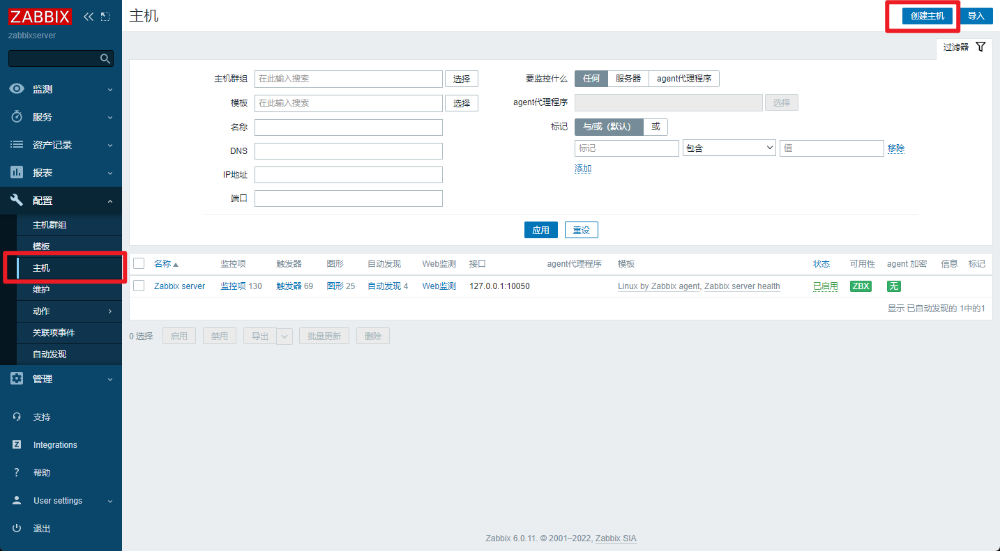

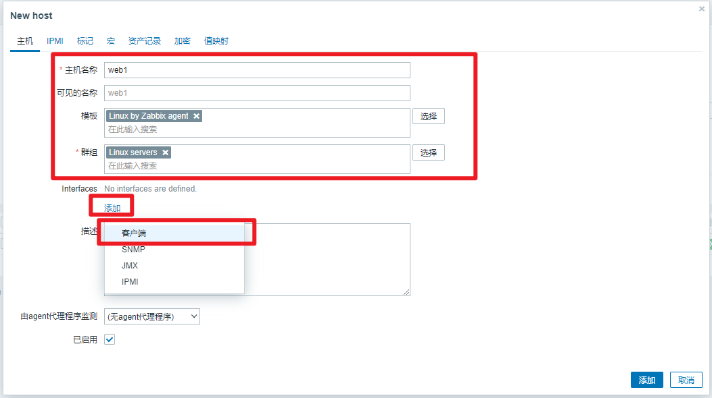

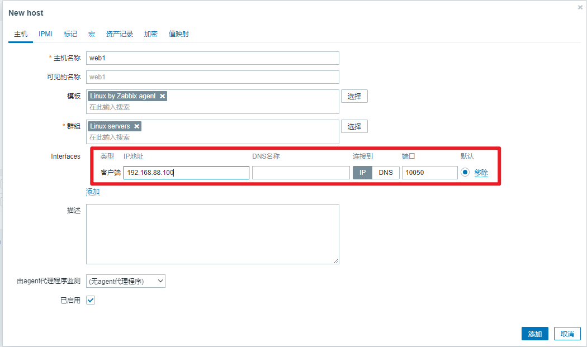

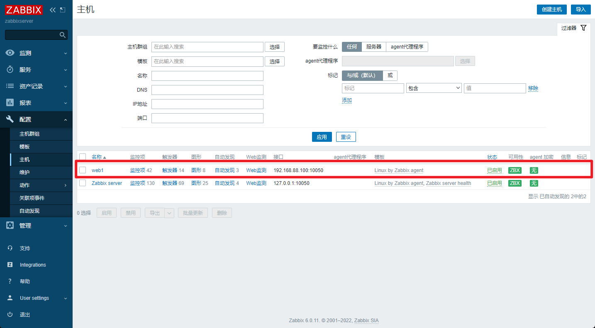

#### 常用监控指标

- Space utilization：以百分比显示的磁盘利用率
- Used space：已用磁盘空间
- Available memory：可用内存
- CPU idle time：CPU空闲时间。不宜过低。
- Load average (1m avg)、Load average (5m avg)、Load average (15m avg)：CPU1分钟、5分钟、15分钟的平均负载。这个值不应长期大于核心数。
- Interface eth0: Bits received：网卡接收到的数据量
- Interface eth0: Bits sent：网卡发送的数据量
- Number of processes：系统运行的进程数
- Number of logged in users：已登陆的用户数

## 自定义监控项

### 实现监控web1用户数量的监控项

1. 在被控端创建key。被控端被监控的内容叫作key，可以理解为它就是一个变量名，具体的名字自己决定。
2. 在web页面中创建监控项。监控项对应key值。

#### 在被控端创建key

- 创建key的语法

```bash
UserParameter=自定义key值,命令
# 命令的执行结果，是key的value
```

- 创建自定义配置文件。文件名自定义。

```bash
[root@web1 ~]# vim /etc/zabbix/zabbix_agentd.d/usercnt.conf
UserParameter=usercnt,sed -n '$=' /etc/passwd
[root@web1 ~]# systemctl restart zabbix-agent.service 
```

- 验证自定义监控项

```bash
# 1. 安装zabbix-get
[root@zabbixserver ~]# yum install -y zabbix-get
[root@web1 ~]# yum install -y zabbix-get

# 2. 获取监控项的值
[root@web1 ~]# zabbix_get -s 127.0.0.1 -k usercnt
46
[root@zabbixserver ~]# zabbix_get -s 192.168.88.100 -k usercnt
46
```


#### 创建模板

- 创建模板

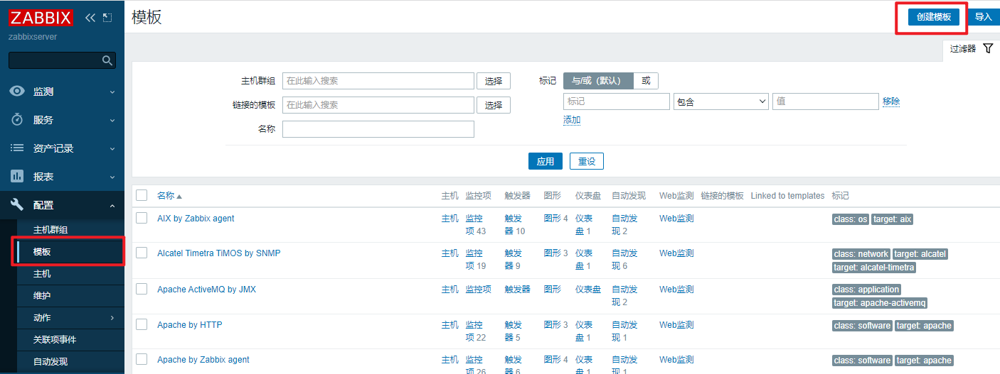

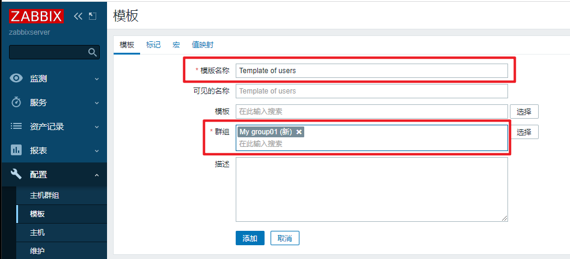

- 创建监控项

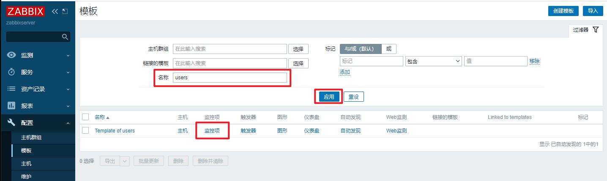

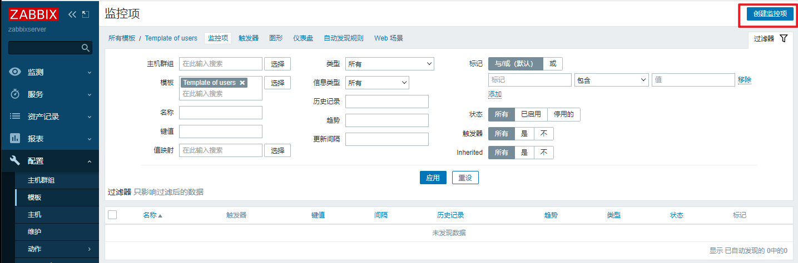

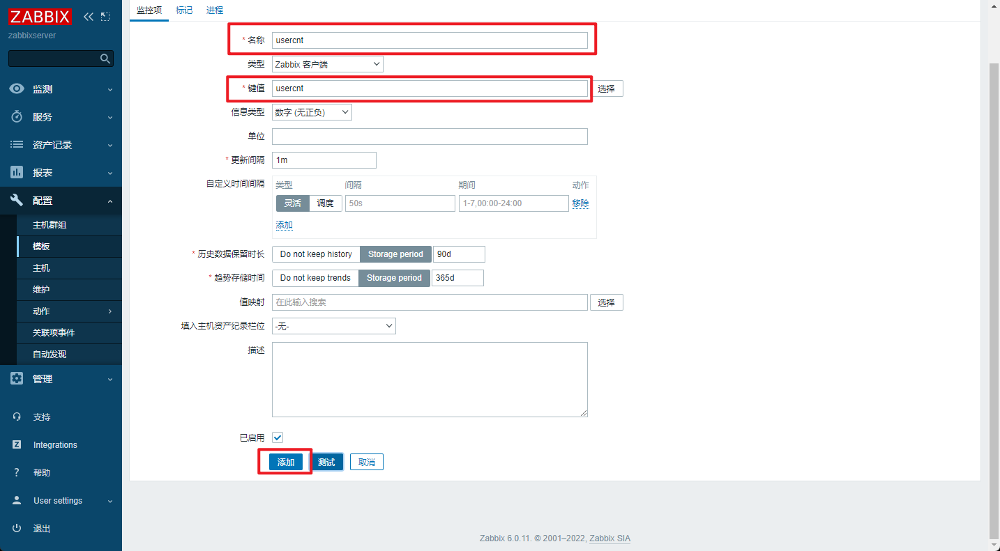

#### 应用模板到主机

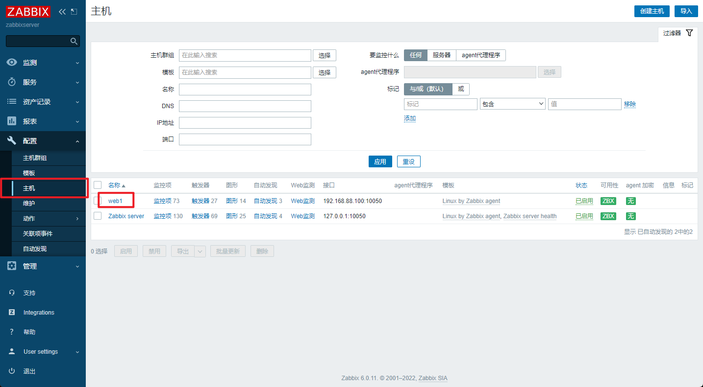

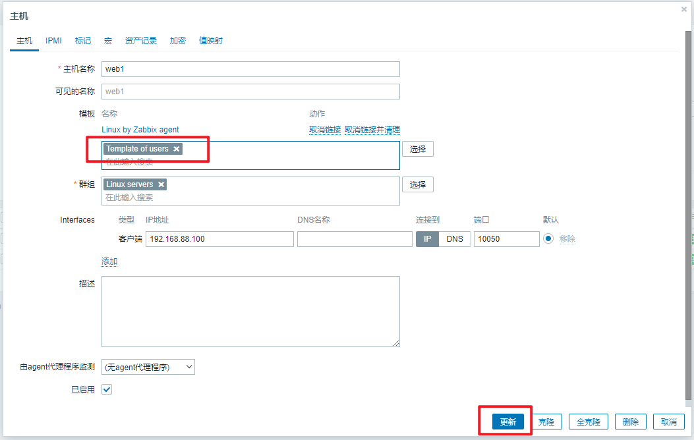

知识点思维导图：https://flowus.cn/share/7875c0e1-ebbd-4dad-aa7e-f40e6ed6c6d3


## Prometheus概述

- Prometheus是一个开源系统监控和警报工具包，最初由 SoundCloud构建。
- 也是一款监控软件，也是一个时序数据库。Prometheus 将其指标收集并存储为时间序列数据，即指标信息与记录时的时间戳以及称为标签的可选键值对一起存储。
- 主要用在容器监控方面，也可以用于常规的主机监控。
- 使用google公司开发的go语言编写。
- Prometheus是一个框架，可以与其他组件完美结合。


- 配置文件
  - 配置文件中包含三个配置块：`global`、`rule_files`和`scrape_configs`。
  - `global`块控制 Prometheus 服务器的全局配置。我们有两个选择。第一个，`scrape_interval`控制 Prometheus 抓取目标的频率。您可以为单个目标覆盖它。在这种情况下，全局设置是每 15 秒抓取一次。该`evaluation_interval`选项控制 Prometheus 评估规则的频率。Prometheus 使用规则来创建新的时间序列并生成警报。
  - `rule_files`块指定我们希望 Prometheus 服务器加载的任何规则的位置。现在我们还没有规则。
  - 最后一个块，`scrape_configs`控制 Prometheus 监控的资源。由于 Prometheus 还将有关自身的数据公开为 HTTP 端点，因此它可以抓取和监控自身的健康状况。在默认配置中，有一个名为 的作业`prometheus`，用于抓取 Prometheus 服务器公开的时间序列数据。该作业包含一个单一的、静态配置的目标，即localhost的`9090`端口。Prometheus期望度量在/metrics路径上的目标上可用，所以这个默认作业是通过 URL 抓取的：http://localhost:9090/metrics。
- 编写服务启动文件并启动服务

```bash
[root@prometheus ~]# vim /usr/lib/systemd/system/prometheus.service
[Unit]
Description=Prometheus Monitoring System
After=network.target

[Service]
ExecStart=/usr/local/prometheus/prometheus \
  --config.file=/usr/local/prometheus/prometheus.yml \
  --storage.tsdb.path=/usr/local/prometheus/data/

[Install]
WantedBy=multi-user.target

# 启动服务
[root@prometheus prometheus_soft]# systemctl daemon-reload 
[root@prometheus prometheus_soft]# systemctl enable prometheus.service --now
[root@prometheus prometheus_soft]# ss -tlnp | grep :9090
LISTEN 0      128                *:9090             *:*    users:(("prometheus",pid=4396,fd=7))   
```

## 添加被监控端

- 监控方式：
  - 拉取：pull。监控端联系被监控端，采集数据
  - 推送：push。被监控端主动把数据发给监控端。在prometheus中，push的方式需要额外的组件pushgateway
- 被监控端根据自身运行的服务，可以运行不同的exporter（被监控端安装的、可以与Prometheus通信，实现数据传递的软件）
- exporter列表：https://prometheus.io/docs/instrumenting/exporters/


### 部署通用的监控exporter

- node-exporter用于监控硬件和系统的常用指标
- exporter运行于被监控端，以服务的形式存在。每个exporter所使用的端口号都不一样。
- 在web1[192.168.88.100]上部署node exporter

```bash
# 1. 拷贝node_exporter到web1
[root@prometheus ~]# scp prometheus_soft/node_exporter-1.5.0.linux-amd64.tar.gz 192.168.88.100:/root/

# 2. 解压即部署
[root@web1 ~]# tar xf node_exporter-1.5.0.linux-amd64.tar.gz 
[root@web1 ~]# mv node_exporter-1.5.0.linux-amd64 /usr/local/node_exporter

# 3. 创建服务文件，并启动服务
[root@web1 ~]# vim /usr/lib/systemd/system/node_exporter.service
[Unit]
Description=node_exporter
After=network.target

[Service]
Type=simple
ExecStart=/usr/local/node_exporter/node_exporter

[Install]
WantedBy=multi-user.target

[root@web1 ~]# systemctl daemon-reload 
[root@web1 ~]# systemctl enable node_exporter.service --now
[root@web1 ~]# ss -tlnp | grep :9100
LISTEN 0      128                *:9100             *:*    users:(("node_exporter",pid=7371,fd=3))   
```

- 在Prometheus服务器上添加监控节点

```bash
# 1. 修改配置文件，追加以下内容。特别注意缩进
[root@prometheus ~]# vim /usr/local/prometheus/prometheus.yml 
...略...
  - job_name: "web1"
    static_configs:
      - targets: ["192.168.88.100:9100"]
      
# 2. 重启服务
[root@prometheus ~]# systemctl restart prometheus.service 
```

## Grafana

### 概述

- Grafana是一款开源的、跨平台的、基于web的可视化工具
- 展示方式：客户端图表、面板插件
- 数据源可以来自于各种源，如prometheus

### 部署Grafana

- 装包、启服务

```bash
[root@prometheus ~]# yum install -y prometheus_soft/grafana-enterprise-9.3.2-1.x86_64.rpm
[root@prometheus ~]# systemctl enable grafana-server.service --now
```

- 初始化。访问[http://192.168.88.5:3000](http://192.168.88.5:3000/)。初始用户名和密码都是admin。第一次登陆时，要求改密码，本例中密码改为tedu.cn。如果登陆报错，请更换其他浏览器。

## 监控MySQL数据库

### 配置MySQL

```bash
[root@web1 ~]# yum install -y mysql-server
[root@web1 ~]# systemctl enable mysqld --now
[root@web1 ~]# mysql
mysql> create user dbuser1@localhost identified by '123456';
mysql> grant all privileges on *.* to dbuser1@localhost;
mysql> quit
```

### 配置mysql exporter

#### 配置mysql exporter

```bash
# 1. 安装
[root@prometheus ~]# scp prometheus_soft/mysqld_exporter-0.14.0.linux-amd64.tar.gz 192.168.88.100:/root/
[root@web1 ~]# tar xf mysqld_exporter-0.14.0.linux-amd64.tar.gz 
[root@web1 ~]# mv mysqld_exporter-0.14.0.linux-amd64 /usr/local/mysqld_exporter

# 2. 编写用于连接mysql服务的配置文件
[root@web1 ~]# vim /usr/local/mysqld_exporter/.my.cnf
[client]
host=127.0.0.1
port=3306
user=dbuser1
password=123456

# 3. 创建service文件
[root@web1 ~]# vim /usr/lib/systemd/system/mysqld_exporter.service
[Unit]
Description=mysqld_exporter
After=network.target

[Service]
ExecStart=/usr/local/mysqld_exporter/mysqld_exporter \
--config.my-cnf=/usr/local/mysqld_exporter/.my.cnf

[Install]
WantedBy=multi-user.target

[root@web1 ~]# systemctl daemon-reload
[root@web1 ~]# systemctl enable mysqld_exporter.service --now
```

#### 配置prometheus监控mysql

- 修改配置文件，启动服务

```bash
# 1. 在配置文件中追加内容
[root@prometheus ~]# vim /usr/local/prometheus/prometheus.yml 
...略...
  - job_name: "mysql"
    static_configs:
      - targets: ["192.168.88.100:9104"]
      
# 2. 重启服务
[root@prometheus ~]# systemctl restart prometheus.service 
```

## 自动发现机制

### 概述

- 自动发现是指Prometheus自动对节点进行监控，不需要手动一个一个去添加，和Zabbix的自动发现、自动注册一个道理
- Prometheus有多种自动发现发现，比如`file_sd_configs`基于文件自动发现、基于K8S自动发现、基于openstack自动发现、基于consul自动发现等。

### 基于文件自动发现

- `file_sd_configs`实现文件级别的自动发现
- 使用文件自动发现功能后，Prometheus会定期检查配置文件是否有更新
- 如果有更新的话就将新加入的节点接入监控，服务端无需重启服务

#### 修改Prometheus使用自动发现

- 修改Prometheus

```bash
# 1. 备份现有配置文件
[root@prometheus ~]# cp /usr/local/prometheus/prometheus.yml ~

# 2. 修改配置文件，删除静态配置，添加自动发现配置
[root@prometheus ~]# vim /usr/local/prometheus/prometheus.yml
# 将scrape_configs及以下内容修改为：
 21 scrape_configs:
 22   - job_name: "prometheus"
 23     file_sd_configs:
 24       - refresh_interval: 120s
 25         files:
 26           - /usr/local/prometheus/sd_config/*.yml
 
 # 3. 重启服务
 [root@prometheus ~]# systemctl restart prometheus.service 
```

#### 配置web2接受Prometheus监控

- 将web1的node exporter拷贝到web2

```bash
[root@web1 ~]# scp -r /usr/local/node_exporter 192.168.88.200:/usr/local/
[root@web1 ~]# scp /usr/lib/systemd/system/node_exporter.service 192.168.88.200:/usr/lib/systemd/system/
```

```
[root@web2 ~]# systemctl daemon-reload 
[root@web2 ~]# systemctl enable node_exporter.service --now
```

```bash
[root@prometheus ~]# vim /usr/local/prometheus/sd_config/discovery.yml 
- targets:
    - 192.168.88.5:9090
    - 192.168.88.100:9100
    - 192.168.88.100:9104
    - 192.168.88.200:9100
```

## Alertmanager

### 概述

- Prometheus服务器中的告警规则向Alertmanager发送告警。然后，Alertmanager管理这些告警，包括静默、抑制、分组以及通过电子邮件、即时消息系统和聊天平台等方法发出通知。

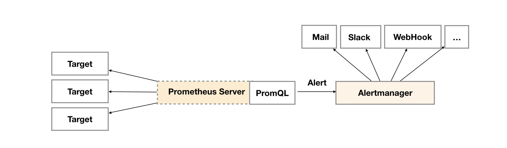


- 设置告警和通知的主要步骤是：

  - 设置和配置Alertmanager
  - 配置Prometheus与Alertmanager对接
  - 在普罗米修斯中创建告警规则

- 在Prometheus中一条告警规则主要由以下几部分组成：

  - 告警名称：用户需要为告警规则命名
  - 告警规则：告警规则实际上主要由PromQL进行定义，其实际意义是当表达式（PromQL）查询结果持续多长时间（During）后出发告警

  ### Alertmanager特性


- Alertmanager处理客户端应用程序(如Prometheus服务器)发送的警报。它负责重复数据删除、分组，并将其路由到正确的接收方集成
- 分组：分组将性质相似的警报分类到单个通知中。这在较大的停机期间特别有用，此时许多系统同时发生故障，数百到数千个警报可能同时发出。
- 抑制：抑制是当某一告警发出后，可以停止重复发送由此告警引发的其它告警的机制。
- 静默提供了一个简单的机制可以快速根据标签对告警进行静默处理。如果接收到的告警符合静默的配置， Alertmanager则不会发送告警通知。静默设置需要在Alertmanager的Web页面上进行设置。

### 部署Alertmanager

#### 部署

- 解压即部署

```bash
# 1. 解压
[root@prometheus ~]# cd prometheus_soft/
[root@prometheus prometheus_soft]# tar xf alertmanager-0.25.0.linux-amd64.tar.gz 
[root@prometheus prometheus_soft]# mv alertmanager-0.25.0.linux-amd64 /usr/local/alertmanager

# 2. 编写服务文件并启动
[root@prometheus prometheus_soft]# vim /usr/lib/systemd/system/alertmanager.service
[Unit]
Description=alertmanager System

[Service]
ExecStart=/usr/local/alertmanager/alertmanager \
--config.file=/usr/local/alertmanager/alertmanager.yml

[Install]
WantedBy=multi-user.target

[root@prometheus ~]# systemctl daemon-reload 
[root@prometheus ~]# systemctl enable alertmanager.service --now
```

#### 配置文件

- Alertmanager的配置主要包含两个部分：路由(route)以及接收器(receivers)。所有的告警信息都会从配置中的顶级路由(route)进入路由树，根据路由规则将告警信息发送给相应的接收器。
- 在Alertmanager中可以定义一组接收器，比如可以按照角色(比如系统运维，数据库管理员)来划分多个接收器。接收器可以关联邮件，Slack以及其它方式接收告警信息。
- 目前配置文件中只设置了一个顶级路由route并且定义的接收器为default-receiver。因此，所有的告警都会发送给default-receiver。
- 因此在Alertmanager配置中一般会包含以下几个主要部分：
  - 全局配置（global）：用于定义一些全局的公共参数，如全局的SMTP配置
  - 模板（templates）：用于定义告警通知时的模板，如HTML模板，邮件模板等
  - 告警路由（route）：根据标签匹配，确定当前告警应该如何处理
  - 接收器（receivers）：接收器是一个抽象的概念，它可以是一个邮箱也可以是微信，Slack或者Webhook 等，接收器一般配合告警路由使用
  - 抑制规则（inhibit_rules）：合理设置抑制规则可以减少垃圾告警的产生

#### Prometheus与Alertmanager对接

- 编辑Prometheus配置文件，修改alerting配置

```bash
[root@prometheus ~]# vim /usr/local/prometheus/prometheus.yml 
...略...
  8 alerting:
  9   alertmanagers:
 10     - static_configs:
 11         - targets:
 12           - localhost:9093
 ...略...
 [root@prometheus ~]# systemctl restart prometheus.service
```

#### 配置Alertmanager通过邮件发送告警

```bash
# 1. 备份配置文件
[root@prometheus ~]# cp /usr/local/alertmanager/alertmanager.yml ~

# 2. 修改配置文件
[root@prometheus ~]# vim /usr/local/alertmanager/alertmanager.yml 
global:
  smtp_from: 'zzg@tedu.cn'      # 发件人地址
  smtp_smarthost: 'localhost:25'   # 邮件服务器地址
  smtp_require_tls: false       # 是否使用TLS安全连接
route:
  group_by: ['alertname']
  group_wait: 30s
  group_interval: 5m
  repeat_interval: 1h
  receiver: 'default-receiver'  # 接收器
receivers:
  - name: 'default-receiver'    # 配置接收器为邮件
    email_configs:
      - to: 'root@localhost.localdomain'
inhibit_rules:
  - source_match:
      severity: 'critical'
    target_match:
      severity: 'warning'
    equal: ['alertname', 'dev', 'instance']
    
# 3. 定义告警规则
[root@prometheus ~]# mkdir /usr/local/prometheus/rules
[root@prometheus ~]# vim /usr/local/prometheus/rules/hoststats-alert.rules
groups:
- name: example
  rules:

  - alert: InstanceDown
    expr: up == 0
    for: 5m 
    labels:
      severity: warn
    annotations:
      summary: "Instance {{ $labels.instance }} down"
      description: "{{ $labels.instance }} of job {{ $labels.job }} has been down for more than 5 minutes."

  - alert: hostMemUsageAlert
    expr: (node_memory_MemTotal - node_memory_MemAvailable)/node_memory_MemTotal > 0.85
    for: 1m 
    labels:
      severity: warn
    annotations:
      summary: "Instance {{ $labels.instance }} MEM usgae high"

# 4. 在Prometheus中声明规则文件位置
[root@prometheus ~]# vim /usr/local/prometheus/prometheus.yml 
...略...
 15 rule_files:
 16   - /usr/local/prometheus/rules/*.rules
...略...

# 5. 重启服务
[root@prometheus ~]# systemctl restart alertmanager.service 
[root@prometheus ~]# systemctl restart prometheus.service 

# 6. 安装并启动邮件服务
[root@prometheus ~]# yum install -y postfix mailx
[root@prometheus ~]# systemctl enable postfix --now
```

知识点思维导图：https://flowus.cn/share/7875c0e1-ebbd-4dad-aa7e-f40e6ed6c6d3


## kali

- 实际上它就是一个预安装了很多安全工具的Debian Linux

- 基础配置

```bash
$ ip a s    # 查看网络IP地址，本例中查看到的是192.168.88.192
$ sudo systemctl start ssh      # 启ssh服务，弹出的窗口输入密码kali
$ sudo systemctl enable ssh     # 设置ssh服务开机自启
[root@myhost ~]# ssh kali@192.168.88.192
kali@192.168.88.192's password: kali
┌──(kali㉿kali)-[~]
└─$ 
```

### nmap扫描

- 一般来说扫描是攻击的前奏。
- 扫描可以识别目标对象是什么系统，开放了哪些服务。
- 获知具体的服务软件及其版本号，可以使得攻击的成功率大大提升。
- 扫描可以检测潜在的风险，也可以寻找攻击目标、收集信息、找到漏洞
- windows下，扫描可以使用xscan / superscan
- Linux，扫描可以采用nmap
- 吾爱破解：https://www.52pojie.cn/
- 中国黑客团队论坛：https://www.cnhackteam.org/
- 俄罗斯论坛：https://rutracker.org/

```bash
┌──(kali㉿kali)-[~]
└─$ nmap
# -sS: TCP SYN扫描（半开）
# -sT: TCP 连接扫描。（全开）
# -U: 扫描目标的UDP端口。
# -sP：ping ICMP扫描
# -A：对目标系统全面分析
```

- 使用脚本扫描

```bash
# 通过脚本扫描目标主机的ftp服务
# 在目标主机上安装vsftpd服务
[root@web1 ~]# yum install -y vsftpd
[root@web1 ~]# vim /etc/vsftpd/vsftpd.conf 
 12 anonymous_enable=YES
[root@web1 ~]# systemctl enable vsftpd --now

# 在kali主机上查看有哪些脚本
┌──(kali㉿kali)-[~]
└─$ ls /usr/share/nmap/scripts/

# 扫描ftp服务是否支持匿名访问。ftp控制连接端口号是21
┌──(kali㉿kali)-[~]
└─$ sudo nmap --script=ftp-anon.nse 192.168.88.100 -p 21
21/tcp open  ftp
| ftp-anon: Anonymous FTP login allowed   # 允许匿名访问

# 扫描ftp相关信息，如版本号、带宽限制等
┌──(kali㉿kali)-[~]
└─$ sudo nmap --script=ftp-syst.nse 192.168.88.100 -p 21

# 扫描ftp后门漏洞
┌──(kali㉿kali)-[~]
└─$ sudo nmap --script=ftp-vsftpd-backdoor 192.168.88.100 -p 21
```

- 扫描口令

```bash
# 通过ssh协议，使用nmap自带的密码本扫描远程主机的用户名和密码
# 在目标主机上创建名为admin的用户，密码为123456
[root@web1 ~]# useradd admin
[root@web1 ~]# echo 123456 | passwd --stdin admin

# 在kali上扫描弱密码
┌──(kali㉿kali)-[~]
└─$ sudo nmap --script=ssh-brute.nse 192.168.88.100 -p 22

# 通过ssh协议，使用nmap以及自己的密码本扫描远程主机的密码
# 1. 创建用户名文件
┌──(kali㉿kali)-[~]
└─$ sudo echo root > /tmp/users.txt
                                                        
┌──(kali㉿kali)-[~]
└─$ cat /tmp/users.txt 
root

# 2. 生成1990-01-01到2020-12-31之间的所月日期
┌──(kali㉿kali)-[~]
└─$ vim mydate.py
from datetime import datetime, timedelta

d1 = datetime(1989, 12, 31)
d2 = datetime(2021, 1, 1)
dt = timedelta(days=1)

with open('/tmp/mima.txt', 'w') as f:
    while d1 < d2:
        d1 += dt
        f.write("%s\n" % d1.strftime('%Y%m%d'))

┌──(kali㉿kali)-[~]
└─$ python3 mydate.py

# 3. 修改web1的密码
[root@web1 ~]# echo 19910101 | passwd --stdin root

# 4. 使用自己的密码本破解密码
┌──(kali㉿kali)-[~]
└─$ sudo nmap --script=ssh-brute.nse --script-args userdb=/tmp/users.txt,passdb=/tmp/mima.txt 192.168.88.100 -p 22

# 5. 目标主机将会记录所有的登陆事件
[root@web1 ~]# vim /var/log/secure
# 查看最近的登陆失败事件
[root@web1 ~]# lastb
# 查看最近的登陆成功事件
[root@web1 ~]# last
```

- 扫描windows口令

```bash
[root@myhost ~]# cat /tmp/winuser.txt    # windows用户名
administrator
admin
# 通过samba服务扫描密码
[root@myhost ~]# nmap --script=smb-brute.nse --script-args userdb=/tmp/winuser.txt,passdb=/tmp/mima 172.40.0.151
```

### 使用john破解密码

- 在线破解哈希值的网站：https://cmd5.com/
- 哈希是算法，英文hash的音译，包括md5、sha等
  - 哈希算法是一种单向加密的算法，也就是将原始数据生成一串“乱码”
  - 只能通过原始数据，生成这串“乱码”，但是不能通过“乱码”回推出原始数据
  - 相同的原始数据，生成的乱码是相同的。
- kali系统提供了一个名为john的工具，可用于密码破解

```bash
# 字典暴力破解，密码本是/usr/share/john/password.lst
┌──(kali㉿kali)-[~]
└─$ sudo john shadow  

# 直接显示破解的密码，不显示其他额外信息
┌──(kali㉿kali)-[~]
└─$ sudo john --show shadow                
root:123456:18912:0:99999:7:::
tom:abc123:18912:0:99999:7:::
jerry:123123:18912:0:99999:7:::

# 字典暴力破解，指定密码本文件
┌──(kali㉿kali)-[~]
└─$ sudo john --wordlist=/tmp/mima.txt shadow
```


## 抓包

### 封装与解封装


### 以太网数据帧结构


- MAC地址：分为目标和源MAC地址，6字节
- Type：类型，说明数据帧中包含的数据类型
- Data：高层数据
- FCS：帧校验序列

### 网络层数据包结构


- 版本：协议版本，如IPv4

- 生存时间：8位，初始一个值n，每经过一个路由器减1，直到为0丢弃，目的为防止分组在网络上无限传播下去

- ###### 协议号：数据部分应交付的协议号，如TCP是6，UDP是17

### TCP头部结构

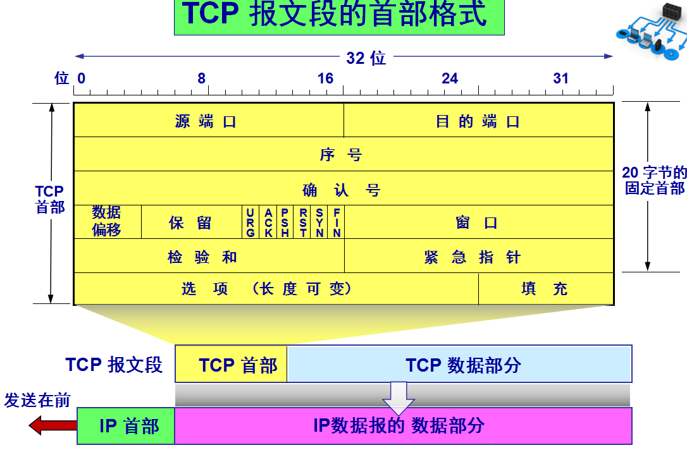

- 源端口：数据段的源端口，一般为大于1024的随机值
- 目标端口：数据段的目标端口
- 序号：在一个TCP连接中传输的数据段都按顺序编号

### UDP头部结构


- 源端口：数据段的源端口，一般为大于1024的随机值
- 目标端口：数据段的目标端口


### 实施抓包

- 传输的各种数据，在网络中都是一个个的数据包

```bash
┌──(kali㉿kali)-[~]
└─$ sudo tcpdump
# -i：指定抓取哪块网卡进入的数据包
# -A：转换为ASCII码，使得可读
# -w：抓包写入文件
# -r：从文件中读取抓包信息
# -c: 定义抓包的个数
# 抓包时可以过滤要抓哪些包
# 使用host过滤主机，使用net过滤网段，使用port过滤端口... ...

# 抓包：抓取eth0上进出的、与192.168.88.100有关的、涉及TCP21端口的数据包。以下命令执行后，打开新终端。
┌──(kali㉿kali)-[~]
└─$ sudo tcpdump -i eth0 -A host 192.168.88.100 and tcp port 21

# 保存抓包文件
# 将抓到的包存入文件ftp.cap
┌──(kali㉿kali)-[~]
└─$ sudo tcpdump -i eth0 -A -w ftp.cap host 192.168.88.100 and tcp port 21

#读取抓到的包，并过滤
┌──(kali㉿kali)-[~]
└─$ tcpdump -A -r ftp.cap | egrep 'USER|PASS' 
```


## 安全加固

### nginx安全

- 隐藏版本信息

```bash
[root@web1 ~]# vim /etc/nginx/nginx.conf
... ...
 17 http {
 18     server_tokens off;
... ...
[root@web1 ~]# systemctl restart nginx.service 
```

- 防止DOS、DDOS攻击
- DDOS：分布式拒绝服务

```bash
# 压力测试，每批次发送100个请求给web服务器，一共发200个
[root@myhost ~]# yum install -y httpd-tools
[root@myhost ~]# ab -c 100 -n 200 http://192.168.88.100/ 
... ...
Benchmarking 192.168.88.100 (be patient)
Completed 100 requests
Completed 200 requests
Finished 200 requests    # 发送200个请求完成
... ... 
Complete requests:      200   # 完成了200个请求
Failed requests:        0     # 0个失败
... ...
```

- 配置nginx连接共享内存为10M，每秒钟只接收一个请求，最多有5个请求排队，多余的拒绝

```bash
[root@web1 ~]# vim /etc/nginx/nginx.conf
 17 http {
 18     limit_req_zone $binary_remote_addr zone=one:10m rate=1r/s;   # 添加
... ...
 40     server {
 41         listen       80 default_server;
 42         listen       [::]:80 default_server;
 43         server_name  _;
 44         root         /usr/share/nginx/html;
 45         limit_req zone=one burst=5;  # 添加
[root@web1 ~]# systemctl restart nginx.service 

# 再次测试
[root@myhost ~]# ab -c 100 -n 200 http://192.168.88.100/ 
... ...
Benchmarking 192.168.88.100 (be patient)
Completed 100 requests
Completed 200 requests
Finished 200 requests
... ...
Complete requests:      200
Failed requests:        194   # 失败了194个
... ...
```

### 防止缓冲区溢出

- 缓冲区溢出定义：程序企图在预分配的缓冲区之外写数据。
- 漏洞危害：用于更改程序执行流，控制函数返回值，执行任意代码。

```bash
# 配置nginx缓冲区大小，防止缓冲区溢出
[root@web1 ~]# vim /etc/nginx/nginx.conf
... ...
 17 http {
 18     client_body_buffer_size     1k;
 19     client_header_buffer_size   1k;
 20     client_max_body_size        1k;
 21     large_client_header_buffers 2 1k;
... ...
[root@web1 ~]# systemctl restart nginx.service 
```


## Linux加固

```bash
# 查看tom的账号信息
[root@web1 ~]# chage -l tom
# 修改
[root@web1 ~]# chage -E 2022-1-1 tom

# 设置账号永不过期，注意-E后面是数字-1，不是字母l
[root@web1 ~]# chage -E -1 tom

# 设置新建用户的密码策略
[root@web1 ~]# vim /etc/login.defs 
 39 PASS_MAX_DAYS   99999    # 密码永不过期，设置最长有效期
 40 PASS_MIN_DAYS   0        # 密码最短使用时间，0表示随时可改密码
 41 PASS_MIN_LEN    5        # 密码最短长度
 42 PASS_WARN_AGE   7        # 密码过期前7天发警告
 47 UID_MIN                  1000   # 新建用户最小的UID
 48 UID_MAX                 60000   # 新建用户最大的UID
```

- 用户安全设置

```bash
# 锁定tom账号
[root@web1 ~]# passwd -l tom
锁定用户 tom 的密码 。
passwd: 操作成功

[root@web1 ~]# passwd -S tom   # 查看状态
tom LK 2021-10-12 0 99999 7 -1 (密码已被锁定。)

# 解锁tom账号
[root@web1 ~]# passwd -u tom
解锁用户 tom 的密码。
passwd: 操作成功
[root@web1 ~]# passwd -S tom
tom PS 2021-10-12 0 99999 7 -1 (密码已设置，使用 SHA512 算法。)
```

- 保护文件

```bash
# 查看文件的特殊属性
[root@web1 ~]# lsattr /etc/passwd
---------------- /etc/passwd    # 没有特殊属性

# 修改属性
chattr +i 文件    # 不允许对文件做任何操作，只能看
chattr -i 文件    # 去除i属性
chattr +a 文件    # 文件只允许追加
chattr -a 文件    # 去除a属性

[root@web1 ~]# chattr +i /etc/passwd
[root@web1 ~]# lsattr /etc/passwd
----i----------- /etc/passwd
[root@web1 ~]# useradd zhangsan
useradd：无法打开 /etc/passwd
[root@web1 ~]# rm -f /etc/passwd
rm: 无法删除"/etc/passwd": 不允许的操作
[root@web1 ~]# chattr -i /etc/passwd
[root@web1 ~]# rm -f /etc/passwd   # 可以删除
[root@web1 ~]# ls /etc/passwd
ls: 无法访问/etc/passwd: 没有那个文件或目录

# 恢复passwd文件
[root@web1 ~]# cp /etc/passwd- /etc/passwd

# 追加
[root@web1 ~]# chattr +a /etc/hosts
[root@web1 ~]# echo 'hello world' >> /etc/hosts
[root@web1 ~]# rm -f /etc/hosts
rm: 无法删除"/etc/hosts": 不允许的操作
```


## iptables

### 默认规则设置

- 白名单： 默认禁止，添加放行规则

- 黑名单： 默认放行，添加禁止规则

### 四表五链

表：raw/mangle/nat/filter

链：INPUT/OUTPUT/FORWARD/PREROUTING/POSTROUTING

重点：filter表是默认的表，它实现防火墙，也就是包过滤的功能。nat表实现网络地址转换。


### 防火墙filter表

- 配置iptables时，不指定表，就是使用filter表
- 配置时不指定规则链，则配置所有链
- 可以向规则链中加入很多规则，数据包进入该链时，从上向下匹配，一旦匹配就停止，开始应用规则。如果全都不匹配，则应用默认规则
- 命令选项、链名、目标操作使用大写字母，其他小写

#### filter中的三条链

- INPUT：数据包的目标地址是自己，则进入INPUT链
- OUTPUT:数据包的源地址是自己，则进入OUTPUT链
- FORWARD：数据包穿过自己，则进入FORWARD链


### 准备工作

- client1：eth0 -> 192.168.88.10/24 网关：192.168.88.11
- node1：eth0 -> 192.168.88.11/24，eth1 -> 192.168.99.11/24
- server1：eth1 -> 192.168.99.100/24 网关：192.168.99.11

- 系统启动IPv4转发

```bash
[root@node1 ~]# tail -1 /etc/sysctl.conf
net.ipv4.ip_forward=1  #配置内核参数，允许系统作为路由器，转发网络接口的数据包到另一个网络接口

[root@node1 ~]# sysctl -p  #重新加载配置文件
net.ipv4.ip_forward = 1
[root@node1 ~]# cat /proc/sys/net/ipv4/ip_forward  #虚拟文件，反映IPv4转发功能
1
```

- client配置网关

```bash
[root@client ~]# nmcli connection modify "System eth0" ipv4.gateway 192.168.88.11 autoconnect yes 
[root@client ~]# nmcli connection up "System eth0"
[root@client ~]# route -n
Kernel IP routing table
Destination     Gateway         Genmask         Flags Metric Ref    Use Iface
0.0.0.0         192.168.88.11   0.0.0.0         UG    100    0        0 eth0
192.168.88.0    0.0.0.0         255.255.255.0   U     100    0        0 eth0
```

- web1配置网关

```bash
[root@web1 ~]# nmcli connection modify "System eth0" ipv4.gateway '' autoconnect no
[root@web1 ~]# nmcli connection down "System eth0"
Connection 'System eth0' successfully deactivated (D-Bus active path: /org/freedesktop/NetworkManager/ActiveConnection/3)

[root@web1 ~]# nmcli connection modify "System eth1" ipv4.gateway 192.168.99.11 autoconnect yes
[root@web1 ~]# nmcli connection up "System eth1"
[root@web1 ~]# noute -n
```

- iptables有多种功能，每一种功能都用一张表来实现
- 最常用的功能是防火墙和NAT
- 从RHEL7开始，默认的防火墙为firewalld，但是它的底层仍然调用iptables
- 安装iptables服务

```bash
# 关闭firewalld
[root@node1 ~]# systemctl stop firewalld
[root@node1 ~]# systemctl disable firewalld

# 安装iptables
[root@node1 ~]# yum install -y iptables-services.x86_64  
```


### iptables操作

```bash
##语法
iptables [-t 表名] 选项 [链名] [条件] [-j 满足条件的操作]
##选项
-A 追加规则-->iptables -A INPUT
-D 删除规则-->iptables -D INPUT 1(编号)
-R 修改规则-->iptables -R INPUT 1 -s 192.168.12.0 -j DROP 取代现行规则，顺序不变(1是位置)
-I 插入规则-->iptables -I INPUT 1 --dport 80 -j ACCEPT 插入一条规则，原本位置上的规则将会往后移动一个顺位
-L 查看规则-->iptables -L INPUT 列出规则链中的所有规则
-P 设置默认规则

通用参数：
-p 协议  例：iptables -A INPUT -p tcp
-s 源地址 例：iptables -A INPUT -s 192.168.1.1
-d 目的地址 例：iptables -A INPUT -d 192.168.12.1
--sport 源端口 例:iptables -A INPUT -p tcp --sport 22
--dport 目的端口 例:iptables -A INPUT -p tcp --dport 22
-i 指定入口网卡 例:iptables -A INPUT -i eth0
-o 指定出口网卡 例:iptables -A FORWARD -o eth0

-j 指定要进行的处理动作
常用的ACTION：
DROP：丢弃
REJECT：明示拒绝
ACCEPT：接受
LOG：记录日志，然后传给下一条规则（不常用）
```

- 示例
  - 可以设置默认拒绝，然后明确允许
  - 也可以设置默认允许，然后明确拒绝

```bash
# 向INPUT链追加规则，192.168.88.254发来的包全部接受
# -A是追加，-s是匹配源地址，-j为jump，采取的行为，ACCEPT是接受
[root@node1 ~]# iptables -A INPUT -s 192.168.88.254 -j ACCEPT

# 将INPUT链的默认规则改为DROP丢弃。-P设置默认规则
[root@node1 ~]# iptables -P INPUT DROP

# 查看INPUT链的规则 -n #是指用数字来表示端口号、主机等
[root@node1 ~]# iptables -L INPUT

# 允许192.168.88.0网络的主机ssh连接node1
# -I是插入到INPUT链的第1个位置。-p指定协议，--dport指定目标端口号。-j是执行的操作
[root@node1 ~]# iptables -I INPUT 1 -s 192.168.88.0/24 -p tcp --dport 22 -j ACCEPT

# 不指定源，就是任何源
[root@node1 ~]# iptables -A INPUT -p tcp --dport 80 -j ACCEPT

# icmp就是ping命令底层用到的协议，叫Internet控制消息协议
[root@node1 ~]# iptables -A INPUT -s 192.168.88.254 -p icmp -j REJECT

# 删除第4条规则
[root@node1 ~]# iptables -D INPUT 4

# 拒绝192.168.88.254 ping node1。-I不指定位置，默认插到最上面
[root@node1 ~]# iptables -I INPUT -s 192.168.88.254 -p icmp -j REJECT

# 对于所有进入本机的数据包，如果是已经建立的连接的一部分，请直接放行。
[root@node1 ~]# iptables -I INPUT -m state --state ESTABLISHED -j ACCEPT

# 保存规则。不保存规则，重启iptables服务，自定义规则将消失
[root@node1 ~]# iptables-save > /etc/sysconfig/iptables
```


### 验证FORWARD链

- 要求：在node1上配置防火墙，保护server1
  1. 默认拒绝所有数据包通过
  2. 从server1所在网段发往client1所在网段的包全部允许
  3. 从client1所在网段到server1所在网段，允许icmp，允许22、80、443端口通过


```bash
# 默认拒绝所有数据包通过，此时client1和server1完全不通
[root@node1 ~]# iptables -P FORWARD DROP

# 源地址是192.168.99.0/24，目标地址是192.168.88.0/24的包，放行
[root@node1 ~]# iptables -A FORWARD -s 192.168.99.0/24 -d 192.168.88.0/24 -j ACCEPT

# 从client1到server1，允许icmp
[root@node1 ~]# iptables -A FORWARD -s 192.168.88.0/24 -d 192.168.99.0/24 -p icmp -j ACCEPT

# client1和server1已经可以ping通了
[root@client1 ~]# ping -c2 192.168.99.100

# 允许从client1访问server1的22、80、443，100-120端口范围
# -m是引入扩展模块，multiport多端口
[root@node1 ~]# iptables -A FORWARD -p tcp -m multiport --dport 22,80,443,100:120 -s 192.168.88.0/24 -j ACCEPT

# 现在从client1到server1的ssh、http都可以放行了
[root@client1 ~]# ssh 192.168.99.100
[root@client1 ~]# curl http://192.168.99.100/


# 拒绝192.168.88.10-192.168.88.20访问192.168.99.50-192.168.99.150
# -m是引入扩展模块，src-range是源地址范围，dst-range目标地址范围
[root@node1 ~]# iptables -I FORWARD -m iprange --src-range 192.168.88.10-192.168.88.20 --dst-range 192.168.99.50-192.168.99.150 -j REJECT
```


## NAT

- NAT：网络地址翻译、网络地址转换
- NAT技术产生，主要是解决IPV4地址不够用。
- NAT一般用于将私有地址转成全球唯一的公有地址。
- 私有地址：
  - A类：10.x.x.x
  - B类：172.16.x.x-172.31.x.x
  - C类：192.168.x.x
- 私有地址，如果需要访问互联网中的公有地址，进行上网，可以通过NAT技术，将私有地址转成公有地址，再访问外界。

### 配置SNAT

- 现在的实验环境，client1可以访问server1，server1看到的是客户端地址是client1的地址。

```bash
# 跟踪httpd日志的尾部
[root@server1 ~]# tail -f /var/log/httpd/access_log 

# 在client上访问server1的web服务
[root@client1 ~]# curl http://192.168.99.100/

# 查看服务器终端的日志，将会显示client1的地址192.168.88.10访问了它
192.168.88.10 - - [13/Oct/2021:17:31:35 +0800] "GET / HTTP/1.1" 403 4897 "-" "curl/7.29.0"
```

- 互联网环境下，运营商不允许私有地址出现在互联网上，发现有这样的数据，就直接丢弃。所以，私有地址发往互联网时，需要用NAT转换成公有地址，也叫合法地址。
- 在我们的练习环境下，在node1上配置NAT，当client1访问server1时，将client1的地址转换成server1的192.168.99.x再发给server1。因为数据包的源地址改变了，所以叫SNAT，S即Source。

```bash
# 向nat表中的POSTROUTING链添加规则。将源地址192.168.88.0/24转换成它外网卡地址。
[root@node1 ~]# iptables -t nat -A POSTROUTING -s 192.168.88.0/24 -j MASQUERADE

# 目标地址转换，场景：内网服务发布到公网
[root@node1 ~]# iptables -t nat -A PREROUTING -d 192.168.88.11/24 -p tcp --dport 8080 -j DNAT --to-destination 192.168.99.100:80

[root@node1 ~]# iptables -t nat -nL

# client1再次访问server1时，server1上的日志将会显示node1的192.168.99.11访问
[root@server1 ~]# tail -f /var/log/httpd/access_log 
192.168.99.11 - - [13/Oct/2021:17:45:07 +0800] "GET / HTTP/1.1" 403 4897 "-" "curl/7.29.0"
```


