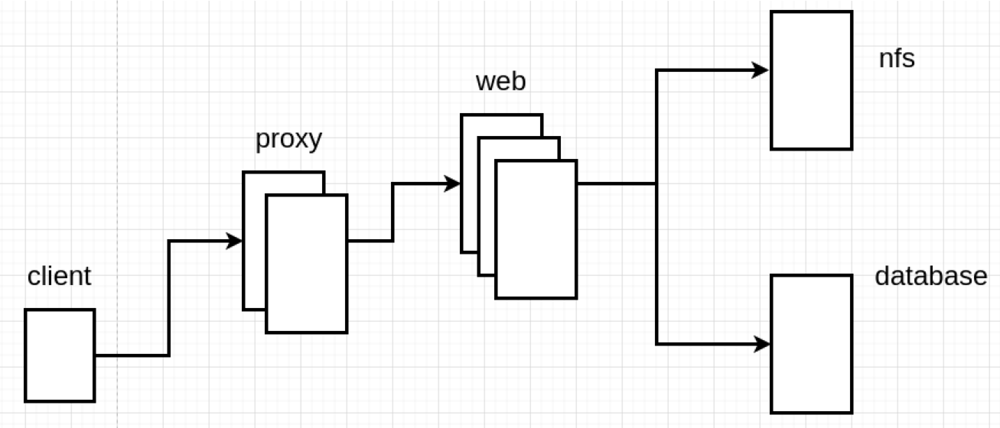

## 项目实战目标



| 主机名    | IP地址           |
| --------- | ---------------- |
| client01  | 192.168.88.10/24 |
| web1      | 192.168.88.11/24 |
| web2      | 192.168.88.12/24 |
| web3      | 192.168.88.13/24 |
| database  | 192.168.88.21/24 |
| nfs       | 192.168.88.31/24 |
| haproxy01 | 192.168.88.5     |
| haproxy02 | 192.168.88.6     |

## 单机安装基于LNMP结构的WordPress网站

### 基本环境准备

- 创建虚拟机，并配置防火墙、SELINUX、主机名、IP地址、yum

```bash
[root@myhost ~]# vm clone web1    # 克隆一台虚拟机
[root@myhost ~]# vm setip web1 192.168.88.11   # 设置ip地址
```

- 配置ansible管理环境

```bash
# 1. 创建工作目录
[root@pubserver ~]# mkdir -p project01/files
[root@pubserver ~]# cd project01/

# 2. 创建主配置文件、主机清单文件、yum配置文件
[root@pubserver project01]# vim ansible.cfg 
[defaults]
inventory = inventory
host_key_checking = false

[root@pubserver project01]# vim inventory 
[webservers]
web1 ansible_host=192.168.88.11

[all:vars]
ansible_ssh_user=root
ansible_ssh_pass=a

[root@pubserver project01]# vim files/local88.repo 
[BaseOS]
name = BaseOS
baseurl = ftp://192.168.88.240/dvd/BaseOS
enabled = 1
gpgcheck = 0

[AppStream]
name = AppStream
baseurl = ftp://192.168.88.240/dvd/AppStream
enabled = 1
gpgcheck = 0

[rpms]
name = rpms
baseurl = ftp://192.168.88.240/rpms
enabled = 1
gpgcheck = 0
```

- 配置yum服务

```bash
[root@pubserver project01]# vim 01-upload-repo.yml 
---
- name: config repos.d
  hosts: all
  tasks:
    - name: delete repos.d
      file:
        path: /etc/yum.repos.d
        state: absent

    - name: create repos.d
      file:
        path: /etc/yum.repos.d
        state: directory
        mode: '0755'

    - name: upload local88
      copy:
        src: files/local88.repo
        dest: /etc/yum.repos.d/

[root@pubserver project01]# ansible-playbook 01-upload-repo.yml 
```

### 配置nginx

- 配置web1服务

```bash
[root@pubserver project01]# vim 02-config-web1.yml 
---
- name: config web1
  hosts: webservers
  tasks:
    - name: install pkgs   # 安装软件包
      yum:
        name:
          - nginx
          - mysql-server
          - php-mysqlnd
          - php-fpm
          - php-json
        state: present

    - name: start service   # 循环启动多个服务
      service:
        name: "{{item}}"
        state: started
        enabled: yes
      loop:
        - nginx
        - php-fpm
        - mysqld
[root@pubserver project01]# ansible-playbook 02-config-web1.yml
```

- 编写php文件，并访问http://192.168.88.11/测试

```bash
[root@web1 ~]# vim /usr/share/nginx/html/index.php
<?php
    phpinfo();
?>
```

- 测试完成后，删除文件

```bash
[root@web1 ~]# rm -f /usr/share/nginx/html/index.php 
```

### 配置数据库服务

- 安装Wordpress网站，需要数据库，创建数据库并授权

```bash
# 1. 编写用于创建数据库和用户的脚本
[root@pubserver project01]# vim files/config_mysql.sh
#!/bin/bash

mysql -e "create database wordpress character set utf8mb4"
mysql -e "create user wpuser01@localhost identified by 'wordpress'"
mysql -e "grant all privileges on wordpress.* to wpuser01@localhost"

# 2. 通过ansible的script模块执行脚本
[root@pubserver project01]# vim 03-config-mysql.yml 
---
- name: config mysql
  hosts: web1
  tasks:
    - name: create database
      script: files/config_mysql.sh

[root@pubserver project01]# ansible-playbook 03-config-mysql.yml

# 3. 测试账号，如果可以成功登陆mysql，则数据库和用户创建正确
[root@web1 ~]# mysql -uwpuser01 -pwordpress -hlocalhost wordpress
```

### 部署wordpress

- 复制程序文件到nginx工作目录

```bash
# 1. 拷贝wordpress到web1
[root@myhost ~]# scp /linux-soft/s2/zzg/project01_soft/wordpress-6.1.1-zh_CN.tar.gz 192.168.88.11:/root/

# 2. 解压并复制文件到nginx文档目录
[root@web1 ~]# tar xf wordpress-6.1.1-zh_CN.tar.gz  
[root@web1 ~]# cp -r wordpress/* /usr/share/nginx/html/

# 3. php程序是由php-fpm处理的，php-fpm以apache身份运行
[root@web1 ~]# ps aux | grep php-fpm
root        5655  0.0  0.4 395620 19056 ?        Ss   12:13   0:00 php-fpm: master process (/etc/php-fpm.conf)
apache      5670  0.0  0.3 412108 13812 ?        S    12:13   0:00 php-fpm: pool www

# 4. 为了让php-fpm程序能对html目录进行读写操作，需要为他授予权限
[root@web1 ~]# chown -R apache:apache /usr/share/nginx/html/
```


